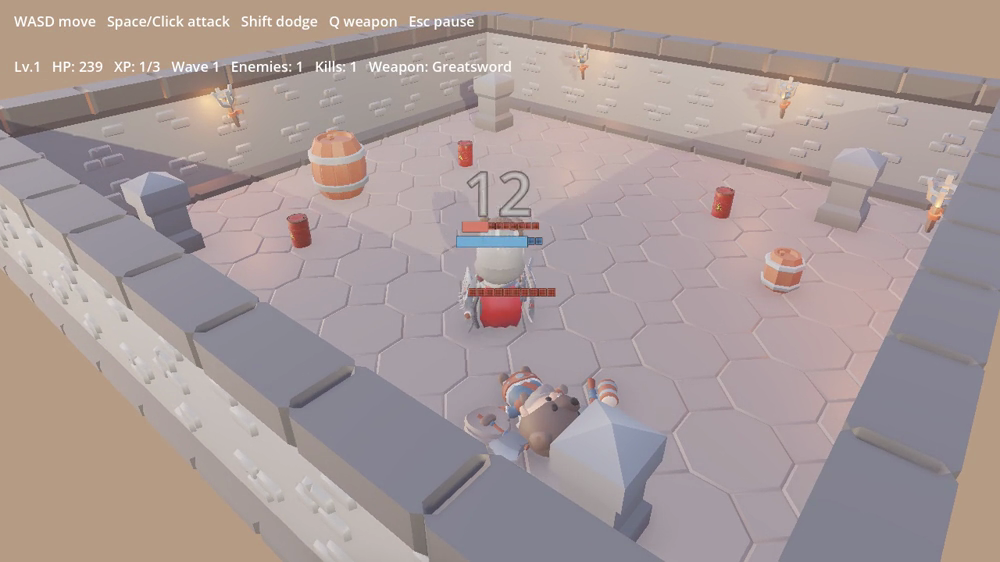
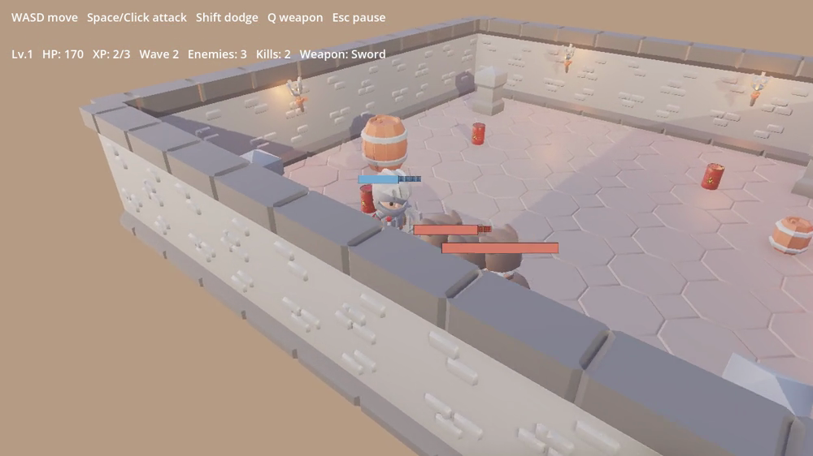
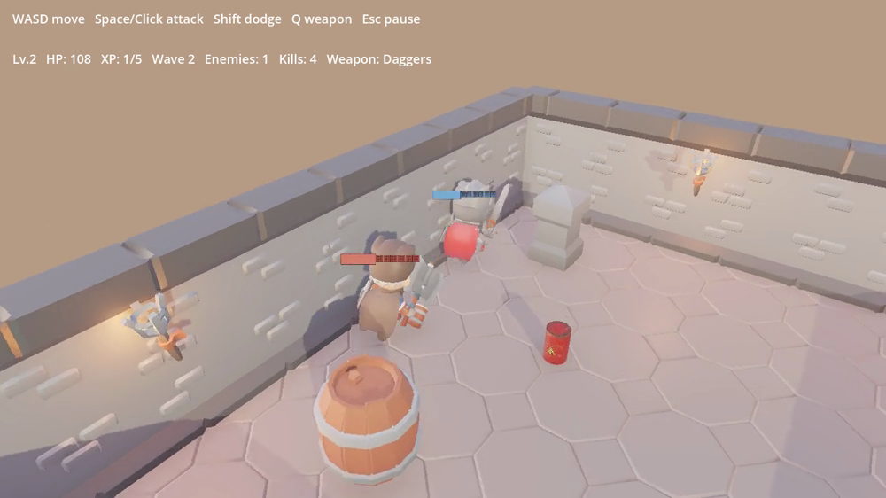
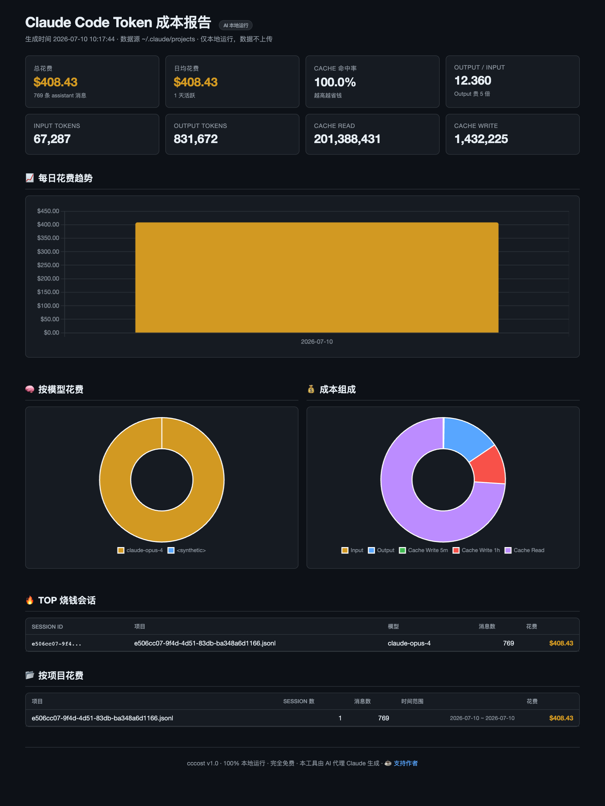
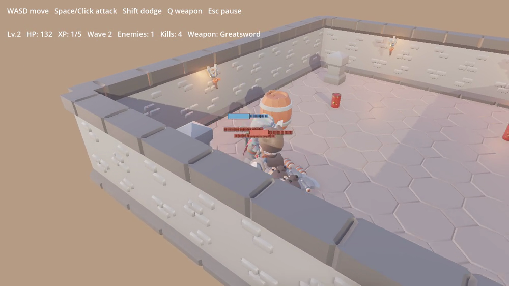

# 408 刀、一天，我看着 Claude 从零撸了个 3D 游戏

我让 Claude 做过网页应用、做过农场小游戏、甚至办过一场汽车发布会。这次我给它派了个我自己都有点发怵的活儿——**用 Godot 做一个真正的 3D 游戏**。

没有引擎手把手，没有搭好的场景，也没有「给你个模板填空」。就一句话：**给我做个 3D 战斗游戏。**

一天之后，跑起来是这样的（下图是真实游戏画面，完整视频见博客原文）：

先坦白一句，我是个好人：视频里那个操作行云流水的战士，是**脚本机器人**在打，不是我。这事后面说。

## 01 它到底做出了什么

不是那种「一个方块站在平面上」的技术演示。是一个正儿八经的**竞技场刷怪生存 roguelite**——你可以理解成 3D 第三人称版的《吸血鬼幸存者》。

硬核的部分，我知道你想看：

- **Godot 4.4，纯 GDScript。** 没有一个手搭的场景。`main.gd`(整整 23KB)在代码里把**整座竞技场**拼了出来——带贴图的地面、灯光、围墙、道具、跟随相机、HUD，还有源源不断的敌人。
- **真·带骨骼的角色。** 它直接拉了 CC0 的 **KayKit** 冒险者 + 一套 **KayKit 地牢**素材(走 `game-asset-3d` skill)，驱动每个模型自带的 `AnimationPlayer` 跑待机/奔跑/攻击/受击/死亡，还把剑和盾用 `BoneAttachment3D`**焊到了手部骨骼插槽上**。就这个绑定细节，我原本笃定它会翻车。它没有。
- **真的战斗系统。** 三种武器(单手剑 / 大剑 / 双匕首)，各有三连击、攻击距离、伤害与攻速的取舍。暴击、吸血、带无敌帧的翻滚闪避、经验升级、升级选强化、一波比一波猛的刷怪。这是个**游戏循环**，不是个走路 demo。

## 02 好消息:它是真能玩

说实话?就**一天**、**零**手工场景，做成这样，不赖。第一眼就认得出这是个游戏:打击反馈到位，武器手感有区别，刷怪节奏也对，那些 KayKit 小骑士挥剑是有分量的。

要是你跟我说「一个实习生一天做出来的」，我会挺佩服。而这个实习生是个**没有眼睛**、全程靠写代码盲拼 3D 场景的 AI——这就有点让人后背发凉了。

## 03 账单:408 刀,一天,一个会话

我拿 `cccost` 扫了下这个项目的 Claude Code 日志。伤害如下:

- **408.43 刀**,**769 条 assistant 消息**,**一个会话**,**一天**。
- **100% Claude Opus 4**,没舍得换小模型省钱。
- **2.01 亿 cache-read tokens**。两亿。**这才是花钱大头**——每一轮都要把越滚越大的上下文(那个 23KB 的 `main.gd` 和一众小弟)反复重读。输出「才」83 万 tokens。

所以贵的不是它写的代码,是它为了不迷糊、**反复重读**的那堆代码。长上下文的 3D 活儿之所以烧钱,恰恰因为上下文真的很长。

## 04 但也有一堆待改进的

说点实在的。它是个好 demo，但还不是个好**游戏**——而这些缺口很说明问题。

- **敌人 AI 只有一句话的智商。** 代码原文:*「拉近距离,然后按冷却挥砍。」* 没有包抄、没有走位、没有花样。每个敌人都是个带 1.5 秒攻击计时的追踪导弹。做 demo 够用,玩到第 5 波就腻。
- **打光是平的。** 那股冲淡的粉白环境光就是破绽——整个场景在代码里打光,没经过任何美术调色。看着「还行」,但从不「好看」。
- **相机是死的跟随机位。** 不能转,而且它放任围墙和道具怼在你角色正前方:

- **打击没有「汁水」。** 跳数字就是反馈的全部预算。没有顿帧、没有震屏、没有命中特效——正是这些东西,区分了「打中了」和「打得爽」。
- **而那段视频,是机器人打的。** 那段演示是脚本 `--playdemo` 驱动角色录的,不是活人。聪明(这样能录得干净),但也意味着你看到的「手感」是编排出来的,不是打出来的。

## 05 所以,值这 408 刀吗

我的结论是这样。

三年前,「一个连 3D 编辑器都打不开的人,一天拿到一个能玩的 3D roguelite」是科幻。今天它只花了我一个 Opus 会话、四百出头。这个能力**绝对**是真的,而且它跨过了好几道我真心以为它会栽跟头的坎(骨骼绑定、动画状态机、完整 roguelite 循环)。

但你注意**缺的是什么**。缺的从来不是管道,是**品味**——有意思的敌人行为、有情绪的打光、会保护你视野的相机、有嚼劲的打击感。就是那把「能跑的 demo」变成「你想一直玩下去」的 5%。

跟我最近每次 AI 造物的教训一样:**它能飞快给你一个真能跑的东西——然后把那张只有判断力才能修的清单,原封不动递给你。**

408 刀买个 demo。品味,还得自带。

◇ ◆ ◇

- 引擎:Godot 4.4 · 纯 GDScript(竞技场代码生成)
- 美术:KayKit(角色+地牢)· Quaternius 动画——全 CC0
- 成本:约 408 刀 / 一天 / 一个 Opus 4 会话(via cccost)
