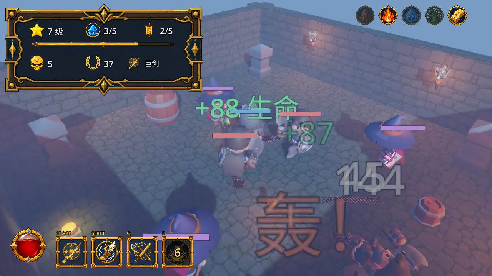
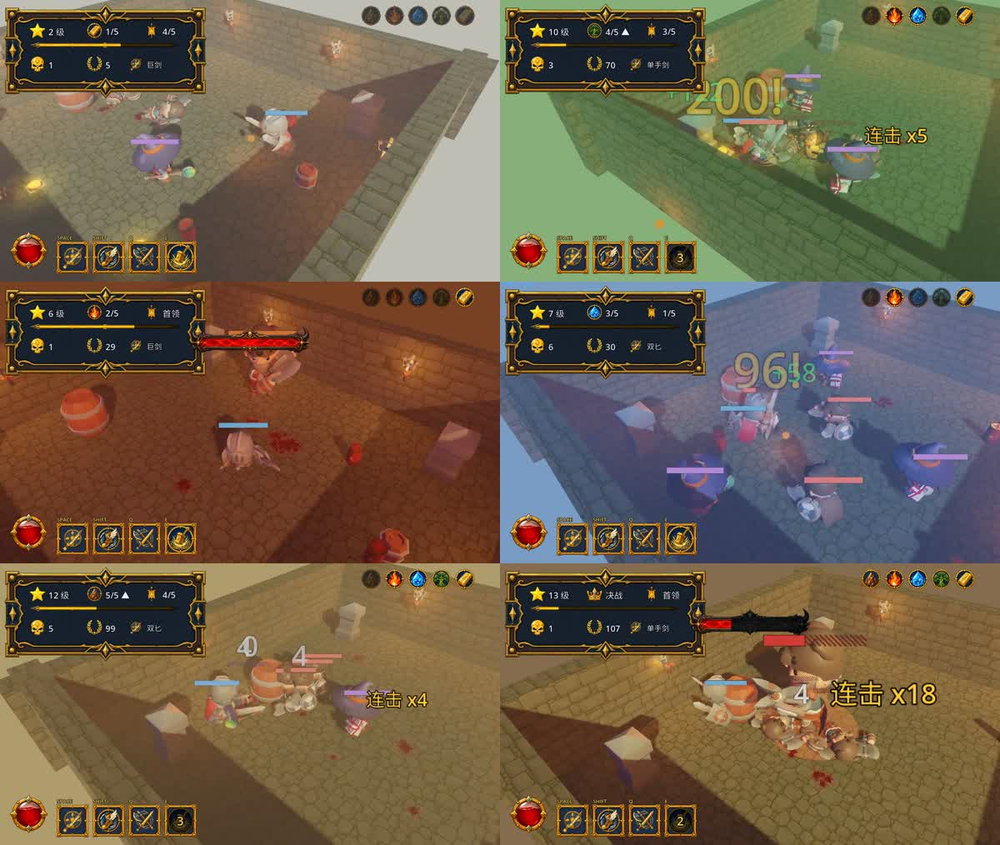
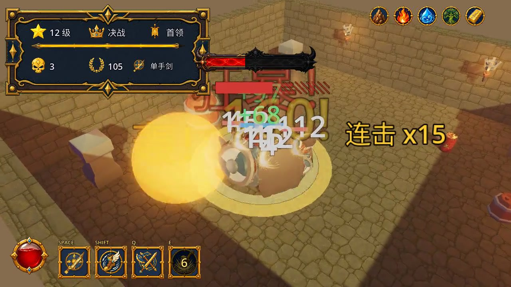
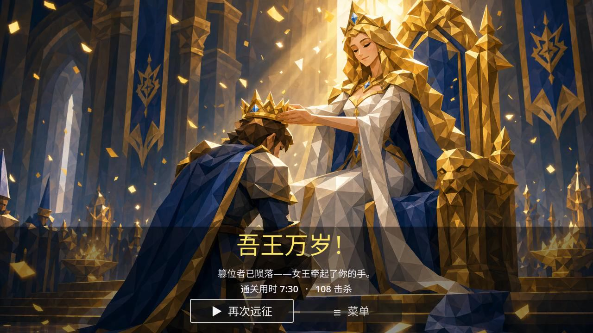

# 又烧 372 刀，我把那个 AI 做的 3D demo，逼成了能通关的真游戏

前两天我写过一篇：一句话，没给引擎手把手，我让 Claude 用 Godot 从零撸了个 3D 战斗游戏。一天，408 刀。

那篇的结尾，我是这么收的：**「408 刀买个 demo。品味，还得自带。」**

因为它当时交出来的，是个能跑、但一眼就能挑出五宗罪的半成品——敌人只有「贴上去砍」一句话的智商、打光平得像证件照、相机死死怼着道具、打击没汁水、连视频都是机器人代打的。

这话撂出去，我心里其实有点不服……

于是这回，我把它打回去重做。不是修 bug，是把那缺的 5%——**品味**——一点点喂回给它。

又搭进去一天多、372 刀。它长成了下面这样。

> 📺 文末有一整关的真实游戏视频（金之秘境，71 秒，从刷怪打到 Boss）。先提醒一句，我是个诚实的人：视频里那个操作行云流水的战士，还是**脚本机器人**在打——这事儿后面还得说。

## 01 先说结论：它现在是个能从头打到通关的游戏了

上一版是个**无尽刷怪竞技场**：一个场景，一波比一波猛，打到死为止。没有开头，没有结尾，玩到第 5 波就腻。

这一版，它变成了一个有名有姓的东西——**《五行王座》**。

一次完整的远征长这样：

> 你要闯过 **金、木、水、火、土** 五座元素秘境。每关 4 波小怪 + 第 5 波元素 Boss，打死 Boss 必掉一颗**元素结晶**，拾取点亮 HUD 右上角的五行槽位。集齐五行，才能开启最终的**王座之门**，单挑两阶段的**篡位魔王**。赢了，女王登场，加冕：**「吾王万岁」**。

看这张图就够了：这是同一套竞技场代码，靠换灯光、雾色、地面染色、敌人构成，硬生生抠出了 6 种完全不同的氛围（右上角那排五行槽位也在一关关地亮起来）。

还记得我上次骂它「打光平得像证件照」吗？现在金关是冷白金光、火关是暗红火把、水关是靛蓝冷雾、木关是暖绿、土关是土黄尘雾……**每一关的光，是不一样的。**这正是上一版最扎眼的破绽，它这回自己补上了。

## 02 Boss 学会了「摆招式」

上一版我给它判过一条死刑：*敌人 AI 只有一句话智商——「拉近距离，按冷却挥砍」。* 每个怪都是个追踪导弹。

杂兵到现在……其实还是导弹（笑）。但 **Boss 不一样了。**

这一版它给每个 Boss 拼了一套**预警型技能**（telegraph）：地上先亮一个红圈 / 黄圈，告诉你「这块马上要挨打」，给你留出翻滚闪避的窗口。

- 金关白虎：贴身「金刃旋风」；
- 水关术士：三连水弹 + 落点留一滩**减速水洼**；
- 火关狂战：跳劈落地留一圈**燃烧火环**；
- 土关巨汉：全场**环形震地波**，得靠翻滚的无敌帧穿过去；
- 最终魔王：血量约是普通 Boss 的 5 倍，**打到半血直接狂暴**——加速、连震地、还召唤俩精英来夹你。

而且这些机制，全是拿现有的积木拼的：一个通用的 `hazard_zone.gd`（进去就持续掉血 / 减速的地面区域）、`telegraph` 红圈预警、火球改个色、召唤复用刷怪函数。它没有给每个 Boss 都写一坨新代码，而是**把已有的东西重新排列组合**。这个工程直觉，说实话比我预期的好。

## 03 还有个我没想到它会去碰的东西：相生相克

光有五关还不够，它给这游戏又塞了一层**策略**。

五行相克：金克木、木克土、土克水、水克火、火克金。你**手上攥着克制当前关卡的那个元素**时，对这一关全体敌人**增伤 25%**，HUD 上会亮一个「克制」标记。

所以每关打完，会升起两扇传送门让你二选一——**选门，就是在选顺序。**先打水拿到水元素，下一关挑火，火关就全程增伤……这是有讲究的。

一个「一句话让它做的战斗 demo」，迭代到后来，自己长出了 build 和路线规划。这一步，是我没安排的。

## 04 而且——这次它是真能下载了

上一版是个躺在我硬盘里的 demo。这一版，它把**发行**这摊活儿也顺手干了：

- **macOS + Windows 双端构建。**它写了 Godot 的导出预设，macOS 出**签名 + 公证**的 DMG，Windows 出单个内嵌 pck 的 exe。
- **一条 GitHub Actions 流水线。**打个 tag，CI 就自动在 mac / windows runner 上导出、签名、公证、发 Release。中间它还踩了一堆坑自己爬出来了：mac runner 磁盘不够、签名身份没导进去、`secrets` 不能写在 `if` 条件里……commit 记录里全是它跟 CI 搏斗的痕迹。
- **一个官网。**React + Vite + Tailwind，部署在 Cloudflare Pages，安装包走私有 R2 + Pages Functions 分发。首页还煞有介事地写着「40 秒看完五行远征」。
- 顺带还加了 **Xbox 手柄支持**（带自定义按键重绑定）、**中英双语**、一个**带真实进度条的开机 Splash**，以及一波**杀刷怪卡顿**的性能优化（模型对象池 + 管线预热，把切关时那 42ms 的卡顿磨掉了）。

从「一个能跑的场景」，到「一个能签名、能公证、能挂官网下载的东西」。这一步的跨度，可能比做游戏本身还大。

## 05 账单：从 408，到 779

老规矩，`cccost` 扫一遍日志，报账：

| | 上一篇（demo） | 现在（整个项目） |
|---|---|---|
| 花费 | 408 刀 | **779.65 刀** |
| 消息数 | ~769 条 | **2281 条** |
| 时间跨度 | 1 天 | 3 天 / 4 个会话 |
| cache-read | 2 亿 tokens | **8.2 亿 tokens** |
| 输出 | 83 万 tokens | **265 万 tokens** |

也就是说，把那个 demo 熬成现在这个能通关、能下载的样子，**又搭进去 372 刀。**

有意思的是花钱结构。上次我还挺得意地吹「全程 100% Opus，没舍得换小模型」。这次我没端着了——**Opus 4.8 和 Fable 5 混着用**，2281 条消息里，有 1474 条是丢给 Fable 5 干的。粗活让便宜点的模型顶，关键判断留给 Opus。

但真正的花钱大头，还是那 **8.2 亿的 cache-read**。这活儿越到后面上下文越长（`main.gd` 从上一版的 23KB，滚到了现在的 **70KB、2045 行**），它每一轮都要把这坨越滚越大的代码从头重读一遍才不迷糊。所以贵的从来不是它写的那点代码，是它**为了记住自己写过什么、一遍遍重读的那堆代码。**

## 06 那，这回的「品味」，它补齐了吗？

诚实讲：补了一大半，但没补完。

**补上的：**打光有情绪了（五关五种光）、Boss 有了会预警的招式、有了完整的开头-中段-结局的仪式感、甚至有了策略深度。这些恰恰是上一篇我列的缺口——它真的照着那张单子，一条条补了。

**还没补上的，我也不藏：**

- **相机还是不会转。**它学会了打击时「抖」一下（screenshake），但那个死死跟随、任由墙和桶怼在你面前的机位，还是老样子。
- **打击还是差点顿。**加了震屏，但没有**顿帧**（hitstop）——就是命中那一瞬间画面卡住零点几秒的那个「咔」。有它没它，是「打中了」和「打得爽」的区别。
- **视频……还是机器人打的。**你上面看到、文末即将看到的那段行云流水，依然是脚本 bot 驱动录的，不是我肉身在打。（这样能录得干净，但那份「手感」是编排出来的。我，是个诚实的人……）

## 07 所以

上一篇我才说：AI 能飞快给你一个能跑的东西，然后把「只有判断力才能修的那张清单」，原封不动递还给你。

这回它证明了另一半：**那张清单上的东西，是可以一条条喂回去的。**你嫌它打光平，它能给你五种光；你嫌它没结局，它能给你一整套加冕画面；你说它发不出去，它能给你签名公证 + 一个官网。

只不过，每往里喂一口品味，都是真金白银的 token。408 到 779，涨的这 372 刀，买的不是代码——是我上次那张「缺什么」的清单，被一条条划掉。

至于那最后一点点、连它自己都还没补上的顿帧和活相机……**下一篇，接着烧吧。**

> 📺 **真实游戏视频**（金之秘境一整关，71 秒）：`assets/3d-demo-v2/gameplay-realm.mp4`

◇ ◆ ◇

- 引擎：Godot 4 · 纯 GDScript（整座竞技场 + 五关，全在代码里生成）
- 美术：KayKit（角色 + 地牢）· Quaternius 动画 · 元素 / UI 图标 AI 生成 · 结局立绘 AI 生成——素材全 CC0 或自产
- 音频：ElevenLabs 音效 · MiniMax BGM（含 Boss 战曲 + 加冕号角）
- 发行：GitHub Actions 自动出 macOS（签名+公证 DMG）/ Windows 构建 · 官网 React+Vite+Tailwind 挂 Cloudflare Pages
- 成本：约 779 刀 / 3 天 / 4 个会话（Opus 4.8 + Fable 5，via cccost）
