# 1 小时 3 条路，我让 AI 交出了一套能直接进引擎的 2D 动作素材

起因很小：我手上有一张 Q 版小男孩的立绘，想让他动起来——待机、走路、跑步、攻击，四套横版 2D 素材，能直接丢进游戏引擎那种。

参照物我也有，是一张扒来的仙侠小人循环动画，512×512、63 帧、黑底：

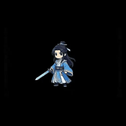

于是我扔给 Claude 一句话：**参考 demo，密钥在 .env，帮我生成类似 target 的游戏素材，角色参考这张图。**

这是我的角色，一张正面立绘，深蓝马甲 + 绿松石领结（记住这个领结，后面它是个雷）：

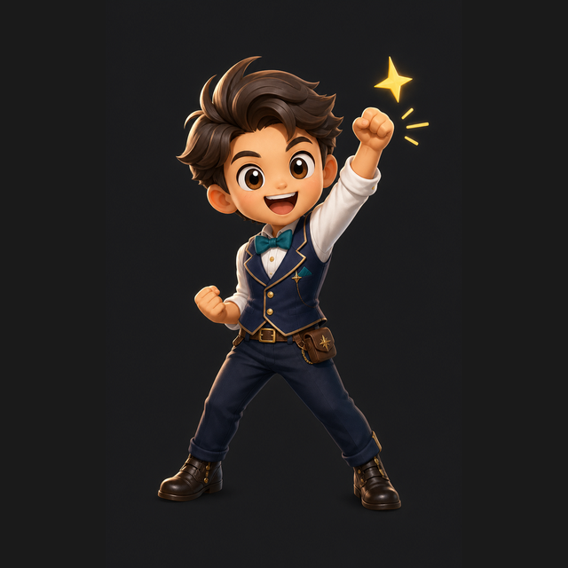

一个小时后我拿到了能用的素材。但中间换了三条技术路线，翻了两次车，还顺手把一个模型追杀了 417 次……

（照例声明：非商业练手项目，模型走的是火山方舟，角色图也是 AI 生成的。）

先看结论——同一个动作，三条路线并排跑，差距一眼就出来：

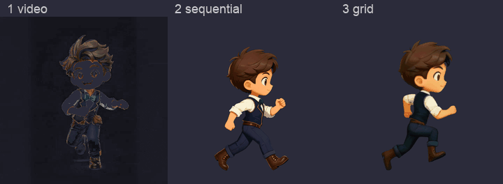

下面按时间线拆。

## 01 第一条路之，视频模型给我整了个「自己转身」

最直觉的做法：图生视频。给一张图，让模型脑补 5 秒动画，再抽帧打包。

Ark 的 `doubao-seedance-1-0-pro`，720p、5 秒、`--camerafixed true` 锁机位、关水印，出来的 mp4 用 ffmpeg 按 12fps 抽到 512×512，背景归一成纯黑，再按亮度阈值软抠一层 alpha，打包成动画 webp 和 10×6 的精灵表。

四个动作，十几分钟就全出来了，快得让我以为这事儿结了：

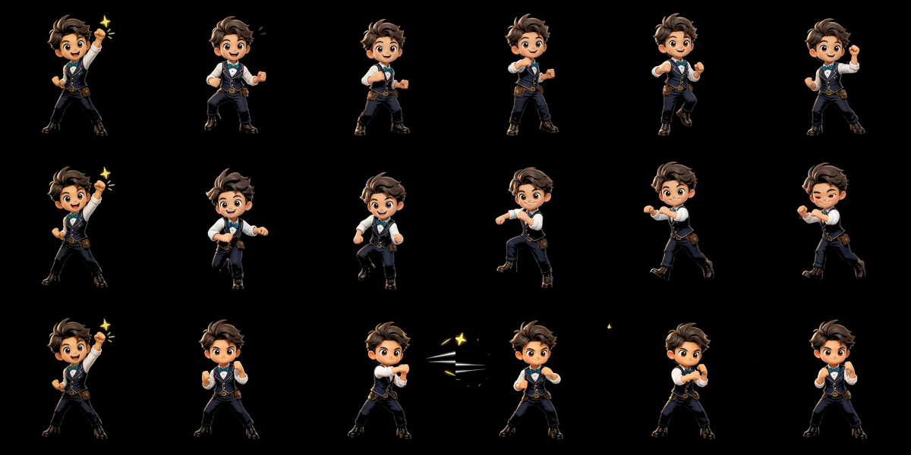

单看画质是真不错。待机这条甚至挺灵动，呼吸起伏、头发衣角轻摆、旁边那颗小星星还会一闪一闪：

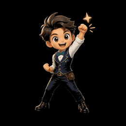

然后我打开跑步这条……


他自己转身了。

而且是**四分之三视角**朝着你跑，跑着跑着还往镜头前凑了一点，逐帧大小对不齐。前 12 帧还是从立绘那个「举拳欢呼」姿势硬切进步态的过渡帧，压根不属于循环内容。

我当时的反馈很简单：**作为 2D 游戏素材，人物的朝向就很有问题。**

问题的根在路线本身：**视频模型的目标函数是「看起来自然」**。自然，就意味着它会让角色转身、走近、飘移——这些在影视里叫演出，在 2D 素材里全叫废帧。`--camerafixed` 只锁镜头，锁不住角色。

调提示词救不回来。这是路线和需求打架，换路。

## 02 第二条路之，「逐帧出图」到底是逐哪个帧

换成图像模型。但「让图像模型逐帧出图」这句话，我一开始理解得也不对，这里值得掰开说说——因为它是整件事的题眼。

**视频模型**：你给一句「他在走路」，模型自己决定这 5 秒里发生什么，吐 120 帧连续画面。中间每一帧长什么样，你说了不算。

**图像模型逐帧**：你自己把走路拆成 8 个关键帧，逐条写清楚每一帧的姿势——

```
1 接触帧：右腿前伸脚跟触地，左腿在后，左臂前摆右臂后摆
2 下沉帧：重心压低，右脚全掌着地，身体最低
3 通过帧：左腿抬起经过支撑腿旁，身体升到最高
4 上升帧：左腿向前摆出，双臂交换摆动中
5~8 同上，左右腿互换
```

模型只负责把这 8 个**静止姿势**画出来。帧之间的关系由你的描述决定，不由模型推演。

（顺带一提，contact / down / pass / up 这四个相位左右各来一轮，是传统动画教科书里走路循环的标准拆法——这活儿人类动画师已经拆了一百年了，你只要把它抄给模型。）

还有个容易误会的点：**「逐帧」说的是逐帧描述，不是逐次调用。**

实际是**一次 API 调用出一整张 2048×1024 的大图**，里面并排画着 8 个姿势，我再用代码切开。这么干有两个好处：同一张图内部，模型天然会把 8 个角色画成同样的画风、同样的体型（分 8 次调用就各画各的，攒起来就花了）；以及，1 次调用 vs 8 次调用，钱包也开心。

更妙的是，这玩意儿的产物**本来就是精灵表**——游戏引擎要的就是「一张图里排着所有帧」。视频路线还得先转格式，中间那些「自然过渡帧」对游戏毫无用处。

## 03 立基准像之，模型顺手多送了我一张

第一步不是出动作，是**先把视角钉死**。

拿正面立绘去生成一张纯侧面站立像，绿幕底。结果模型贴心地给了我一张**正面 + 侧面的转身图**（turnaround）：

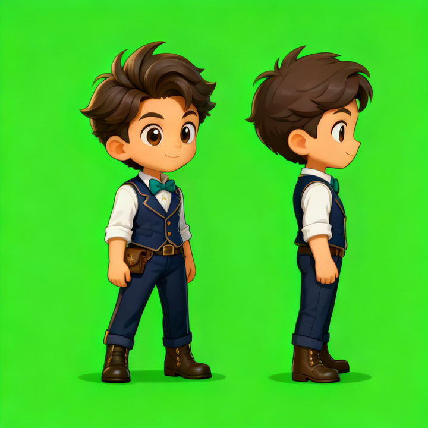

要的是右边那张。裁出来、洗干净，存成 `side_ref_clean.png`——**后面所有动作都以它为唯一基准**，角色一致性就锁死在这一步了。

然后我拿它直接出 8 格精灵表，结果……第 1 格给我怼成了大头特写，第 2 格又缩得只剩一点点，格与格之间还带着白边。

朝向是锁住了，**但尺寸和基线全在飘**。

## 04 关键一招之，给模型一个「空间锚点」

这是整件事的转折点，也是我觉得最值得拿出来讲的一招。

纯文字约束——「保持正侧面」「保持大小一致」「脚底对齐」——**模型基本不听**。你说得再狠，它该画特写还是画特写。

换个思路：**把约束画进参考图里。**

把那张侧面基准像，按**固定身高（格子高度的 78%）、固定脚底基线（92% 处）**，原样复制铺进 8 个格子，拼成一张模板：

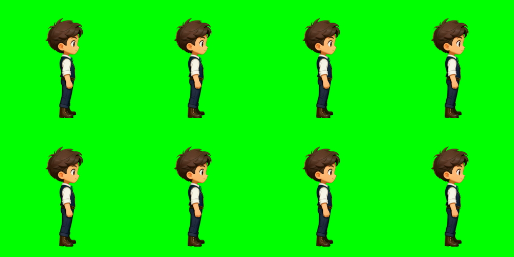

然后把**这张模板**当参考图喂回去，提示词改成一句话：**只改每一格里的姿势，其余一切不变。**

任务性质就变了。原来是「重新构图」，现在是「改姿势」——每格里已经摆好了一个朝向正确、大小正确的角色，模型只需要动动胳膊腿。

这回它听话了。

顺带说个副作用：绿幕这个选择其实有风险，我这角色戴着**绿松石领结**，色相要是再靠近一点就被抠没了。（后面会说更专业的做法。）

## 05 三个 bug 之，模型的不服从要用代码兜住

生成质量对了，但流水线还是接连翻车。三个真实的坑：

**坑一：模型压根没听我的 4×2。**

我要 4 列 2 行 8 格，它给我排了 **6 列 2 行 12 格**：

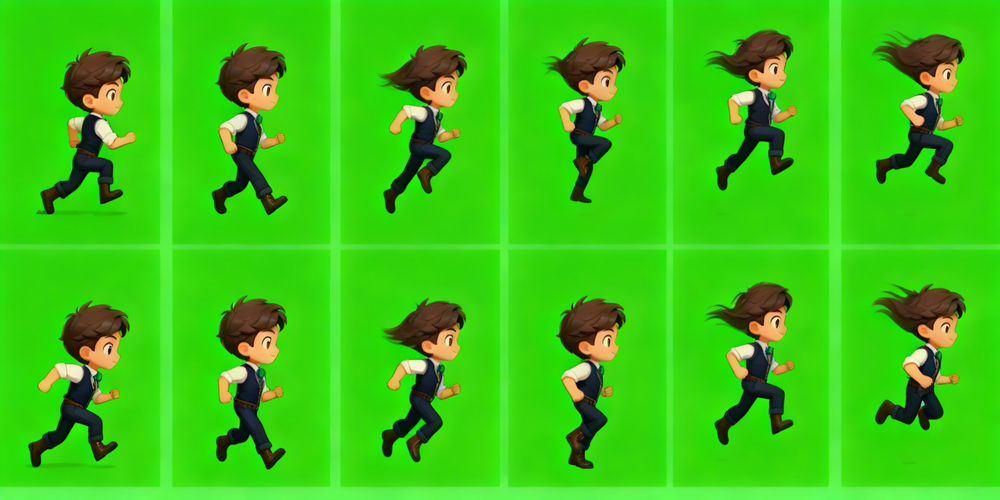

按格硬切，全切歪。

修法不是去说服模型，是**不再假设网格**：在 alpha 通道上做行列投影找连续段，自动定位每个角色的包围盒。模型爱排几列排几列，多于 8 个就等间隔抽 8 帧。

**坑二：抠图把脸打穿了。**

绿幕软抠的 alpha 是这么算的：绿色优势度 `d = G - max(R, B)`，然后 `alpha = (60 - d) * 255 // 45`。

跑出来的图，脸上和衣服上全是破洞。查了半天：`(60 - d) * 255` 这一步，`d` 取到 -129 的时候结果是 48195，**在 int16 里直接溢出翻负**，clip 成 0——于是肤色这类高饱和像素被判成了全透明。

改成 int32，收工。（一个 2026 年的 AI 项目，最后卡在整数溢出上，这很赛博朋克。）

**坑三：一团烟雾冒充了角色。**

攻击动作里，出拳会带特效。轮廓检测器老老实实把那团烟雾也识别成了一个「角色」，顶掉了真正的第 6 帧。

修法：按中位身高过滤，明显矮一大截的体块直接丢掉。

**还有一个是绕过去的，不算真修好**：待机那张图，模型在第 8 格把角色转回了正面（前面 7 格都对）。我加了一层帧序重映射，用呼吸的下沉帧当回程，凑满 8 帧循环——所以待机实际只有 7 个独立姿势。

（能不能重出？能。但那格是随机事件，我不想为 1/8 的概率再赌一次……）

最后还有个隐形英雄：**归一化**。整组帧用**同一个**缩放系数（以中位身高为准，这样步态本身的高低起伏被保留下来），只有偏离中位 20% 以上的异常帧才单独拉回，再统一对齐脚底基线、水平居中。

所以那套素材最终的一致性，**不是模型给的，是这一步算出来的。**

## 06 成品之，四个动作

四个动作，512×512、8 帧、10fps、带 alpha 透明通道，缩放和脚底基线完全对齐，朝左直接水平镜像：

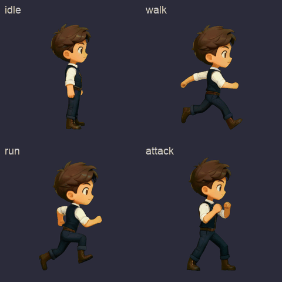

拆开看：

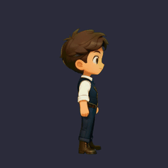
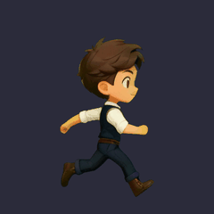
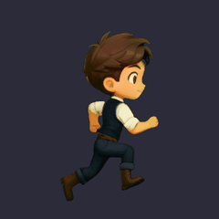
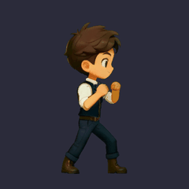

整套的接触表长这样，视角、缩放、基线三统一：

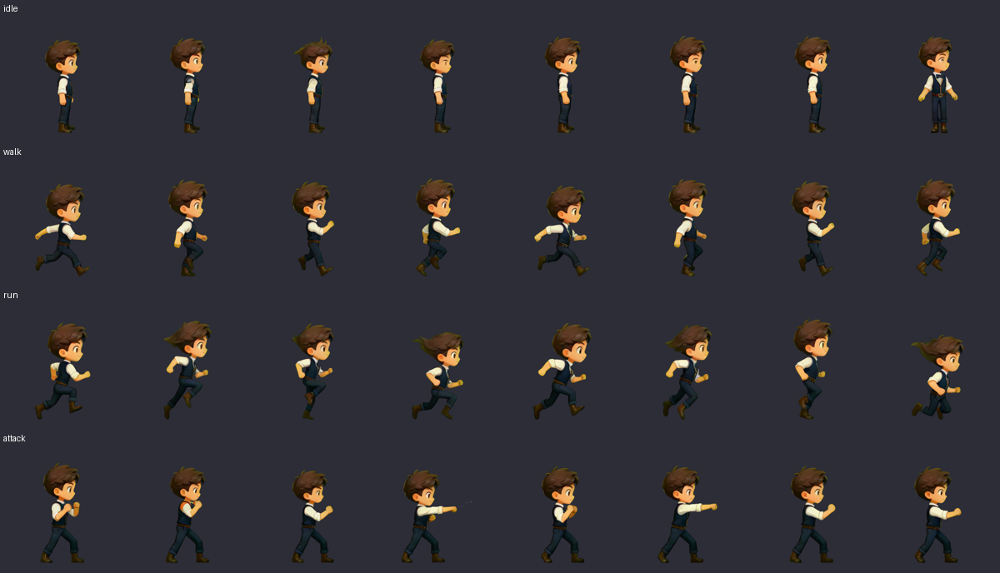

到这儿其实可以收工了。但我手贱……

## 07 第三条路之，「组图模式」听着更对，结果更差

seedream 5.0-lite 有个 `sequential_image_generation` 组图模式：一次请求返回 N 张**独立的图**。

听起来简直是为序列帧量身定做的，对吧？我让它出一版跑步。

（顺带记一笔踩 API 的坑：model id 得试出来，`doubao-seedream-5-0-lite` 加各种日期后缀全是 404，真正能用的是 `doubao-seedream-5-0-lite-260128`；`size` 不吃 `1K`，得传 `2K`；更好玩的是响应里 `model` 字段回的是 `doubao-seedream-5-0-260128`，lite 后缀在服务端被吃掉了。）

8 张独立图确实都出来了，视角也对。但看原始输出：

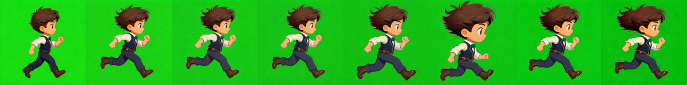

**缩放漂移。** 抠图后量了一下原始身高：

```
1733 → 1766 → 1778 → 1784 → 1848 → 1937 → 1819 → 1825
```

第 6 帧比第 1 帧大了 **12%**，头身比都跟着变了。

道理其实很直白：**分次生成没有共享的空间锚点**，每张各画各的。网格方案里 8 个角色躺在同一张画布上，模型天然会画一样大——这就是第 04 节那招真正值钱的地方。

**第二个问题更要命：姿势区分度不够。** 我明明写足了接触/压缩/蹬地/腾空四个相位，实际出来 8 帧里有 5 帧是几乎相同的跨步姿势，没有明显的腾空帧：

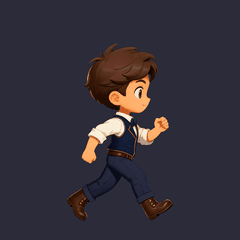

归一化管线能把尺寸拉回来，所以最终还能看，但代价是**步态真实的高低起伏被我的代码当成漂移抹平了**——播起来就是「滑步」。

结论：组图模式的强项是「一组相关但构图不同的图」——分镜、角色多视图、系列图标。恰恰不是「必须严格对齐的逐帧动画」。

## 08 插曲之，我把一个模型追杀了 417 次

中途我说：要不试试 Seedance 1.5-pro？

结果 `doubao-seedance-1-5-pro-251215` 返回 `NotFound`。换 `-251209`、`-251201`、`-260105`……全 `NotFound`。

我以为是没开通，去控制台一看：**已开通，还剩 200 万 tokens。**

那就是 id 猜错了。于是 Claude 干了件很轴的事：先找出一种**不会真正建任务**的探测方式（存在的模型返回 `InvalidParameter`，不存在的返回 `NotFound`，两种都不烧额度），然后从 2025-06-01 到 2026-07-22，**417 个日期后缀全扫了一遍**。

零命中。

最后是 `/api/v3/models` 把真相端出来的——清单里 `doubao-seedance-1-5-pro-251215` 赫然写着状态 **`Retiring`**。

**正在下线。** id 从头到尾就是对的，模型自己要退休了。（我花了半小时，追杀一个正在收拾东西准备离职的模型……）

顺带在那份清单里还捞到两条：Seedance 2.0 系列存在但未开通（报错从 `NotFound` 变成了 `ModelNotOpen`，反过来印证了探测方法是准的）；以及——

**`doubao-seedream-5-0-pro-260628`，不用开通，现在就能跑。**

## 09 最后一版之，只改了一行 model id

同一套网格模板、同一套提示词、同一套抠图归一化，`gen_sprites.py` 一个字没动，只把 `MODEL` 换成 5.0-pro，重跑跑步。

它**老老实实按 4×2 排了**：

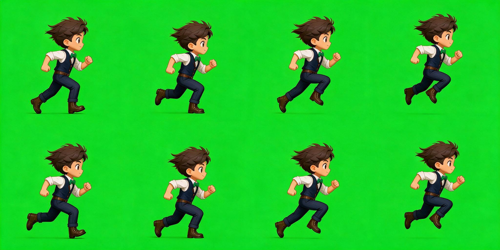

上下并排一看，差距挺明显：

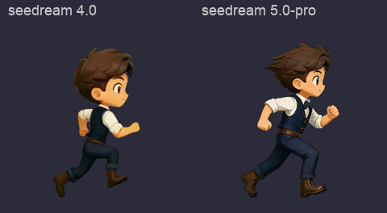

5.0-pro 赢在三点：

- **排版听话**。4.0 无视网格要求排 6×2，5.0-pro 一次到位——省掉轮廓检测那层兜底空转，帧序也更可控。
- **8 帧相位真的分开了**。接触、下沉、蹬地、腾空一眼能认出来，第 4、8 帧是明确的双脚离地腾空帧。4.0 那版腾空感偏弱，5.0-lite 组图那版更是 5 帧撞脸。
- **细节保真度更高**。绿松石领结、马甲扣子、腰带，在 8 帧里始终在（4.0 那版领结经常糊掉），头发的动态也更连贯。

代价也实在：**单张 0.22 元起，2048×1024 一张跑了约 90 秒，4.0 大概 30 秒。**

因为提示词和后处理全套没动，这个质量差距是**模型本身的**。

## 10 顺手对了个答案

折腾完我去搜了一圈，翻到 GitHub 上一个叫 [agent-sprite-forge](https://github.com/0x0funky/agent-sprite-forge) 的项目。

看完 README 我挺踏实的：**骨架跟我这套基本是同一路**——AI 出图 + 本地 Python 后处理（色度键抠图、抽帧、对齐、导出透明图、切片校验），依赖也一样是 Pillow / numpy / ffmpeg。说明这条路是**收敛的**，不是我瞎试出来的孤例。

它有一点比我做得好：色度键用的是**洋红（magenta）而不是绿色**。这个选择更专业——绿色会跟角色身上的绿色元素打架，而我这角色恰好戴着个绿松石领结（说了这是雷吧）。洋红在人物美术里几乎不出现，安全得多。这点我打算直接抄过来。

它也留了一条我踩过并放弃的路：图生视频再抽帧。README 自己都承认代价是 "softer pixels, possible identity drift, chroma fringe"——跟我第一版的结论一字不差。

## 收尾

一小时，三条路，两次翻车，一个整数溢出，和一次 417 连击的无效追杀。

最后能落地的那套方法，其实就一句话：

**AI 只负责画姿势，尺寸、朝向、基线这些工程约束，全部用代码兜住——别指望提示词，指望锚点和后处理。**

你说服不了模型，但你可以把约束**画进它的参考图里**。

◇ ◆ ◇

- 火山方舟 Seedream 5.0 lite API 参考：https://www.volcengine.com/docs/82379/1541523
- 火山方舟图生视频接口文档：https://console.volcengine.com/ark/region:cn-beijing/docs/82379/1520757
- agent-sprite-forge：https://github.com/0x0funky/agent-sprite-forge
