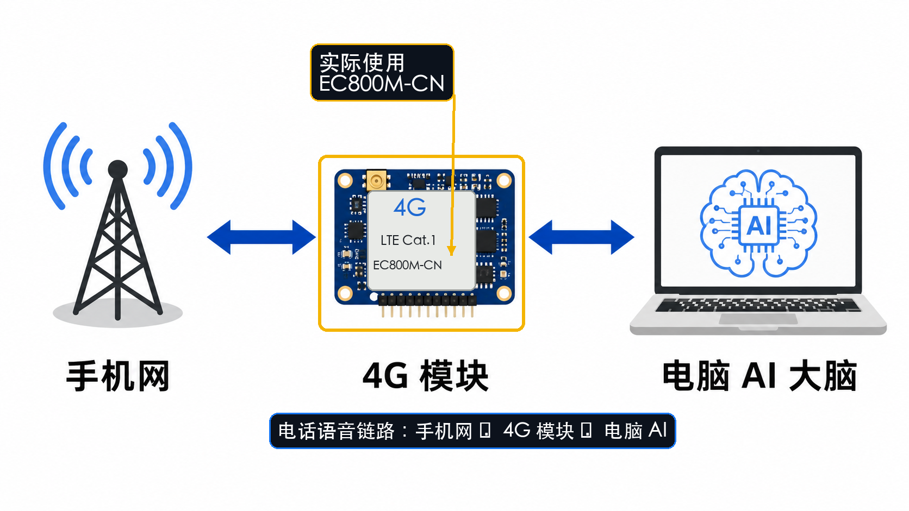
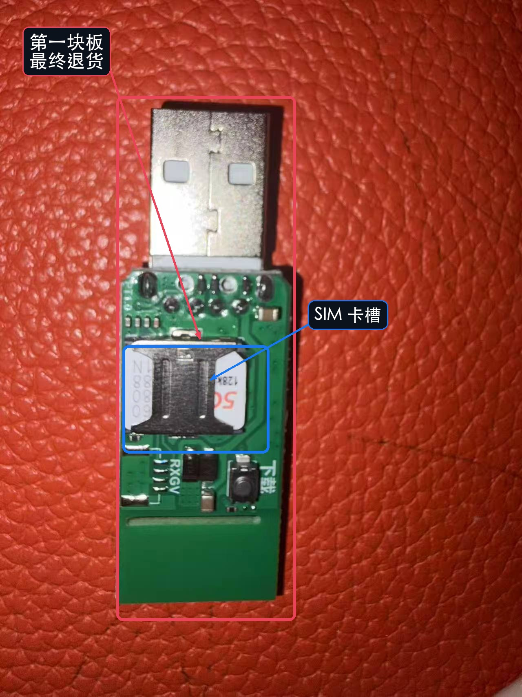
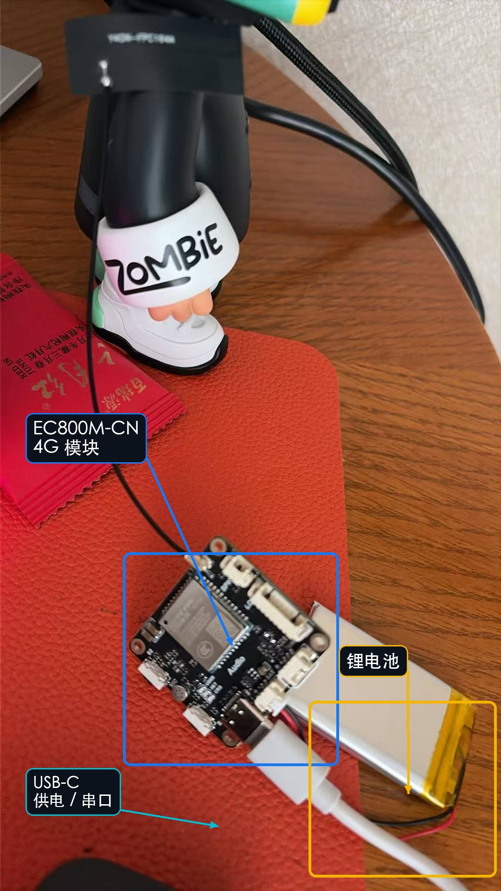
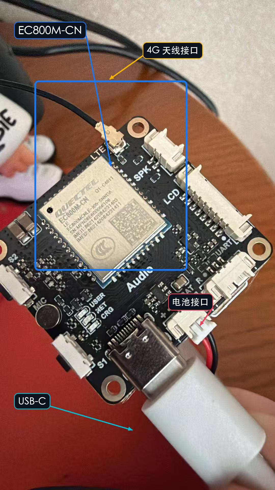
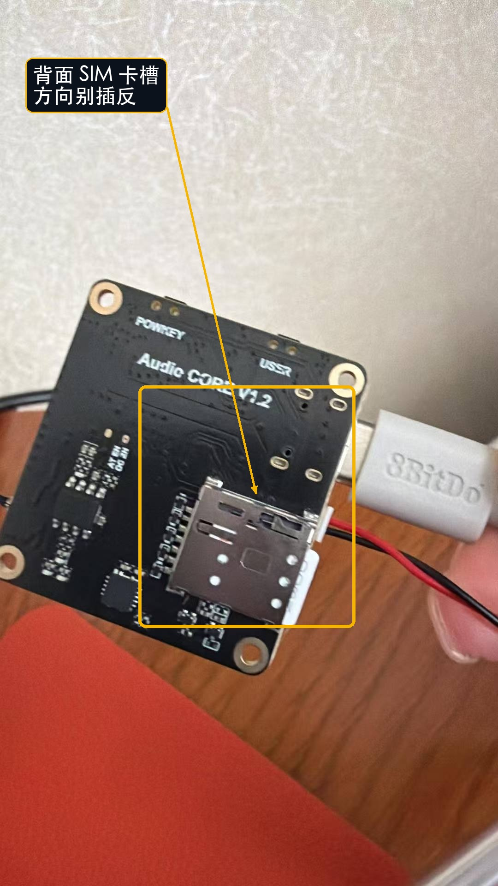
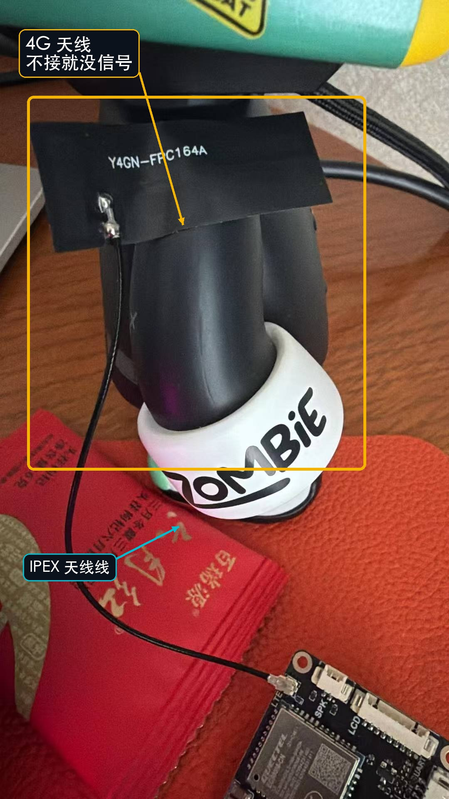
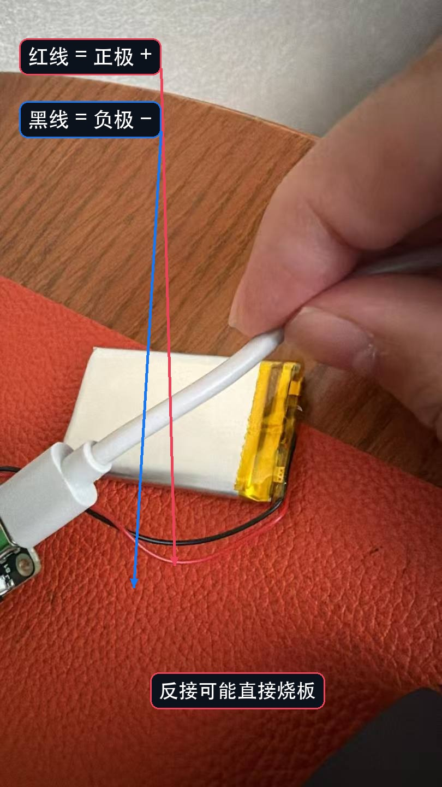
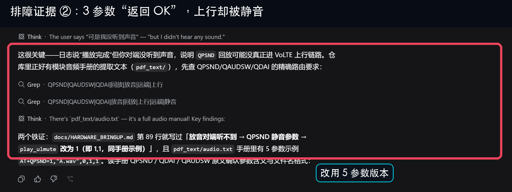
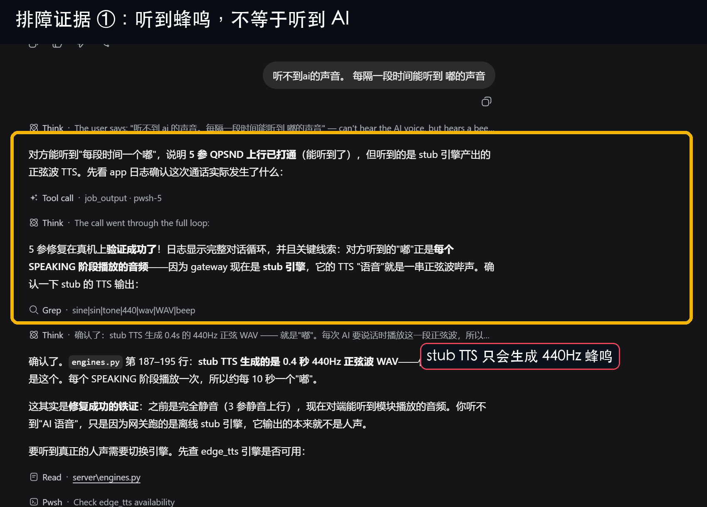

# 为了让 AI 替我接电话，我刷砖一块板子，折腾了整整一个月

我想让 AI 替我接电话、打电话。

不是那种「请按 1、请按 2」的录音菜单，而是电话那头真的能听懂人话、能回话的那种。

听起来不难吧？ASR、大模型、TTS 都有现成的，缺的无非就是把电话那头的声音接进 AI。

结果我折腾了整整一个月：退过一次货，刷砖过一块板子，换过固件、刷机工具、供电方式和音频命令……最后在某个深夜，电话那头终于传回 AI 的声音，我站在电脑前，差点像个老父亲一样哭出来。

这篇不讲宏大叙事，只记坑。准备入坑的朋友，能少踩一个算一个……

## 01 第一块板，直接被我刷砖了

第一块买的是度云 Air780EHV。

官网、论坛、客服发的工具，我挨个试；固件烧了十几次，中途还试过按住 BOOT、断电上电、拼手速的强制烧录。

最后工具报错，板子彻底不认了。客服远程折腾俩小时，只剩一句：「要不你寄回来我们看看。」

我没等。直接退货。

这一轮除了打击自信心，只留下一个教训：**买板子之前，先问清楚售后。客服解决不了问题的板子，价格再便宜都是负债。**

## 02 第二块板，我先让 AI 帮我把问题问对

这回我学乖了。先让 ChatGPT 把需求讲清楚，再拿着问题挨个找淘宝客服确认：

- 到底支不支持打电话？
- VoLTE 和音频是不是现成可用？
- 固件能不能拿到，刷机工具是什么？

最后定了移远 EC800M-CN：4G Cat 1 模块，官方资料和社区内容都相对多。我的路线也慢慢定下来——**模块专职打电话，电脑负责 ASR、LLM 和 TTS。**

理想很丰满。现实嘛……下面请欣赏我的连环踩坑表演。

## 03 硬件上电，全是「我以为」

板子插 USB，电脑不识别。我以为驱动不对，翻手册才发现：它喵的板子没开机。模块不是 U 盘，插上电不会自己醒，得按电源键。

SIM 卡也折腾了半天。卡槽在背面，方向还跟我直觉相反；客服让我「反着推进去试试」，一试果然就对了。

卡插上，没信号。继续翻手册——原来要装天线。我买的时候还心想「这么大根天线肯定自带吧」。并没有。带子和天线，是两码事。

装上天线，模块开机几秒又自动关机。原因是供电不够：射频一发射，电流猛窜，USB 那点电喂不饱它。插上配套锂电池才稳。

然后还有电池正负极……红接正、黑接负，反接可能直接烧板。听完我手心都出汗了。

这一串下来我悟了：搞硬件别跟面子较劲，客服、手册、AI 全用上。但前提是，你得知道该问什么。

## 04 软件才是真正的坑王

硬件跑通后，我天真地以为可以写代码了。还是太嫩了。

默认 AT 固件跑不通 VoLTE 音频：电话能接起来，两边却听不见，跟摆件一样。VoLTE 和音频在固件里是可选功能，出厂版本不一定给你开。

我又刷了论坛里摸到的 QuecPython 固件 `QPY_OCPU_V0005_EC800M_CNLE_FW`，电话还是不通。翻到手册深处才发现，有些固件并不公开，得单独找厂商申请。

论坛里也有人踩过同一个坑：[移远中文论坛：关于 EC800M 的 QuecPython 固件](https://forumschinese.quectel.com/t/topic/14135)

我找客服要 QuecPython 版，对方给我的却是 AT 的 VoLTE 固件。俩东西不是一回事，但我先认了：**先跑通一个 demo，比纠结路线优不优雅重要。**

接着刷机工具又给我上课：QPYcom 认 `.bin`，客服给的是 `.zip`；换成天生吃 zip 的 QFlash，终于刷进去了。

模块注册上网络、信号满格那一刻，我比中了彩票还高兴……

## 05 一个 `OK`，骗了我一整晚

固件能打电话后，最阴的坑来了：命令返回 `OK`，不代表对面真能听见。

播放 AI 语音进通话时，同一个命令有 3 参数和 5 参数两个版本。3 参数版本默认把上行静音了；模块照样回 `OK`，对面却一个字都听不见。

第一个晚上，我就是一遍遍对着空气放 AI 的声音，还以为是 AI 哑了……

改成 5 参数后，对面终于能听到声音。但先听见的并不是人声，而是每隔一阵「嘟」一下。继续查才发现，网关跑的还是 stub TTS：它只会生成 0.4 秒、440Hz 的正弦波蜂鸣。

这反而成了好消息：蜂鸣能过去，说明电话上行链路真的通了。再把 TTS 引擎换掉，人声才终于从听筒里出来。

## 06 Demo 活了，但 AI 还像只树懒

第一版链路终于闭环：模块接电话，录下对方的话传给电脑；ASR 转文字，大模型回答，TTS 再把声音送回通话。

能听，也能答。就是慢……一轮三四秒，隔着免提都能闻到一股 AI 味儿。

DeepSeek 帮我把延迟拆成三段：

- ASR 慢：换更快的接口，并针对电话的 8k 音质和底噪做适配；
- LLM 慢：限制输出、精简提示词，别让它想太多；
- 音频上传慢：改成分块上传，带 ack 确认，别整段堵在网里。

还有个不真跑一遍绝对想不到的坑：模块 UFS 里的录音，WAV 文件头长度字段有时是 0，下载后根本播不了，得自己把 WAV 头补回去。

<video src="assets/ai-phone-secretary/call-connected-proof.mp4" controls playsinline muted preload="metadata" poster="assets/ai-phone-secretary/call-connected-poster.jpg" style="width:100%;border:1px solid #e5e5e5;border-radius:8px"></video>

（原始录屏 166 秒，画面几乎静止，而且没收进通话音频；这里压成 8 秒，只保留「电话确实接通、计时器在走」这件事，不拿它冒充有声 demo。）

## 07 两个 AI 都不会主动「跳出来」

这一个月里，ChatGPT 和 DeepSeek 确实帮了大忙：一个帮我拆产品和技术路线，一个陪我把代码、日志和命令逐行焊上去。

但它们也有同一个要命的毛病：**只要前提错了，就会在错误的框架里无限优化。**

比如拿 QFlash 刷 `.bin`。工具都选错了，AI 却不会突然拍桌子说「别调参数了，换 QPYcom」；它只会继续换波特率、换端口、勾选项，一轮轮试到天荒地老。

再比如 demo 卡死。它会加日志、加重试、猜超时、猜编码，却很难自己退一步怀疑：会不会固件根本不支持这个功能？

前提错了，后面所有努力，都像是在给一栋已经塌掉的房子重新装修。

所以现在，只要 AI 在同一件事上反复失败几轮，我就会主动停下来问一句：

> 会不会是根本前提错了？

这句话，比任何 prompt 技巧都值钱。

## 08 现在能接能打，离「像人」还差一次打断

现在的 demo，能接、能打、能一问一答。

但真实电话聊天不是回合制。你说到一半，对方来一句「诶等等」，你得立刻闭嘴。我的版本还做不到：你说完它才接，中间还慢半拍。

下一步很明确：

1. 继续找合适的 QuecPython 固件，为流式链路做准备；
2. 把「录完再识别」改成「边说边识别」，继续压延迟；
3. 加 VAD 和半双工控制，让 AI 学会被打断，也学会听人说话时闭嘴。

从一块摆设一样的板子，到一个真的会在电话里开口的 AI，这一个月没白费。

**AI 很会解题，但题目是不是出错了，暂时还得人来盯着。**

◇ ◆ ◇

- 模块：移远 EC800M-CN
- 链路：手机网 ⇄ 4G 模块 ⇄ 电脑端 ASR / LLM / TTS
- 固件讨论：[移远中文论坛](https://forumschinese.quectel.com/t/topic/14135)
- 当前状态：能接、能打、能一问一答；流式音频和打断仍在计划中
