# 1289 刀，Claude 手搓了个 3D 送外卖游戏，跑完一天我再没敢催过单

上一期我让 Claude 手搓了个《星露谷》，这回换了个更接地气的活儿：**送外卖**。

不是那种 Q 版轻松小游戏——好赌的爸把家底输光、生病的妈药费一天比一天贵、走投无路借了 **10 万高利贷**，7 天里每天得还 **300 块利息**。你，一个骑旧电动车的闪送骑手，得在黄昏的三里屯把这钱跑出来。

> 📺 60 秒实机高光 + 3 分钟完整一天实录，都在博客原文：`lokiwang.com/journal/courier-godot-1289-dollars`（这不是我玩的，是它自己写脚本、用真实按键把一天跑了一遍）

照例声明：非商业学习复刻，美术音频全是 AI 生成或程序合成，没用任何现成资产。妹团、单王这些也都是玩梗，别对号入座。

跑完这一天，我把结论先撂这儿：**做这游戏花了我 1289 刀，但真正贵的，是我第一句话就把它做「穷」了。**

## 01 我的第一句话，就把这游戏做「穷」了

一开始它给的单价挺美——一单几十上百。我看了一眼，打了这么一句：

> 你这个单价跟实际情况差别太大了，一般一个单子也就几块钱。然后东西的重量会影响车子的速度。路上还有红绿灯，闯红灯有一定概率被警察抓住罚款。

就这一句，把一个「爽游」按回了地面。基础价我让它压到 **¥4 起步**，每米加几分钱，一单也就 **3 到 12 块**。

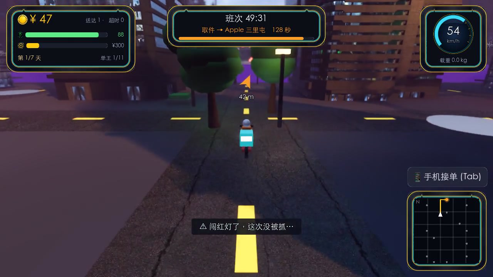

从这句话起，它就不是个游戏了，是面镜子。

## 02 讨债的日子：一个人为什么要玩命跑单

我又给它加了背景故事。开局这块牌子，是它自己写的文案：

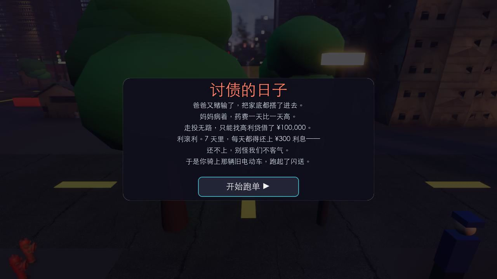

「利滚利，7 天里每天都得还上 ¥300 利息——还不上，别怪我们不客气。」

你没有喘息的余地。**当天凑不够 300，高利贷直接找上门，Game Over，从头再来。** 一单几块钱，一天要跑几十单——你现在知道那些在红灯前抢一秒的骑手，在抢什么了。

## 03 妹团接单：算算一单到底挣几块

右下角掏出手机，「妹团·抢单大厅」（对，美团的梗）弹出来。一次只能接一单，屏幕上明明白白写着：取送点、**距离**、**重量**、预估 ¥、时限。

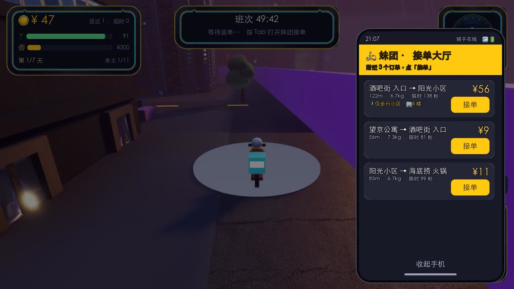

越重的货，把电动车压得越慢（8kg 直接掉到七折速度）。越远的单，给的钱多一点、时限也松一点。你得在「多接远单冲业绩」和「时限内送到」之间赌。

真实尺度、确定结算，一分钱都不糊弄。

## 04 红灯、警察、罚款 6 块——一单等于白跑

路口是有红绿灯的。绿灯放心冲，红灯……你懂的，赶时间的人谁看灯。

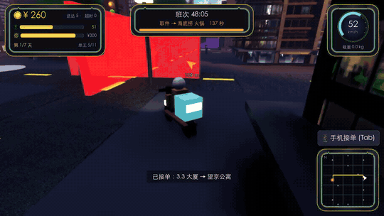

问题是路口蹲着警察。闯红灯 **35% 概率被抓**，附近有警察再 +40%。被抓一次，**罚 ¥6**。

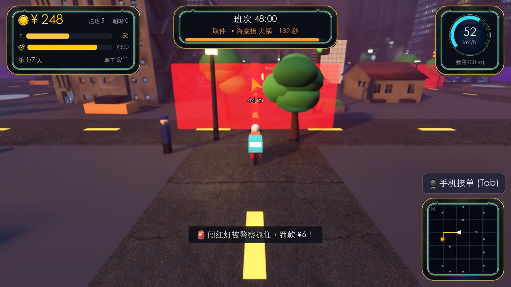

¥6 是什么概念？是你刚才辛辛苦苦送完的一整单。**罚一次，等于白跑一趟。** 但你还是会闯，因为时限在倒数。

## 05 体力见底，就会出车祸进医院

骑久了、送多了、冲刺多了，**体力**会掉。高于 60 满速跑；低于 20，每隔几秒就有 **25% 概率原地摔一跤**——冻结、扣时间，还得付 **¥5 医药费**，被送去医院重生。

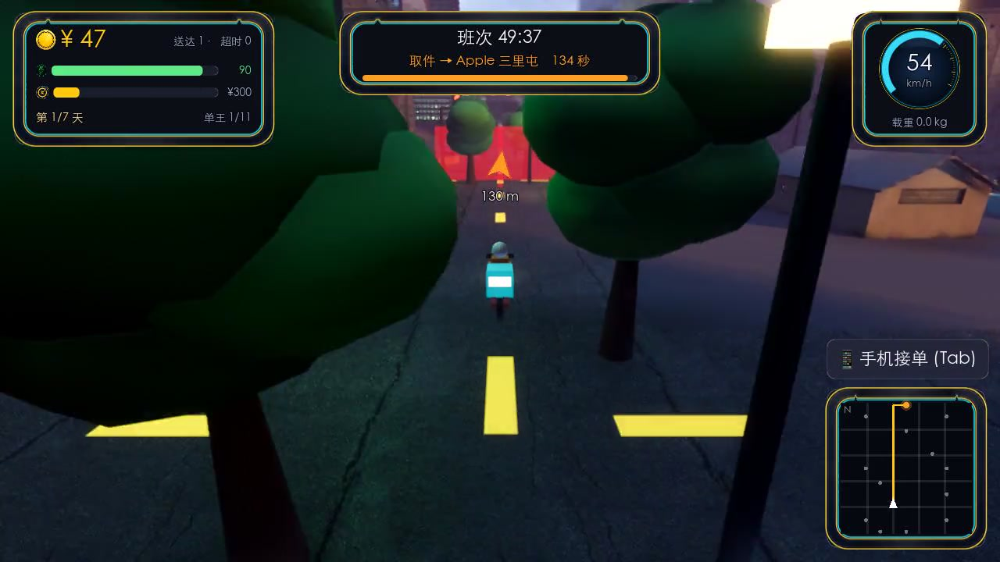

想歇？路边便利店能回体力，但吃口东西也要 ¥2。**在这游戏里，连喘口气都是花钱的。**

## 06 送到 6 楼：下车、步行、挤电梯

有些单不是骑到楼下就完事的。**只能步行的小区、要上楼的单元楼**——门口得下车，切成一个小人，WASD 走进去。

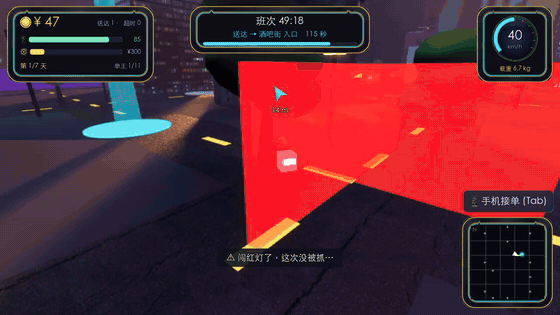

到了单元楼底下，还得挤电梯，一层一层往上爬。

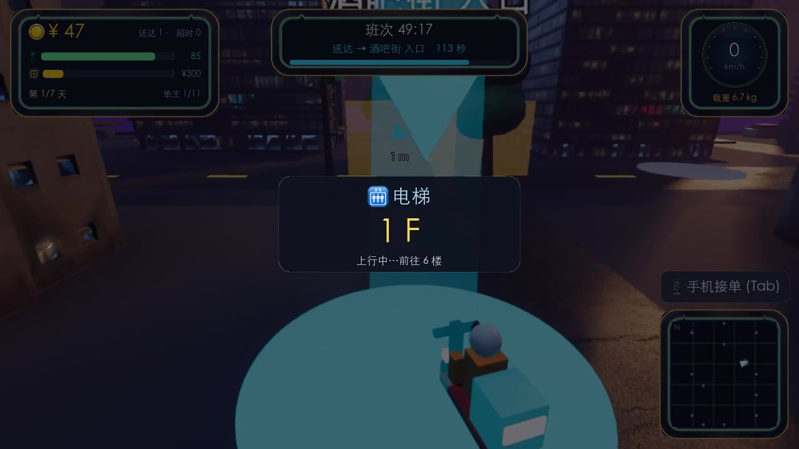

上楼单会多给点溢价（每层 ¥4），可那点钱，换的是你爬楼梯、等电梯、跑断腿的时间。谁都知道不划算，但单子就在那儿。

## 07 「小哥辛苦啦」——当面交付那一下

到了门口触发**当面交付**。收货人（约 20% 不在，得打电话）会说一句话，你从几个回复里挑一个——**你说什么话、有没有准时，决定评价星级和小费。**

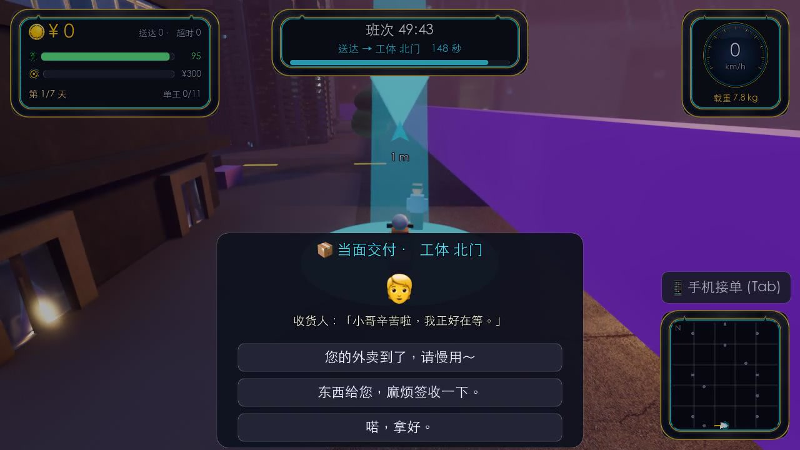

准时 + 一句「您的外卖到了，请慢用～」，好评 ★★★，+¥3 小费。超时了对方甩你一句「怎么这么慢」，你要是回「爱要不要」——差评，一分不给。

就是这几句破对白，让我在屏幕前莫名其妙地……客气了起来。

## 08 收工：跑了 7 单 348，光罚款就 30

天黑了要开车灯，班次时间一到，收工结算。看一眼这张成绩单：

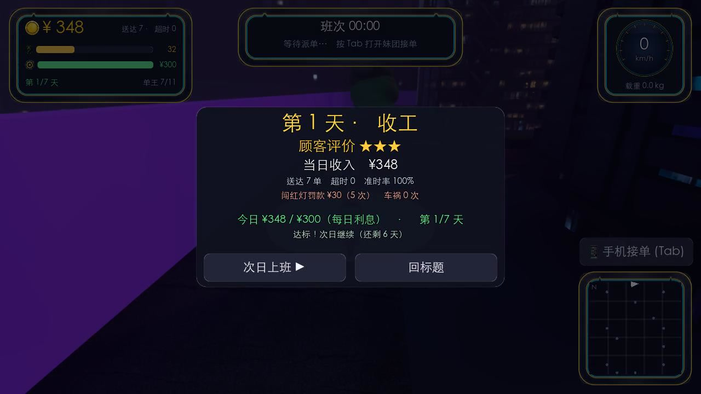

跑了整整一天，**7 单，收入 ¥348**。刚够还今天的 300，还剩 48。可你看那行小字——**闯红灯罚了 ¥30，5 次。** 等于白送了 5 单。

哦对，全区当天单量最多的还有个「单王 +¥50」的奖励。跑到腿软争第一，奖 50 块。**这就是「单王日记」这名字的由来，也是它最扎心的地方。**

## 09 做这游戏，最难的居然是「导航」

聊回开发。你以为最难的是画质？我确实问过它「画质能不能做到蜘蛛侠那种水平」，最后靠 CC0 的 HDRI 天空 + PBR 路面 + 程序化窗户 shader + 体积雾，黄昏霓虹的味道是出来了。

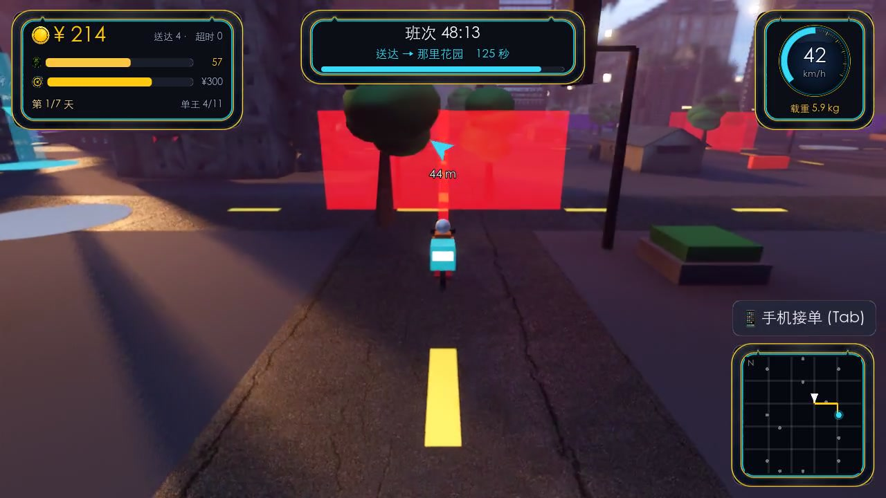

真正把我俩磨了大半天的，是**导航**。我前前后后报了五六次 bug：「路径规划有问题」「还是有 bug」「你的导航系统还是有严重的 bug」——直到我实在没忍住：

> 你先用 A* 把路线规划好了再跑？

A* 路网导航一上，路终于走对了。中间镜头还老卡住（我截了张图甩给它「这里镜头没跟着」「望京公寓那单又卡了」），也是修了好几轮。**AI 写业务逻辑飞快，可一到空间、导航、镜头这种「身体感」的东西，照样得人盯着。**

## 10 这一天，花了我 1289 刀

老规矩，`cccost` 拉一下账单：

- **总花费：$1289.28**
- 时间：2026-07-24 → 07-25，断断续续大半天
- 产出：Godot 4.6 的 3D 送快递游戏，~4500 行 GDScript、72 项断言测试、6 篇 ADR、Wing 全程治理、`wing check` 全绿

比上次的《星露谷》（503 刀）翻了一倍多。贵在哪？贵在导航反复重写、贵在一遍遍录视频、贵在把「真实」这两个字抠进每一个数值里。

---

我知道这只是个玩具。红灯是假的，罚款是假的，那个说「小哥辛苦啦」的人也是假的。

但当我为了凑够 300 块，在假的红灯前犹豫要不要闯、算着这一单值不值得爬 6 楼、被假警察罚了 6 块钱心疼半天的时候——

**我大概,懂了一点点他们的不易。**

下次那个真的小哥晚了十分钟，我不催了。

—— 完整两条实机视频在博客原文：`lokiwang.com/journal/courier-godot-1289-dollars`
