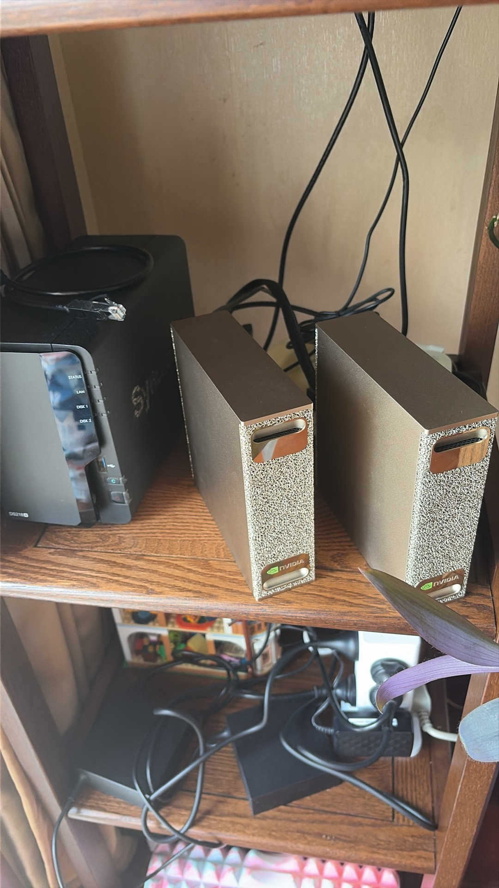
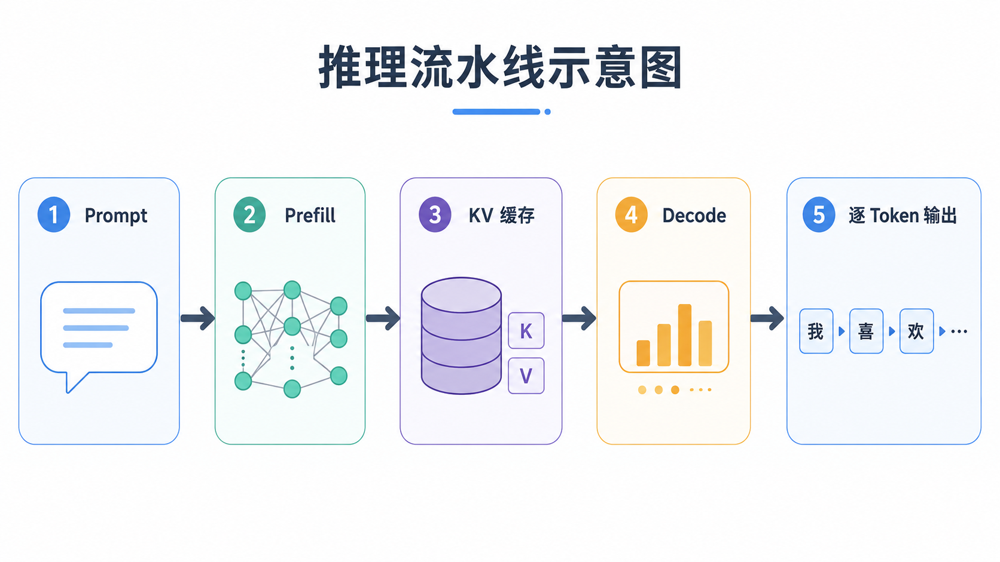
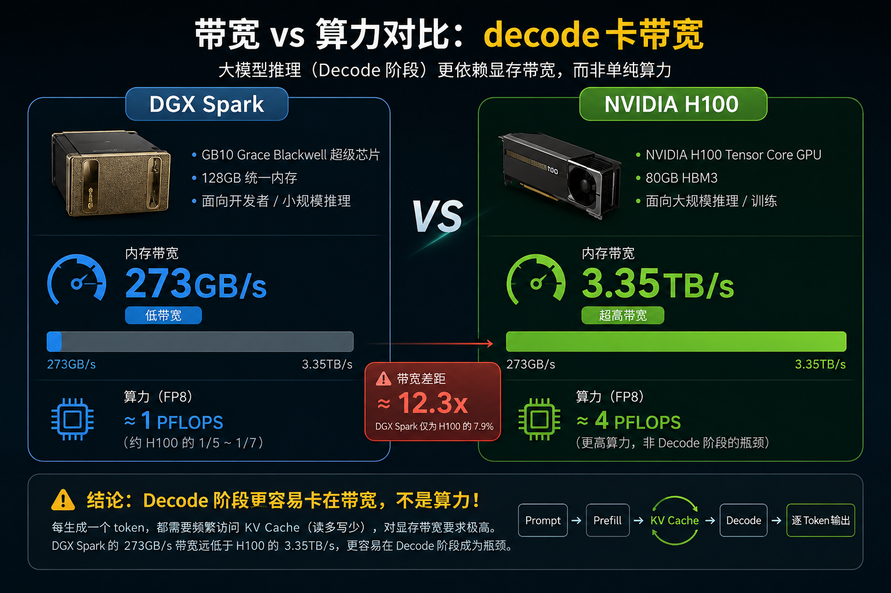
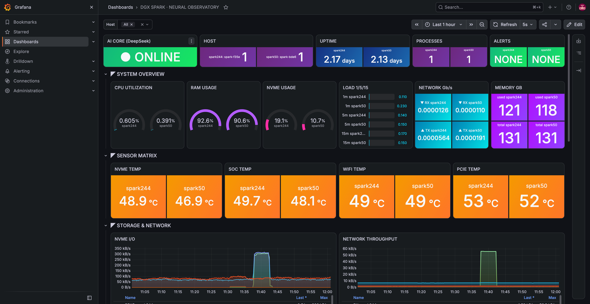

# DeepSeek 涨价那天，我把 284B 的大模型请回了家

8 月 17 日，DeepSeek 官方 API 换了价目表：高峰时段（9–12 点、14–18 点）价格直接翻倍，V4-Flash 输出从 4.5 涨到高峰 9 块/百万 tokens，V4-Pro 到 27 块，有媒体算过，最高涨幅 1100%。

我是刷到新闻才想起这事的。因为就在涨价前后，我家的机架上刚好多了两位「新成员」，已经在家白嫖自己的 DeepSeek 好多天了。


（右边两面 NVIDIA logo……对，就是这两位大爷。）

这篇说说我为什么涨了价反而更佛，284B 的模型怎么塞进两台桌面机，瓶颈到底卡在哪，以及为了能让它们凉快点儿我干的那些事。

## 01 token 自由之，涨价只是压垮骆驼的最后一根稻草

「token 自由」我以前爱讲限流：凌晨三点赶任务被 429、排队、断流，比花钱还难受。

现在的理由变了。

一是真涨价了。上面那串数字就是全部理由。高峰翻倍、V4-Pro 输出 27 块/百万、最高涨幅 1100%。我这种重度用户，thinking 长文一条就几万 token，9 块/百万的输出价，让 agent 全自动跑一天……这账我不敢细算。

二是隐私。代码、prompt、和 AI 说的每一个字，都是私货。云端再方便，也架不住「数据出了家门」心里那根刺。模型权重在自己设备里，数据不出门，才睡得着觉。

三是本地终于能跑了。以前家里那点硬件，顶多喂饱十几 B 的小模型；现在两台 Spark 拼一下（TP=2），284B 的 V4-Flash 直接在家落地，能力和云端同款。这一条其实才是买单的理由。

（本文没有恰饭，价格我一个字都没编。丸。）

## 02 为什么是「两台」之，284B 真的很大

先说结论：单台不够，两台才刚刚好。

DGX Spark 是 NVIDIA 的桌面级 AI 超算：GB10 芯片、128GB 统一内存（CPU/GPU 共享，这点很关键）、约 273GB/s 内存带宽、桌面功耗（插普通插座就能跑），官方说单机跑 200B 级模型没问题（量化后）。

但要跑的是 `deepseek-ai/DeepSeek-V4-Flash-0731`：

- 284B 总参数 / 13B 激活（MoE 混合专家），1024K 上下文；
- NVFP4 量化后整份权重也要约 159GB。

一台 Spark 只有 128GB 统一内存，装完权重，KV cache、激活值就没地方放了。只能上两台，张量并行（TP=2）把权重一分两半，每台扛一半，再腾地方给 KV 池。「两台」就是这么来的。

## 03 DS 推理之，一个字要跑完整座工厂

要理解优化，先得懂推理。一张图讲完：



- Prefill（预填充）：整段 prompt 一次性并行吃进去，算力密集，决定首 Token 要等多久（TTFT）；
- Decode（解码）：之后逐字生成，每一步都要把相关权重从内存读一遍，内存带宽密集；
- MLA：DeepSeek 把 KV 压成低维 latent 再存，不然 1M 上下的 KV cache 早就爆了；
- thinking 模式：先在不显示的区域「想」很久才给答案，这条对 token 的胃口有多大，你懂的。

MoE 还有个细节：路由网络给每个 token 选 top-k 个专家，只读被激活的那 13B 参数，所以它敢放桌面（284B 不用全读）。

## 04 瓶颈之，卡的不是算力，是带宽

网上装完就封神的帖子很多，真实瓶颈他们很少讲全：



- Spark 为了桌面化用了低功耗内存，带宽只有约 273GB/s，云上 H100 是 3.35TB/s 级别的 HBM，差十倍不止；
- decode 阶段每出一个 token 就要把激活权重读一遍，单机 decode 天生就是短板，卡的是带宽，不是算力（算力其实不弱，FP4 下有 PFLOPS 级）；
- 再叠两层：单台内存装不下 284B 权重加 KV，只能双机 TP=2，双机又要靠 RoCE/200Gb 网卡 + NCCL 做跨卡同步，网卡没调对，NCCL 起都起不来。

## 05 优化之，社区把坑一个个填平

理论上讲完，实践才是地狱。这份配方仓库（社区共建）把坑拆成了五层：

- 运维层：worker-first 启动顺序、双机同镜像同权重缓存、fail-closed 热修复工厂，起不来宁可失败，也不带病上线；
- 量化层：NVFP4 的 MLA KV cache 压到 4-bit，KV 池开出约 2.49M token，撑起 1M 上下文 + 6 并发；
- 提速层：MTP-5 概率式 DSpark（投机解码）小模型免费猜、大模型批量验；关掉 breakable CUDA 图，单流 +28.6%；Keys 并发补丁让真实并发不再崩；
- 调度层：长 prefill 排队切块（别让 decode 被饿死）、decode 公平调度、SWA 前缀缓存稀疏化；
- 质量层：编码器/thinking 各种 bug 修复，GSM8K 验收一致率 97.5%，没拿质量换速度。

说白了，能飞起来靠的是投机解码、NVFP4 量化，还有一堆补丁。

## 06 降温之，24 小时开机，温度才是真问题

两台 24 小时值班，我最在意的其实不是速度，是温度和噪音。

Spark 满载时默认会拼命 boost，社区里跑满载经常冲到 80 多度，求助帖一大片。我的做法很朴素：

```bash
nvidia-smi -lgc 2200
```

把 GPU 频率锁在 2200MHz。别心疼，decode 吃的是带宽不是频率，锁完实测速度几乎不掉。换来的是这张我自己搭的 Grafana 监控面板（名字很中二，叫 NEURAL OBSERVATORY）：



看中间那排 SENSOR MATRIX：NVMe 48.9/46.9°C、SoC 49.7/48.1°C、WiFi 49°C、PCIe 53/52°C。两台已经连续跑了 2 天多，稳得像台 NAS，深夜书房里几乎听不见它。

（RAM 那边 92% 看着吓人？那是 131GB 统一内存全用在刀刃上了，正常。左上角 CPU 0.6%……等 inference 的时候它才动。）

## 07 效果之，数字说话

这是我们现在跑的默认档（1M 上下文 / 6 并发）：

| 场景 | 效果 |
| --- | --- |
| 单路对话（任意 prompt 到 128K） | 62~96 token/s decode |
| 6 路并发短对话 | 约 160~191 token/s 聚合 |
| Prefill 吞吐 | 447 ~ 2,563 token/s |
| 上下文 / KV 池 | 1M 上限 / ~2.49M token |
| 900K 上下文实测 | 一次跑通 899,994 tokens |

对比一下：单台 Spark 跑同模型大概 35~52 token/s；两台 TP=2 加全套优化，单流摸到 96，六路并发 16x+ 吞吐。

日常重度使用完全够：单路体感流畅，六路 agent 并行起飞，1M 长上下文也敢喂，而且全程零 API 费用、数据不出门。

## 收尾

也说点让你别冲动下单的话。两台 Spark 本身不便宜，网卡、电费、噪音都要算；单流 60~90+ token/s 体感流畅，但远比不上云上 8×H100 集群；而且不是开箱即用，NCCL/RoCE、双机同镜像、一堆 hotfix，都得愿意啃日志。

涨价那天起我反而踏实了。至少 9 块/百万这个数字，暂时跟我没关系。

◇ ◆ ◇

- 部署配方：[MiaAI-Lab/DeepSeek-v4-Flash-DSpark-2x-DGX-Spark](https://github.com/MiaAI-Lab/DeepSeek-v4-Flash-DSpark-2x-DGX-Spark)
- 官方硬件配方（vLLM Recipes）：[DeepSeek-V4-Flash on DGX Spark ×2](https://recipes.vllm.ai/deepseek-ai/DeepSeek-V4-Flash?hardware=dgx_spark_gb10&features=tool_calling%2Creasoning&nodes=2)
- NVFP4 权重体积参考：[DeepSeek V4 Flash VRAM Requirements](https://willitrunai.com/models/deepseek-v4-flash)
- 社区并发放大版：[tonyd2wild/DeepSeek-v4-Flash-DSpark-60-tok-s-900K-ctx-2x-DGX-Spark](https://github.com/tonyd2wild/DeepSeek-v4-Flash-DSpark-60-tok-s-900K-ctx-2x-DGX-Spark)
- 涨价报道：[DeepSeek-V4 系列 API 正式调价：首创峰谷计费](https://www.techweb.com.cn/it/2026-08-17/2978269.shtml) / [峰时最高飙涨 1100%](https://finance.sina.cn/2026-08-17/detail-ininreap6933641.d.html)
- 社区降频降温参考：[Hitting 83°C under load, solved by clock-locking via nvidia-smi -lgc](https://dev.to/deal_estate_715bf4569d373/dgx-spark-hitting-83degc-under-sustained-ollama-load-solved-by-clock-locking-via-nvidia-smi-lgc-1pn6)
