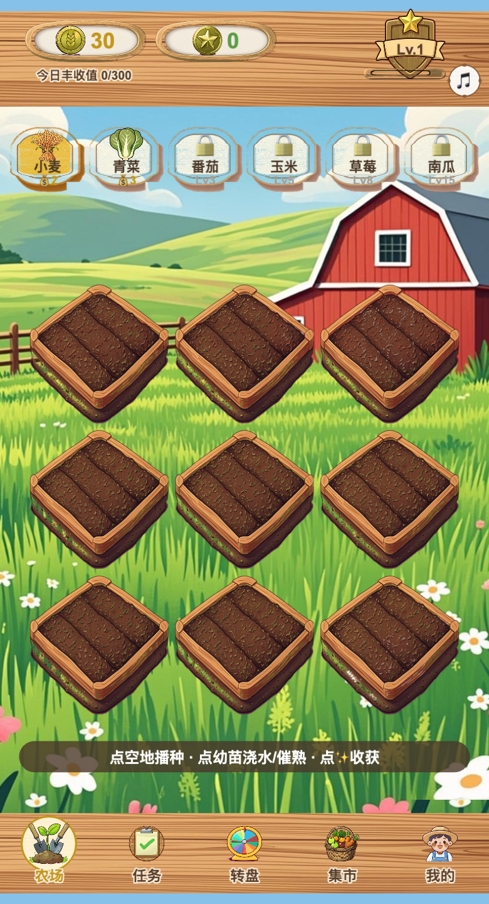
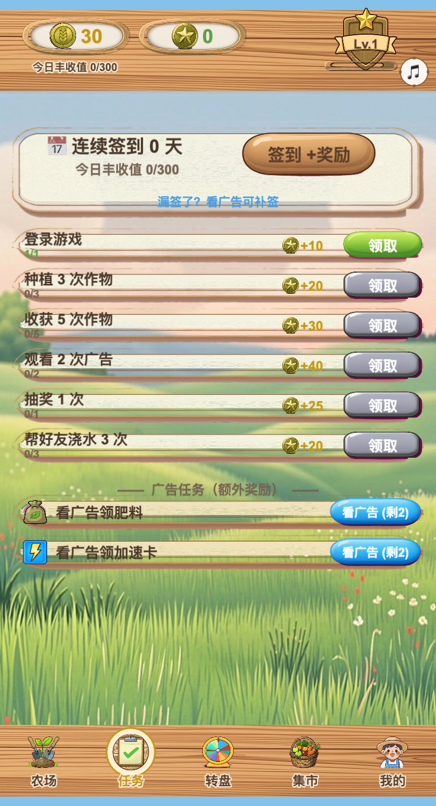
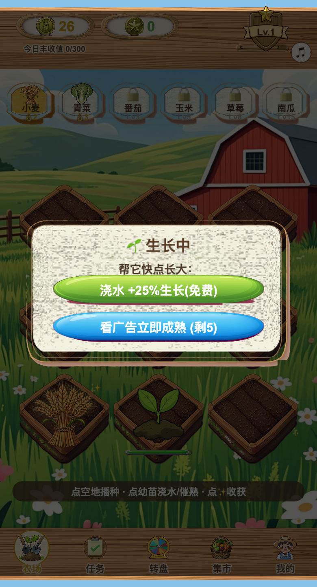
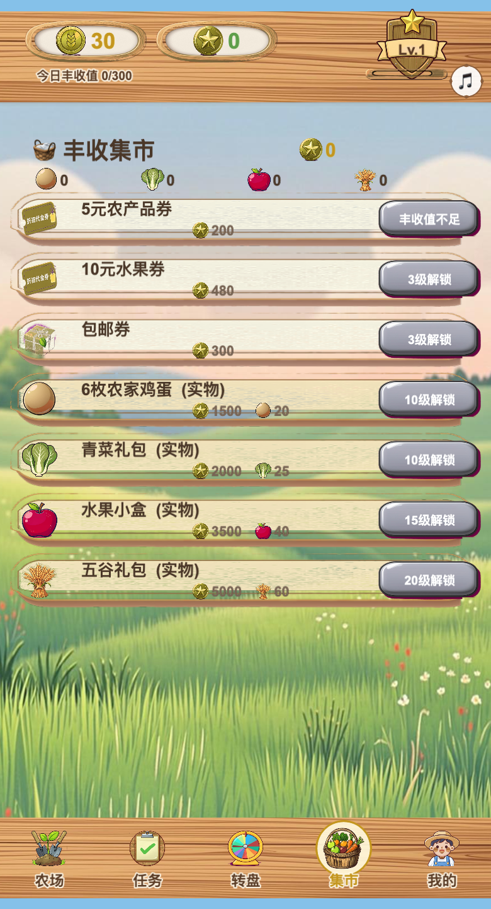
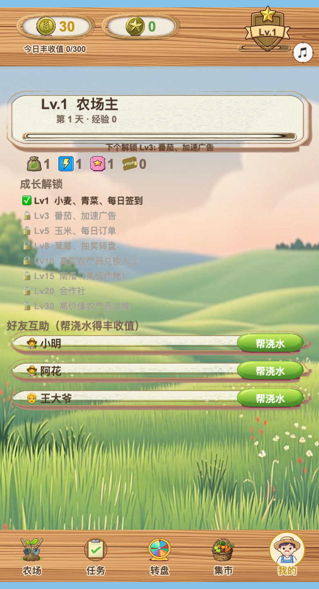
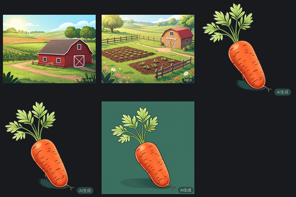

# 我花 880 刀让 AI 从零撸了个游戏，然后它做了个 der

前阵子我干了件事：不写一行代码，让 AI 从零给我做一个能上线的微信小游戏。

选题也很朴素——就那种你妈会在群里转发、点进去种菜、看广告催熟、攒积分换真鸡蛋的**农场小游戏**。玩法我不陌生，变现路子也清楚，是个特别适合拿来压 AI 的活儿：需求明确、边界清楚、还带一整套「种植→成长→看广告→收获→兑换」的闭环。

一个月后，它做出来了。真能跑，真能种，真能收。

然后我花了五分钟玩它，账单停在了 **880 刀**……

我沉默了。

## 01 先看卖家秀，是真的唬人

说实话，第一眼我是有点惊艳的。

你看上面这张图——木纹顶栏、金币和丰收值的牌匾、右上角那个等级盾牌、下面九块翻好的地、远处一栋红仓房、脚下还有小雏菊……**该有的都有**，一眼看过去像那么回事，甚至比某些外包做的还整齐。

点一下空地能播种，点幼苗能浇水，作物三段成长（土包→冒芽→成熟），收割还有音效，背景一直在放循环 BGM。整个 UI 切换是真的**唰**，60 帧稳稳的。

技术栈也不是玩具：Cocos Creator 3.8.8，直接出微信小游戏包。全套美术是 AI 生成的，BGM 是 AI 谱的，音效是本地合的，连那块木头 HUD 皮肤都是一张张抠出来的。

怎么讲，作为一个「我一行代码没写」的东西，这卖家秀，值这 880 刀吗？

**先别急。**

## 02 然后我玩了五分钟，der 在哪儿

买家秀来了。

我随手点开「任务」页，然后就笑了——

「观看 2 次广告 +40」「看广告领肥料」「看广告领加速卡」「漏签了？**看广告可补签**」……

再点「转盘」，好家伙：「免费抽奖 1 次」下面紧跟着一个蓝色大按钮——「**看广告抽奖（剩 3）**」。

回到农场点一棵苗，弹窗弹出来，两个按钮：「浇水 +25%（免费）」和「**看广告立即成熟（剩 5）**」。

你没看错，这游戏的核心循环，本质上就是**围着「看广告」这三个字转**。AI 把 PRD 里那张「广告位设计」表格，一字不差地翻译成了满屏的看广告按钮。

问题是……**广告根本没接**。这些「看广告」点下去，弹出来的是一个假的倒计时遮罩，转几秒，给你发奖励。真接微信得换成 `wx.createRewardedVideoAd`——那是后话了，现在它就是个**空壳**。一个把「变现」两个字刻进 DNA、却还没长出变现能力的空壳。

更绝的是那个「生长中」弹窗（上面那张图）。我想切去别的页看看，点弹窗外面——**关不掉**。它没有关闭按钮，也不响应点击遮罩。我实打实地卡在那个弹窗里，切不了 tab，只能在「浇水」和「看广告」里二选一。

（你细品，这个交互设计，是不是有点太懂广告主了……）

## 03 «真实农产品»，锁在你永远够不到的天边

农场游戏最勾人的钩子是啥？**能换真东西**。看广告攒积分，最后寄给你 6 枚农家鸡蛋——就冲这个，大爷大妈能种一年。

我满怀期待点开「集市」：

5 元农产品券——「丰收值不足」。
10 元水果券——「3 级解锁」。
6 枚农家鸡蛋——「**10 级解锁**」，还要 1500 丰收值 + 20 个鸡蛋碎片。
五谷礼包——「20 级解锁」，5000 丰收值 + 60 碎片。

而我，一个 1 级、丰收值 0 的新号，每天丰收值上限 300。你自己算算，到 10 级、攒够 1500 值和 20 碎片，得看多少个（还没接的）广告、种多少天菜。

这套数值不是 AI 拍脑袋编的——是我 PRD 里白纸黑字写的防刷规则：「新账号 7 天后才能兑换实物」「每月限兑 1 次」。AI 忠实地实现了。**忠实到把一款游戏最有诱惑力的部分，牢牢锁进了没有玩家能走到的未来。**

它执行得完美无缺。它就是没意识到，这么锁下来，这游戏一分钟的「爽」都没有了。

## 04 连好友都是假的

再点开「我的」。

「好友互助（帮浇水得丰收值）」，列了三个人：小明、阿花、王大爷。

我盯着「王大爷」看了三秒。

这仨是**写死在代码里的假人**。没有社交系统，没有微信好友链，没有任何一个活人。就仨硬编码的名字，配个默认头像，杵在那给你演一出「你有朋友」的戏。

成长解锁那一栏也一样：Lv3 番茄、Lv5 每日订单、Lv8 转盘、Lv10 真实兑换、Lv20 合作社……列得清清楚楚，规划得像模像样。可这背后没有一个「让你想玩到 Lv10」的理由。**它把游戏的骨架搭得一丝不苟，唯独忘了往里面塞一个灵魂。**

这就是我说的 der——不是它不能跑，是它**空**。像一栋精装修的样板间，家具齐全、灯光温馨，可你一推门就知道：没人住，也没法住。

## 05 硬核踩坑：这 880 刀，一半烧在了「抠图」上

聊点技术的，证明我是真动手了（也解释这钱到底怎么没的）。

美术是智谱 GLM-Image 出的，一路踩坑：

- **`--ref` 参数直接被无视。** 没法喂参考图，想让几十张素材画风统一，只能在每条 prompt 里**复读**同一段画风描述（色调、描边、光影……），靠复读机维持一致性。
- **每张图右下角焊死一个「AI生成」水印**，CLI 删不掉。你放大看转盘「金币 x120」那一格、集市那些代金券——**噪点和水印残留一清二楚**。要干净只能事后裁、或者换供应商。
- **抠图是场灾难。** 说好的绿幕，模型偏不给你纯绿背景，得先采样角落真实颜色再手动传 key。绿色蔬菜还会被绿幕一起抠掉，于是我改用品红 `#FF00FF` 当底色。棕色泥土呢？despill 一高就褪成灰绿，得死死压到 0.1……

引擎这边也没少受罪：

- Cocos 的九宫格（SLICED）会把窄按钮挤成尖尖的**「杏仁形」**，只能退回普通拉伸 sprite，那按钮美术就必须画成平边圆角矩形——**胶囊形一拉就变形**。
- headless 构建**只认 PNG 内容变化**，你改 meta 它装没看见，得把 PNG 重存一遍「骗」它重新导入。
- 场景 JSON 里那个压缩 uuid（cid）手改极脆，动一下场景就和脚本解绑，只能靠脚本生成。
- 拿无头浏览器截图验证，不加 `--enable-unsafe-swiftshader` 直接**白屏**——shader 编译挂了。

这些坑，AI 一个一个都踩过、也一个一个填上了。它是真能干活。**只是每填一个坑，都在烧我的 token。** 反复出图、反复改 UI、反复抠图对齐——880 刀，大头就烧在这种「看起来在推进、其实在原地打磨螺丝」的循环里。

## 06 所以，还没到它的 iPhone 时刻

我必须说句公道话：**这活儿，放三年前是不可想象的。**

一个人、一句话、一个月，零代码，产出一个技术栈完整、美术自洽、能出微信包、玩法闭环齐全的小游戏骨架。这已经是魔法了。AI 把「把一份 PRD 翻译成一个能跑的应用」这件事，做到了 95 分。

但游戏不是 PRD 的翻译题。

游戏要的是那 5%：核心循环好不好玩、数值爽不爽、手感有没有上瘾点、什么时候给你一个意料之外的惊喜——**那些让人放不下手机的东西**。而这 5%，恰恰是 AI 现在**完全没有概念**的部分。它能把「看广告立即成熟」这个按钮做得像素级完美，却不知道一款好游戏根本不该让你每一步都去看广告。

这让我想起 iPhone 之前的智能手机。

那时候的机器，参数一个不缺：能打电话、能上网、能装软件、能收邮件，功能表拉出来比 iPhone 还长。可你就是不想用——因为它「什么都有，就是不好用」。直到 iPhone 出来，不是加了多少功能，而是**突然好到你离不开**。

AI 做游戏，现在就卡在「iPhone 之前」这一格：**什么都有，就是不好玩。**

它的 iPhone 时刻，是某天你让它做个游戏，它交出来的不是一个功能齐全的骨架，而是一个你**忍不住想多玩两把**的东西。那一天会来。但至少这次，我这 880 刀买到的，是一个做工精良的 der——

以及一个特别踏实的结论：**AI 已经能帮你把游戏搭起来了，但「好玩」这两个字，暂时还得你自己教它。**

（王大爷，下次一定给你安排个真身。）

◇ ◆ ◇

- 引擎：Cocos Creator 3.8.8 → 微信小游戏
- 美术：智谱 GLM-Image ｜ BGM：MiniMax ｜ 全程 Claude Code 驱动
- 账单：约 880 USD / 一个月
