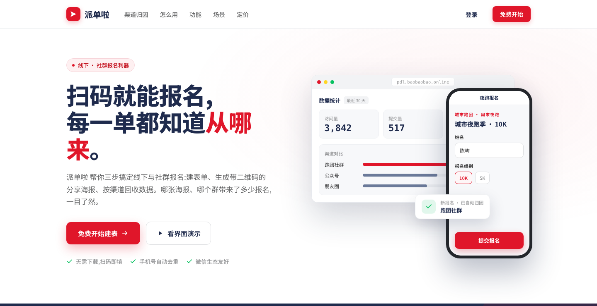
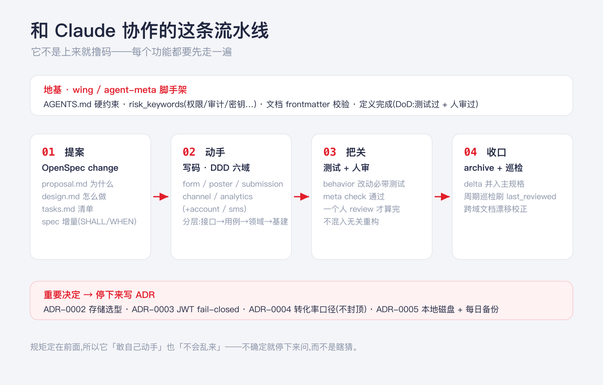
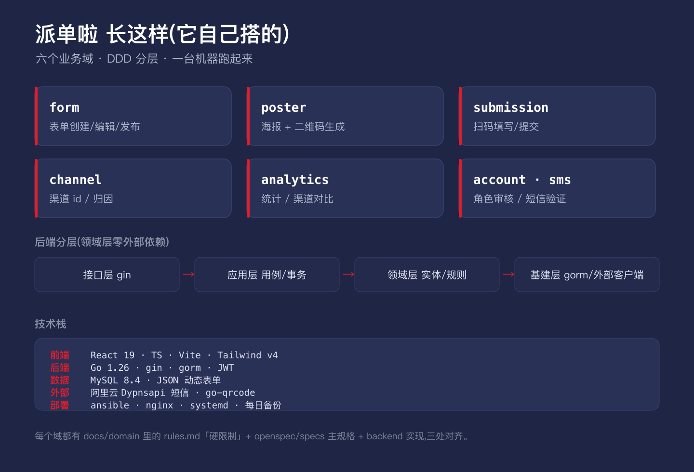
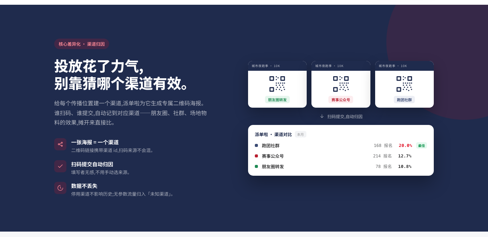
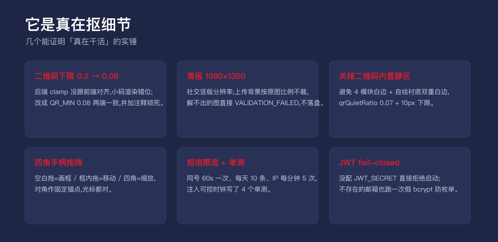
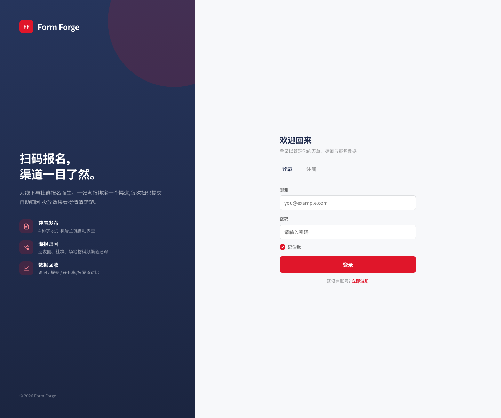
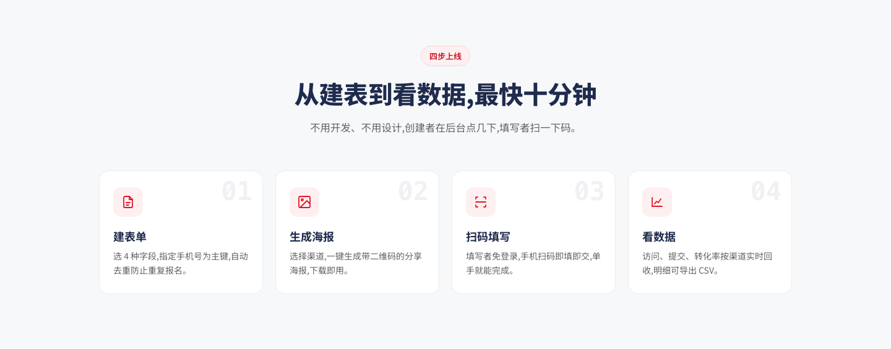
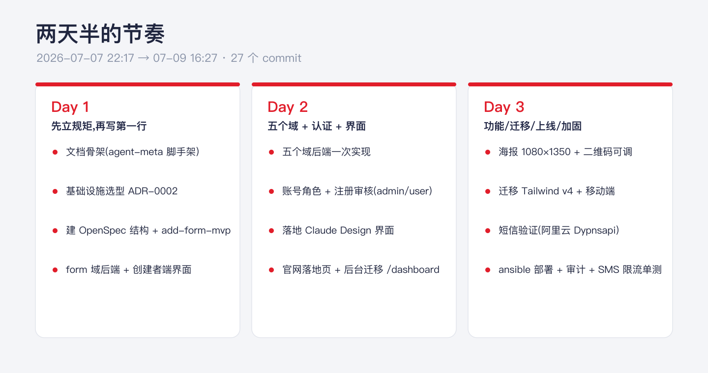

「Claude 能写代码」这事，现在已经没人惊讶了。

我好奇的是另一个问题：它能不能干**从零到上线**的完整活？——不是写个能跑的 demo 截图发朋友圈，而是选型、立规矩、分域、写测试、上线、加固，一条龙走完，做出一个真能给陌生人用的东西。

于是我挑了个真需求来压它：线下和社群报名，最烦的就是**不知道人是从哪来的**——哪张海报、哪个群、哪次投放带来的报名，全靠猜。我让 Claude 做一个专门解决这个的 SaaS，叫**派单啦**。

两天半之后，它上线了。而翻完整个过程，真正让我有点绷不住的，不是它写代码有多快……

## 01 先别写代码，先立规矩

大部分人（和大部分 AI）拿到需求第一反应是什么？开撸。

而它做的第一件事，是**先把规矩写下来**。

第一个 commit 不是代码，是「初始化文档骨架」——用 `wing` 拉起一套 agent 元数据脚手架：一份 `AGENTS.md` 写清楚「我是谁、不能碰什么、什么算做完」，还配了一串 `risk_keywords`（权限、审计、密钥、账单、租户……），凡是碰到这些词的改动就自动进高风险区。

里面有几条硬规矩我特别喜欢：

> - 「如果你在猜、在编，或者结论无法验证，**停下来问人**。」
> - 「改变对外可见行为，就得更新 OpenSpec 规格。」
> - 「行为改动必须带测试。」
> - 「完成的定义里有一条：**一个人 review 过**。」

你看，它不是把自己当个更快的打字机，是把自己当**一个要进团队的新人**——先读规矩，再动手。

## 02 OpenSpec：先说清楚要干嘛，再动手

每加一个功能，它都要先走一遍 **OpenSpec**。

一个功能 = 一个 change 目录，里面雷打不动四份东西：`proposal.md`（为什么做）、`design.md`（怎么做）、`tasks.md`（拆成带勾选框的清单）、还有一份用 `SHALL / WHEN / THEN` 写的规格增量。

说白了，就是逼着它**先写 PRD 再写码**。我数了下，光提案和归档的 change 就有一串：`add-form-mvp`、`add-auth`、`add-poster`、`add-sms-phone-verify`……做完一个，delta 规格并回主规格，change 归档到带日期的 archive 目录里。

好处是啥？我随时能看懂它在干嘛、干到哪了，而不是对着一坨它自己知道的代码干瞪眼。

## 03 六个域，一个个啃

规矩和规格立好，才轮到写码。而它是按**领域**切的，不是按文件夹随便堆。

六个业务域：`form`（建表）、`poster`（海报+二维码）、`submission`（扫码填写）、`channel`（渠道归因）、`analytics`（统计），外加 `account` 和 `sms`。每个域后端还严格分四层：接口 → 用例 → 领域 → 基建，**领域层零外部依赖**。

更狠的是三处对齐：每个域在 `docs/domain` 里有 rules.md 写「硬限制」，在 `openspec/specs` 里有主规格，在 `backend` 里有实现——三份，得对得上。

## 说回产品本身：一张海报 = 一个渠道

这里插一句产品，因为它是整件事的灵魂。

派单啦的核心就一件事：**渠道归因**。你给每个传播位置（朋友圈、跑团群、赛事公众号、场地物料）建一个渠道，它就生成一张**带专属二维码的海报**。谁扫了哪张码、提了哪个单，自动记到对应渠道——填写的人无感，不用手动选来源。

没带参数的流量也不会丢，进「未知渠道」。停用一个渠道，历史数据照样在。

摊开来，哪个群最能带人，一眼就看出来了。

## 04 重要决定，它会停下来写 ADR

碰到「这事得定个调、以后不能随便改」的决策，它不自作主张，写一份 **ADR**（架构决策记录）。

翻了几条，都挺有工程 sense：

- **ADR-0003｜JWT fail-closed**：没配 `JWT_SECRET` 就**直接拒绝启动**；登录时连不存在的邮箱也跑一次假 bcrypt 比对，防时序侧信道枚举。还顺手把之前那个明晃晃写着「可任意伪造、禁止生产」的临时鉴权占位删了。
- **ADR-0004｜转化率口径**：转化率 = 提交/访问，**故意不封顶到 100%**——大于 1 就说明有「没记录到访问的直接提交」，这个信号它宁可露出来。而且规定：口径一旦对用户展示就不能随便改，要改先写 ADR。
- **ADR-0005｜海报存本地磁盘 + 每日备份**：暂不上对象存储，如实把「同机、非异地、天级粒度」的取舍写清楚。

「不确定就停下来问、重要的就落成文档」——这份克制，是我在很多真人身上都没见到的。

## 05 真到细节，它是真在抠

要说最能证明「不是糊弄」的，是那些细节。随便挑几个实锤：

其中我印象最深的是那个二维码的 bug：后端给二维码尺寸设的下限（0.2）和前端（0.08）**没对齐**，导致小码在海报上渲染错位。它自己定位、把两端统一到 0.08，还在代码里加了行注释锁死——

> 「必须与前端 QRPlacer 的 MIN/MAX 保持一致，否则预览可拖到的尺寸与实际渲染不符。」

它知道这种「两处魔法数字要一致」的坑最容易复发，所以留了句话给未来。这个意识，很多人类工程师都没有……

## 06 界面：Claude Design 直接导出

界面这块，是把 **Claude Design** 里做的设计直接导进来当落地页，CTA 重写到 `/login`。登录页也是同一套设计语言——左边深色品牌、右边表单，「欢迎回来」。

说实话，这套红 + 藏蓝的视觉，比我自己瞎调半天要像样多了。

而整个产品的用法，它也在落地页里讲清楚了：从建表到看数据，**四步，最快十分钟**。

## 07 上线：一条命令

上线也没含糊。服务器上没 git、没 go，它就**本地交叉编译**（`CGO_ENABLED=0 GOOS=linux`，`-trimpath -s -w` 压体积），前端 `vite build`，再用一套 ansible playbook 把产物推上去：Go 静态二进制走 systemd，nginx 反代 `/api/`，前端静态托管 + SPA 兜底。

连每日备份都安排上了：systemd timer 每天 03:30 跑 `mysqldump` + 打包海报目录，滚动留 7 份。

## 08 收尾，它自己会「查漏」

最让我意外的是最后那几个 commit——**没人催，它自己在收尾**：

- 跑了一轮「周期性巡检」，校正跨域文档漂移、刷新 `last_reviewed`（它自己定的文档过期规则，自己去执行了）；
- 给管理员的审批操作加了**审计日志**（记操作人和目标，但特意不记邮箱密码这类 PII）；
- 给短信限流器**补了单测**——同号 60 秒一次、每天 10 条、IP 每分钟 5 次，还注入了个可控时钟写了 4 个 case。

写代码的人都知道，「功能能跑了」之后还愿意回头补测试、补审计、清文档的，是什么样的自觉……

## 09 两天半，27 个 commit

从 7 月 7 号晚上 10 点，到 7 月 9 号下午 4 点，27 个 commit，一个能上线、有鉴权、有渠道归因、有短信验证、有备份和审计的 SaaS 就跑起来了。

但你要问我这趟最大的收获是什么，**真不是「Claude 写代码快」**。

是它**有流程、有约束、会停下来问、会自己收尾**。它先立规矩再动手，重要决定落成 ADR，改行为就补测试，做完还等一个人来 review——它把自己当成一个**要对代码负责的团队成员**，而不是一个交差就跑的外包。

所以我的结论是：

**做一个能上线的 SaaS，Claude 早就不是「能不能」的问题了——问题是你有没有像带一个新人那样，先给它把规矩立好。**

产品我放下面了，扫一眼那个渠道归因，比我这干讲有感觉多了。

◇ ◆ ◇

派单啦已经上线了，微信里长按下面的二维码就能上手体验：

