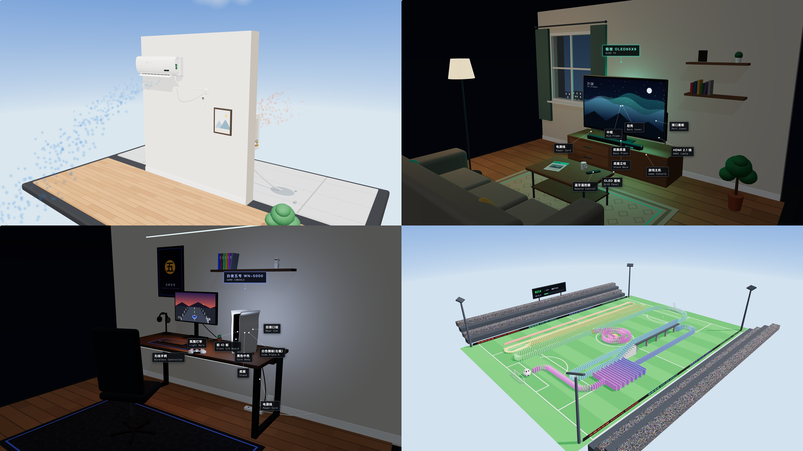
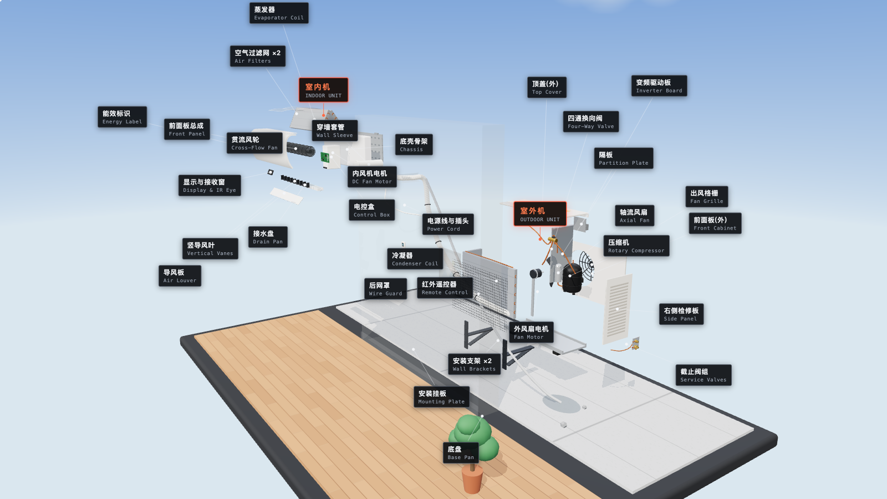
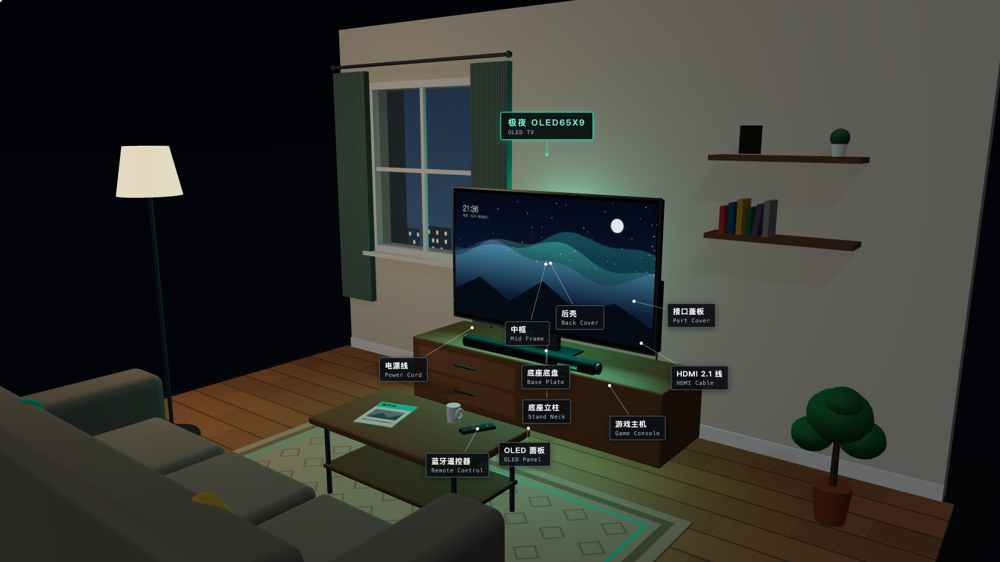
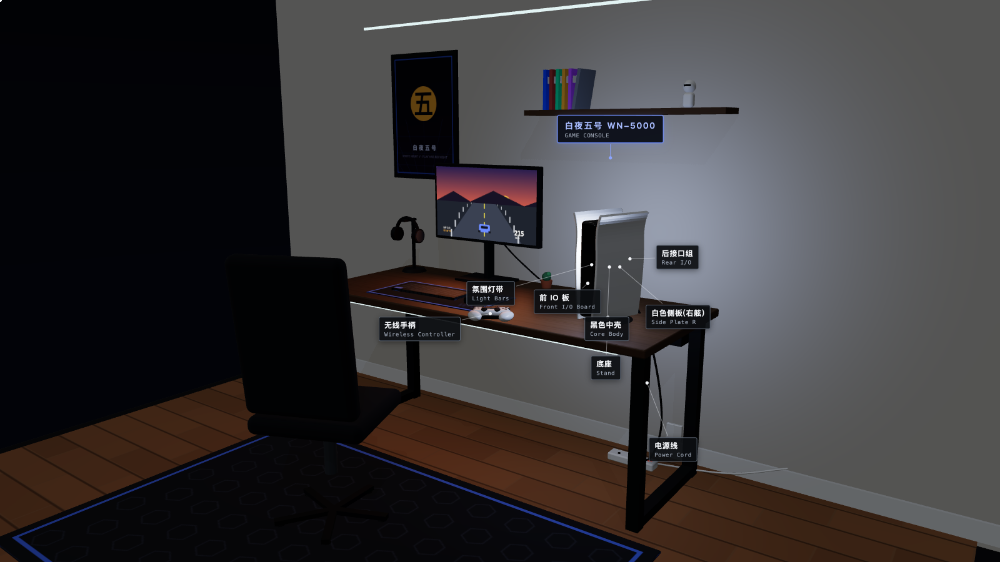
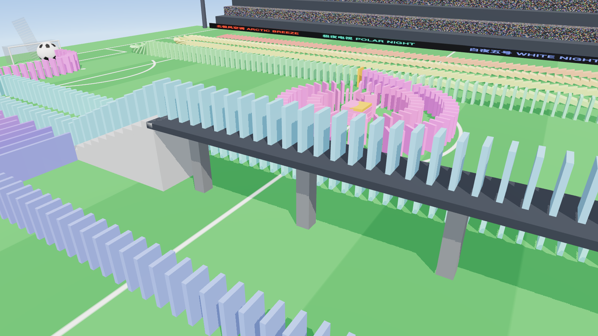
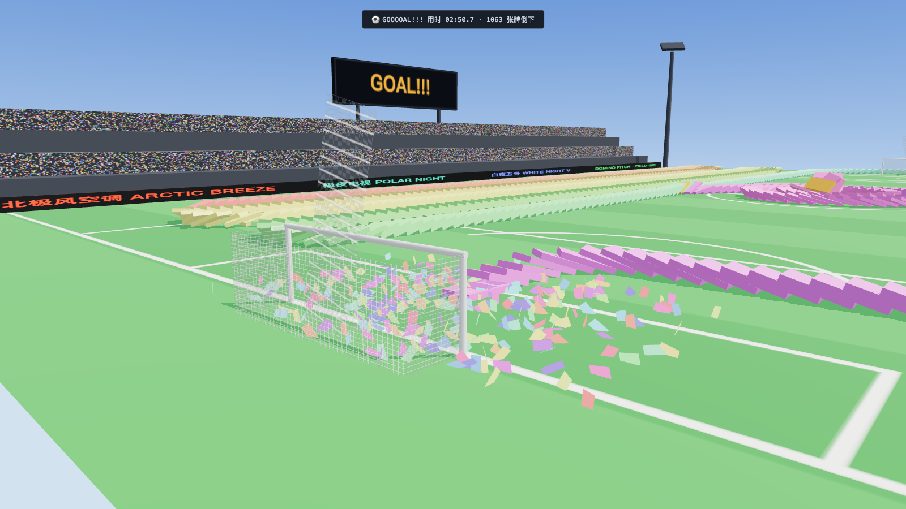

# 拆空调、拆电视、拆主机，再推倒 1095 张多米诺：一天上线 4 个 three.js 网站

昨天翻 GitHub 的时候，我自己都愣了一下。

7 月 17 日这一天，账号里多了 4 个仓库：15:06、15:07、15:07、19:03。

前三个，是**同一分钟内**推上去的……

它们分别是：一台能拆成 33 个零件的空调、一台 21 层的 OLED 电视、一台 20 件的白色游戏主机，和一块码了 **1095 张巨型骨牌**的足球场。

四个都是能直接玩的交互网站，现在全挂在线上。

更离谱的是这四个站的共同点：**没有用一个 3D 模型文件，没有加载一张贴图图片。**

所有零件都是 three.js 基础几何体一块块拼的，所有贴图都是 Canvas 现画的，连 three.js 本体都下载到 vendor 目录，整站断网可玩。

（美术同学看到这里可以放心，暂时还抢不到你们饭碗……大概。）

下面一个个拆给你看。

## 01 北极风空调之，先把家电拆个明白

第一个站叫「北极风 ARCTIC BREEZE」，一台虚构的 1.5 匹变频冷暖分体空调。

<video src="assets/four-sites-one-day/air-assembly.mp4" controls playsinline preload="metadata" style="width:100%;border:1px solid #e5e5e5;border-radius:8px"></video>

打开页面它就开始自己装：室外机 → 穿墙 → 室内机 → 管线 → 遥控器，33 个零件一件件飞到位，镜头还会跟着装配进度走。

装完可以一键爆炸——全部零件按各自向量散开，墙体自动变半透明，中英文标签带着引线飘在零件旁边。

但我最喜欢的是**开机试运行**：

<video src="assets/four-sites-one-day/air-run.mp4" controls playsinline preload="metadata" style="width:100%;border:1px solid #e5e5e5;border-radius:8px"></video>

贯流风轮转起来，导风板扫风，蓝色冷气沉到地板上铺开——对，冷空气是往下沉的，它连这个都做了。

点一下制热，一切反向：室内吹暖风，室外机换成橙色热风。

这不是两套动画，是**四通阀的功劳**。这台假空调的制冷循环，逻辑上是真的。

（顺便，夜晚 + 下雨开关也有。深夜暴雨里默默工作的室外机，看着有点惨，又有点浪漫……）

## 02 极夜电视之，OLED 是块千层饼

第二个站「极夜 POLAR NIGHT」，65 英寸 4K OLED，摆在一个完整的客厅里：电视柜、沙发、茶几、地毯、落地灯、窗外有城市和雨。

21 个零件，从 OLED 面板开始逐层建造：面板 → 排线 → T-CON 板 → 石墨散热膜 → 中框 → 背板 → 电路板 → 扬声器 → 后壳 → 底座。

<video src="assets/four-sites-one-day/oled-explode.mp4" controls playsinline preload="metadata" style="width:100%;border:1px solid #e5e5e5;border-radius:8px"></video>

爆炸图是朝观众展开的——OLED 面板这种「千层饼」结构，平铺开来那一下还挺震撼。

真正值回票价的是**观影模式**：

<video src="assets/four-sites-one-day/oled-watch.mp4" controls playsinline preload="metadata" style="width:100%;border:1px solid #e5e5e5;border-radius:8px"></video>

开机后屏幕开始播动态画面（极光演示片、检测彩条、或者一个合成波风格的赛车游戏），然后整个房间被屏幕照亮。

这个光不是贴图假光，是 three.js 的 RectAreaLight——屏幕真的在发光，光真的会洒到沙发和地毯上。

配合夜晚开关，就是一条 OLED 广告现场。

游戏模式下，HDMI 线上还有一颗颗信号流光点在跑……（这个细节谁想出来的，出来挨夸。）

## 03 白夜五号之，致敬那条著名的拆解视频

第三个站「白夜五号 WHITE NIGHT V」，一台竖在游戏房书桌上的白色主机。

是的，就是在致敬你想的那个拆解视频。（所以它是虚构主机，型号 WN-5000，法务部看完点了赞。）

<video src="assets/four-sites-one-day/ps5-explode.mp4" controls playsinline preload="metadata" style="width:100%;border:1px solid #e5e5e5;border-radius:8px"></video>

20 个零件：主板 → 液态金属 → 均热散热器 → 屏蔽罩 → 电源 → 双侧进风风扇 → 集尘器 → 蓝光光驱 → 白色侧板……拆解视频里的名场面零件，比如液态金属和集尘器，都有自己的档案卡。

一键爆炸时，桌面上的显示器键鼠会自动淡出，20 件零件悬浮在书桌上空。

开机之后是另一个站：

<video src="assets/four-sites-one-day/ps5-game.mp4" controls playsinline preload="metadata" style="width:100%;border:1px solid #e5e5e5;border-radius:8px"></video>

显示器点亮，可以切主界面、竞速演示、性能面板三种画面；主机灯带白蓝呼吸，手柄灯条亮起。

最较真的是：**风扇转速是和 SoC 温度、噪音读数联动的**。你把转速拉高，温度往下走，噪音往上走。

一台假主机，散热曲线倒是挺真……

## 04 多米诺球场之，1095 张骨牌全是真的倒

前三个站可以说是同一套路的三连：装配、爆炸、开机。

第四个站画风突变。

一块标准足球场（105 × 68 米），上面码了 **1095 张 2.2 米高的巨型骨牌**，路线全长约 1.1 公里。

<video src="assets/four-sites-one-day/domino-full.mp4" controls playsinline preload="metadata" style="width:100%;border:1px solid #e5e5e5;border-radius:8px"></video>

重点来了：**全程没有一帧脚本动画。**

每张骨牌都是 Rapier 物理引擎（WASM）里的真刚体。你推倒第一张，后面 1094 张是被物理一张张撞倒的——波前速度约 4.6 m/s，符合多米诺理论速度 √gh。

而且这条路线是立体的：

- 下半场蛇形，岔口分叉进中圈**螺旋**，螺旋末端俯冲撞塌一座井字叠塔；
- 骨牌爬上 **11 级台阶**，走 **4.6 米高空天桥**；
- 末牌**跳水**砸中地面接应床，接力继续；
- 然后是 15×11 的骨牌大阵，V 形波哗一下扩散开；
- 最后一张牌撞出一颗巨型足球，滚进球门，彩带 + 记分牌 GOAL。

<video src="assets/four-sites-one-day/domino-goal.mp4" controls playsinline preload="metadata" style="width:100%;border:1px solid #e5e5e5;border-radius:8px"></video>

你也可以不按剧本来：点击任意一张骨牌，朝你视线的方向推倒它，制造自己的分叉；或者「多点齐推」，六个路段同时起浪，30 秒全场倒完。

<video src="assets/four-sites-one-day/domino-multi.mp4" controls playsinline preload="metadata" style="width:100%;border:1px solid #e5e5e5;border-radius:8px"></video>

工程上这个站有三个我很喜欢的细节：

**第一，1095 张骨牌只有 1 次 draw call。** 全部骨牌塞在一个 InstancedMesh 里，每帧把刚体位姿回写进实例矩阵。

**第二，物理是会睡觉的。** 1095 个刚体默认全部休眠，只有波前附近的牌是活跃的，单步物理约 1ms——所以 8 倍速也不卡。

**第三，上线前它用 node 无头跑完了整场仿真。** 不开浏览器，纯物理步进验证：全线贯通、大阵全倒、叠塔被砸散、170.7 秒进球。骨牌阵这种东西，中间断一张就全剧终，不能靠肉眼赌。

（路线生成也很好玩：海龟作图法的直线 + 圆弧，加贝塞尔岔道和阿基米德螺线，生成时还要自检非相邻牌的最小间距，防止「隔空撞牌」……）

## 05 零资产之，为什么一张贴图都不用

四个站加起来，核心代码 8298 行：空调 2545、电视 2283、主机 2149、多米诺 1321（含 HTML/CSS，不含 vendor）。

没有 .glb，没有 .png 素材，没有 CDN。

空调的能效标识、电视里播的极光、球场的草皮画线、看台人群、广告围栏、记分牌——全部是 Canvas 程序化现画的贴图。

这个约束一开始像自虐，实际收益巨大：

- **整站就是几个 JS 文件**，静态托管随便丢哪都能跑，断网也能玩；
- 改零件不用回美术工位，改两行参数重新刷新就行；
- 每个站还内置了 URL 参数截图接口——`?p=1&x=0.6&view=explode` 直接进入 60% 爆炸图，写文章配图都是脚本批量出的。

对了，部署也有个小坑：这台机器上 wrangler 会被代理的 TUN 模式卡死，最后是绕开 wrangler、直接调 Cloudflare Pages 的 REST API 传的。（连部署脚本都是自己长出来的，deploy-cf.cjs，四个仓库人手一份。）

## 06 所以

一天，4 个站，从「拆开一台空调」到「推倒 1095 张骨牌」。

回头看，这四个站其实在回答同一个问题：**交互网站的下限在哪里？**

不用美术资产、不用建模软件、不用游戏引擎编辑器——只靠几何体、Canvas 和物理引擎，一个「能玩的东西」到底能做到什么程度。

答案是：空调能开机制冷，电视能照亮客厅，主机的风扇会联动温度，1095 张骨牌能真的从第一张一路传到球门。

以前这叫一个团队的排期。

现在这叫昨天。

◇ ◆ ◇

- 北极风空调：https://air-condition.pages.dev
- 极夜 OLED 电视：https://oled-tv.pages.dev
- 白夜五号主机：https://wn5-console.pages.dev
- 多米诺球场：https://domino-pitch.pages.dev
- 技术栈：three.js（vendor 本地化，零外部依赖）· Rapier WASM（多米诺物理）· Canvas 程序化贴图 · Cloudflare Pages
- 代码量：空调 2545 行 / 电视 2283 行 / 主机 2149 行 / 多米诺 1321 行（均含 HTML/CSS，不含 vendor）
