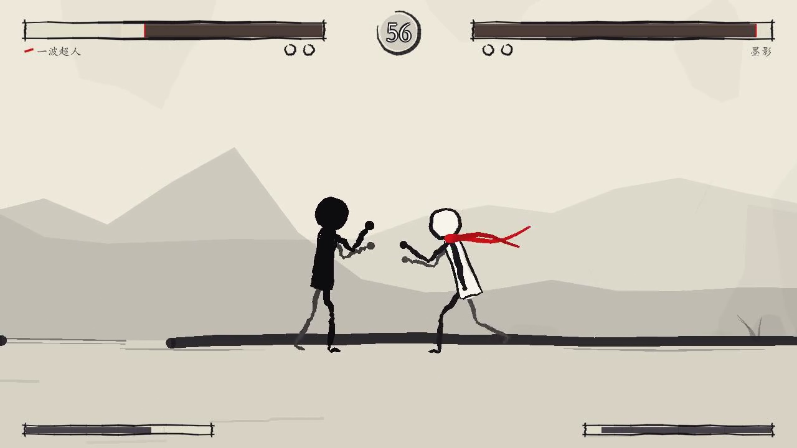
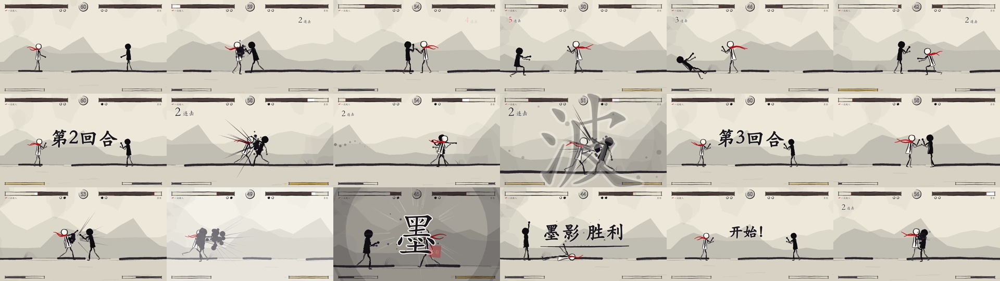
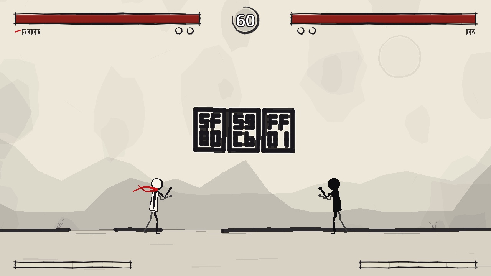
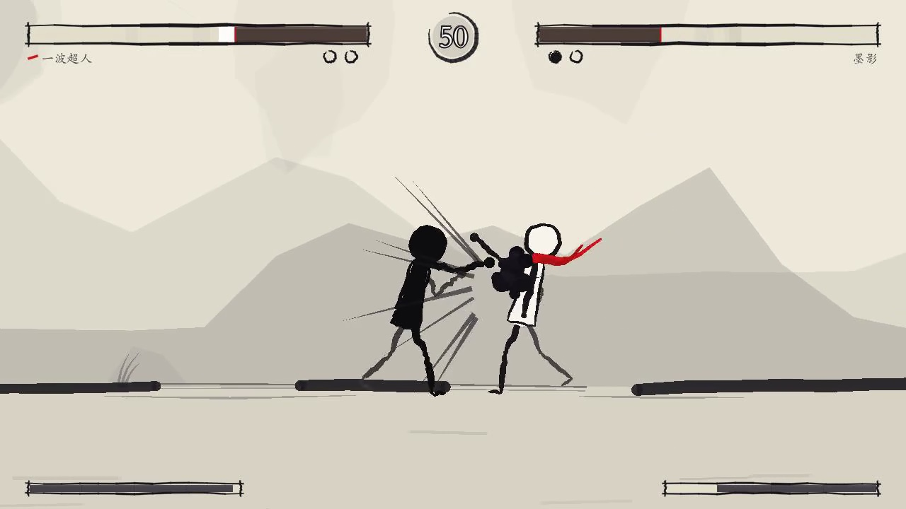
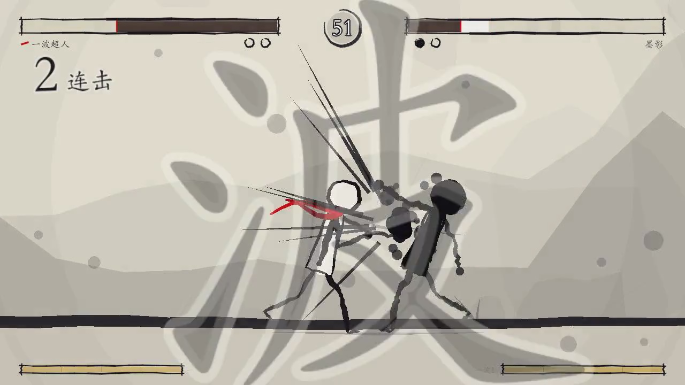
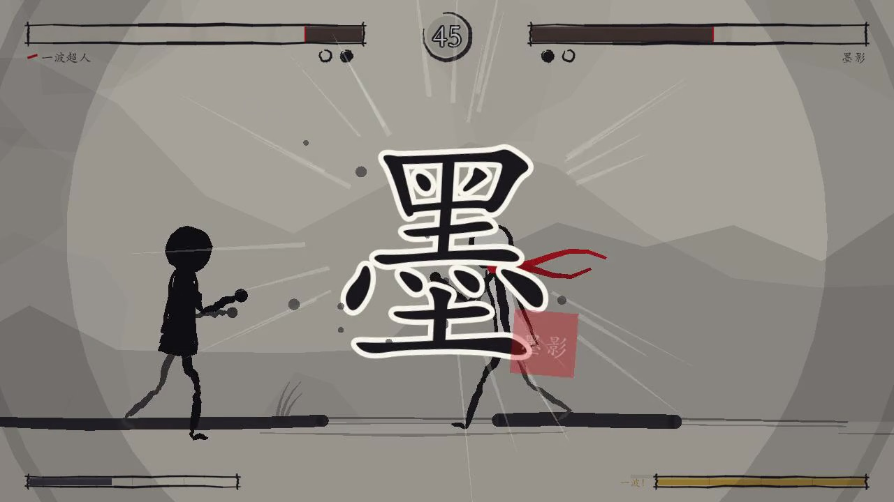

# 7 句话 154 刀，我让 Claude 手搓了个水墨格斗游戏——全程一张图都没生成

上一篇，我让 Claude 用 Codex 生了 56 张图，复刻了个《杀戮尖塔》。

这一篇，我把话反过来说：**一张图都不许生成。**

线条人、宣纸底、血条、命中飞溅、大招——所有你在屏幕上看到的东西，全部用代码一笔一笔「画」出来。仓库里不许出现任何一个 png / jpg / svg。

然后我又只说了 **7 句话**，其中两句还是「commit && push」……

换来的是一个能打满三局两胜、有连招有大招、大招还带过场动画的水墨格斗游戏。

> 📺 两条实机视频（AI 自己打的 60 秒单回合 + 90 秒完整三局）在博客原文：`lokiwang.com/journal/ink-fighter-godot-154-dollars`

照例声明：这是我自己瞎折腾的非商业练手项目，美术音频全部是程序化生成或 AI 合成的，没用任何现成素材。

下面按时间线，把这 7 句话拆开。

## 01 一句话立项之，我给它下了个刁难人的约束

第一句话，我一口气交代了六件事：用 wing cli 治理项目、开 ultracode、做个「一波超人」格斗游戏、引擎用本机的 Godot、音频走 MiniMax、**完全不许生成图片素材，用 SVG 或者程序化技术画（可以是线条人），保持一定美术特色**。

美术方向我没细说，就撂下四个字兜底：**水墨、线条人**。

剩下的它自己发挥：宣纸米白底 + 淡墨山峦，主角白衣 + 红围巾（红是全场唯一的高饱和色），反派通体墨黑、取名「墨影」。主角叫「一波超人」——对，谐音一拳超人，那个「波」是他攒满能量放出去的一道墨浪大招。

这张就是纯 `_draw()` 画的。你看到的每一根线、红围巾的每一次飘动、地上每一道墨渍，都是 GDScript 在**每一帧**用 `draw_polyline` / `draw_line` 现画的——提按笔触是靠线宽变化硬模拟出来的。我翻遍了仓库：零图片文件，一张都没有。

（一个我下令「不许有图」的项目，git 里干干净净全是 `.gd` 脚本，这洁癖我给满分。）

## 02 换 key 之，我三天前的笔记把自己坑了

音频这块我让它走 MiniMax，key 在隔壁 `3d-demo` 项目里。它照着我的老笔记去调，结果国际端点直接回 `invalid api key`。

我补了第二句话：key 找错了，要那个**订阅 key**，在 `store-plm` 项目下。

它翻出订阅 key（`sk-cp-` 前缀），一测——和我三天前写的笔记**正好相反**：这个 key 只在国内端点 `api.minimaxi.com` 认，国际端点反而不吃。

（笔记这玩意儿，写错一次，坑的是未来的自己……而且这回未来的自己是个 AI。）

它顺手把这条纠正存进了长期记忆，又给 `gen_audio.mjs` 打了补丁——端点不再硬编码，优先读 `.env`。然后 15 条语音 + 一段 52 秒战斗 BGM 一次跑通：播报员、主角、反派三种音色，主角放大招喊的是「一——波——！」，BGM 走的是 MiniMax 的 `music_generation`，一把过。

## 03 12 个分身之，它是怎么并行手搓的

这次我开了 **ultracode**。它不是一个 Claude 从头写到尾，而是编排了一整条流水线，前后 **12 个分身**（subagent）并行开工：

- **设计**——一个架构师分身先产出「构建规格」，把接口契约精确到函数签名：`GameManager` 当唯一的信号总线，`resolve_hit` 一个入口结算所有伤害；碰撞层 `1=世界 / 2=身体 / 3=P1 受击盒 / 4=P2 受击盒`；格斗状态机用秒制帧数据表驱动。
- **音频**——一个分身全程并行去 MiniMax 生成，不占开发的道。
- **开发**——5 个分身同时下场，一人包一个模块：`core`（比赛流程）、`fighter`（状态机 + 物理）、`artvfx`（线条人渲染 + 特效）、`ui`（血条 / 大字播报）、`ai`（敌人 AI），各写各的文件互不打架。
- **集成 → 验证 → 修复 → 治理**，一条龙走完。

（说白了我这次就当了回甩手包工头，它自己拉了个 12 人施工队进场……我连图纸都没画。）

## 04 满屏「豆腐块」之，中文全变成了十六进制方块

验证阶段它自己跑 `--demo` 表演模式截了图，然后**逐张看**。第一条 major 问题它自己揪了出来：

看画面正中——「开始！」三个字，硬生生显示成三个黑框，框里还印着 `5F00`、`59CB`、`FF01`。血条旁边的角色名也是一排微型乱码方块。

这就是传说中的「豆腐块」：Godot 默认字体 `ThemeDB.fallback_font` 里根本没有中文字形，画不出来就把十六进制码点顶上去了。（`5F00` 是「开」，`59CB` 是「始」，`FF01` 是「！」——它连乱码都乱得有理有据……）

麻烦在于我立了铁律：仓库不许有任何资源文件，**字体文件也不行**。它试了挂 `SystemFont`，本机居然也渲染失败（解析到一个读不了的 PingFang ttc）。最后它自己想的招：运行时用 `OS.get_system_font_path` 逐个候选探测系统里的楷体，加载后先验证「开」字的字形画得出来再用——楷体优先，正好贴「书法感」。零文件入库，铁律没破。

修完重截图：「开始！」「一波超人」「墨影」全部正常。

## 05 「你玩一下」之，它写了个 AI 自己打给我看

第五句，我说：你玩一下给我看看，顺便录屏。

我以为它会启动游戏、手动按几下、截张图完事。

它的理解是：**给游戏做一个双 AI 表演模式**（`--demo`），两个「墨影」级别的 AI 互相真打，再用 Godot 自带的 Movie Maker 引擎级录制，画面和声音同步录下来。

那 60 秒是它自己打的一整回合：开场「第一回合！」→「开始！」，两个线条人入场对峙；中段一记重拳轰脸上——放射速度线炸开、浓墨飞溅、红围巾甩到身后；一回合打完自动开下一回合。全程有「啪！」「咚！」的拟声打击音（也是 MiniMax 拿拟声词 TTS 现配的）、喊招、KO 播报和铺底 BGM。

## 06 三个嫌弃之，大招被它整成了 CG

看完成片我提了三个嫌弃：**1.** 两人贴太近会疯狂闪烁，像 bug；**2.** 能不能加连招；**3.** 大招能不能更华丽点。

它一条条办了。

**贴身闪烁**——根因很妙：朝向判定的死区只有 1 像素。两人重叠时相对位置每帧变号，整个线条人的左右镜像就每帧翻转一次，看着像抽搐。它加了 26 像素的迟滞死区，只有真正穿身而过才转身，贴脸缠斗立刻稳了。

**连招**——加了突进斩（冲刺中轻击）和飞踢（空中攻击），打通「冲刺 → 突进斩 → 轻 1 → 轻 2 → 轻 3 → 大招」的完整连段；HUD 还会蹦「N 连击」的书法字，4 连起蘸朱砂红。录屏里 AI 自己打出过 5 连击。

**大招 CG 化**——这个它玩大了。现在放大招是一整套过场：起手**全场时停 0.9 秒**，屏幕收暗，一个巨大的书法字从 2.8 倍砸落带余震——主角是「波」，墨影是「墨」——带白晕描边、中心放射爆线，右下角还盖一枚朱砂印章（写着施放者名讳），相机同步推近 1.38 倍。

（一个我明令「不许生成图片」的游戏，硬是给我整出了格斗游戏超必杀切入画的排面。这排面全是 `_draw()` 一笔一笔画的。）

## 07 花了多少钱之，154 刀，七成花在「重读」上

好，到你们最关心的：这一趟多少钱。

**154.45 美元。**

用的是 **Fable 5**——目前最能打的模型，也最贵（每百万 token：进 $10 / 出 $50）。12 个分身加主会话，账单拆开是这样：

| 项目 | token | 花费 |
| --- | --- | --- |
| 生成的代码 / 文档 / 对话 | 79 万 | $39.5 |
| 缓存写入 | 352 万 | $44.0 |
| 缓存读取 | **6892 万** | **$68.9** |
| 新读入 | 20 万 | $2.0 |
| **合计** | | **$154.4** |

最烧钱的不是「生成」，是「重读」——那 6892 万 token 的缓存读取，一家伙 69 刀。多智能体流水线就是这脾气：每个分身每开一次口，都得把前情（构建规格、别的模块进展到哪了、验证抓到什么问题）重新过一遍脑子。`output + cache_read` 两项，吃掉了整整七成成本。

换个角度看：79 万 output token，堆出来一个 10 个 GDScript 文件的完整格斗游戏，外加一套 wing 治理文档（4 条 ADR、三个领域文档，`wing check --strict` 0 报错 0 警告）。

154 刀，我个人觉得……挺值。

## 尾声

回头看，这游戏最「贵」的地方其实不是那 154 刀，是它逼我承认一件事：一个能打满三局、大招带过场动画的格斗游戏，**可以一张美术资源都没有**——全是代码在每一帧现画的。

以前我们说 AI 要抢画师的饭碗。这次它更狠：连画都省了，直接拿代码把画面「写」出来。

我 7 句话，它 154 刀。这买卖，我觉得划算。

（完整两条实机视频在博客原文，链接见文章开头。）
