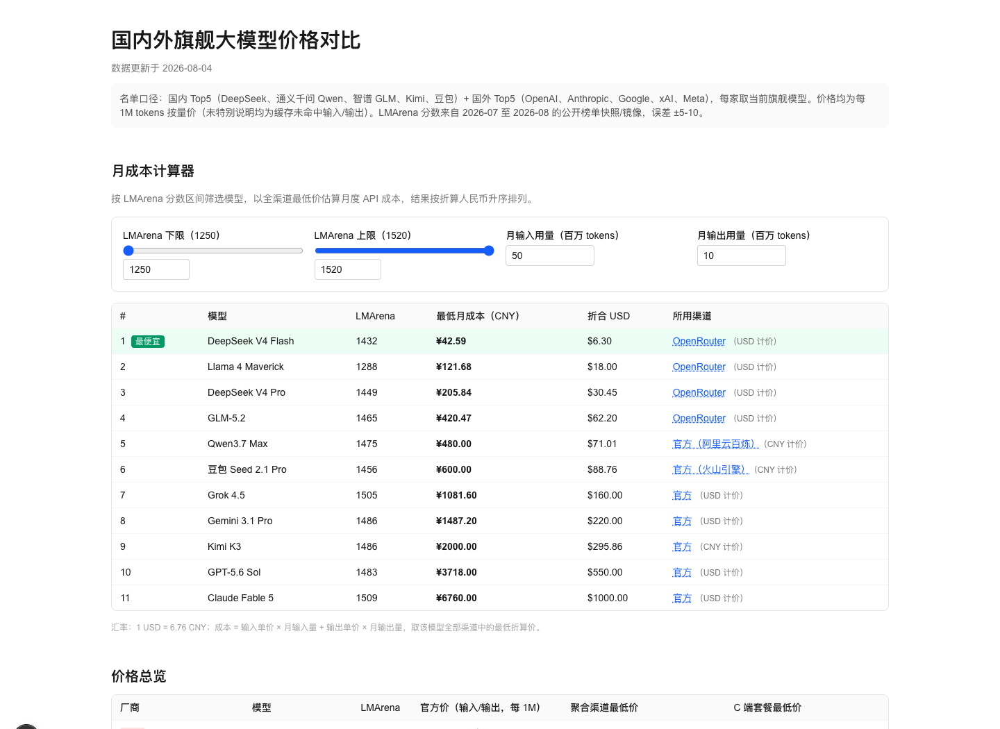
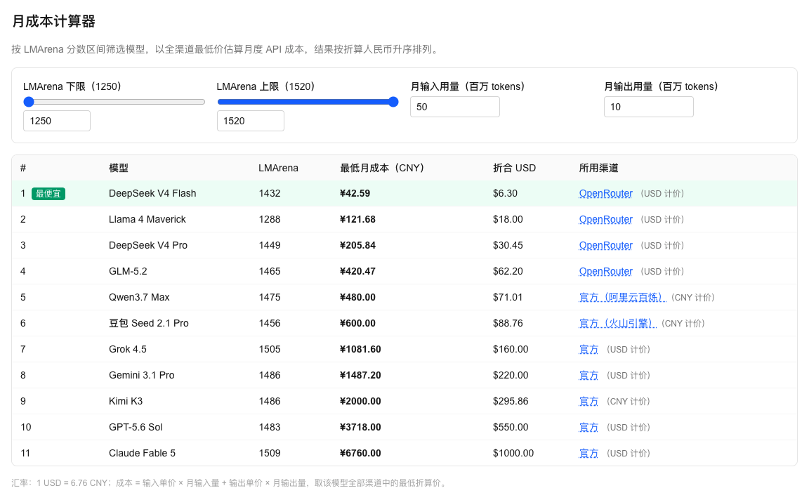
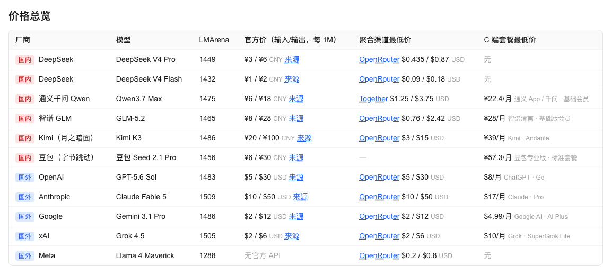
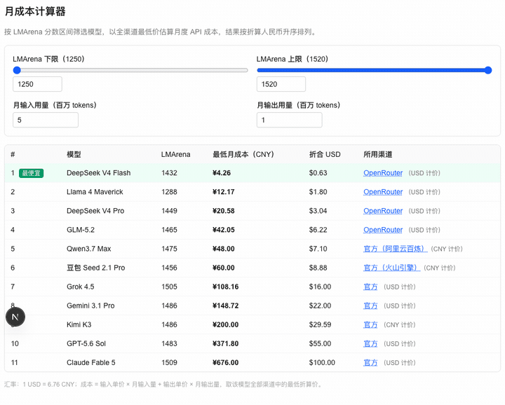
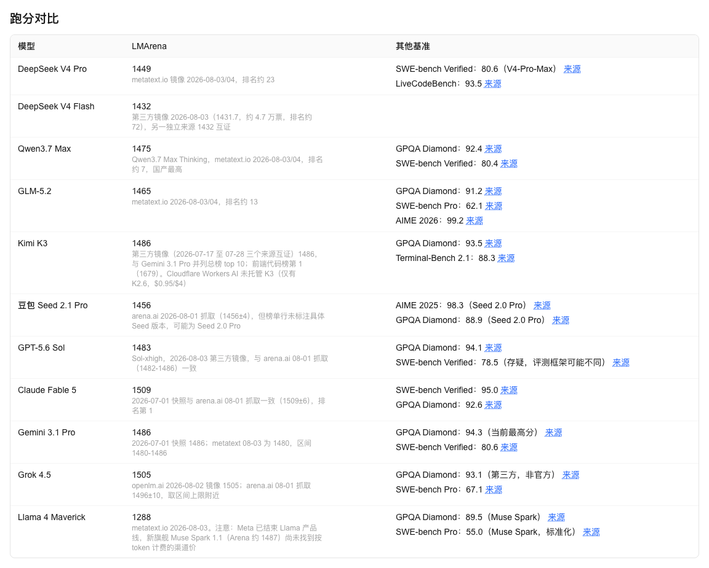
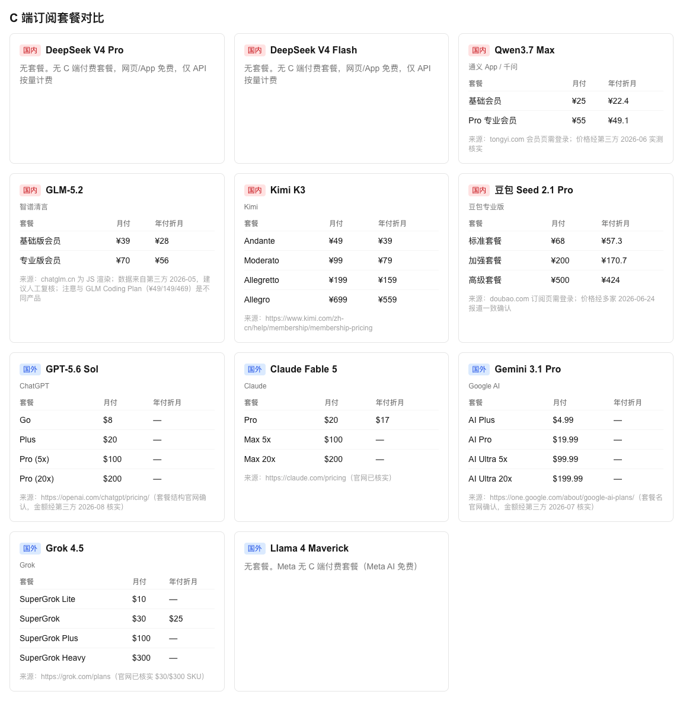
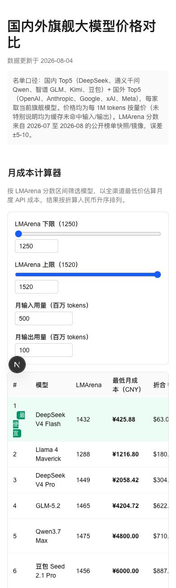
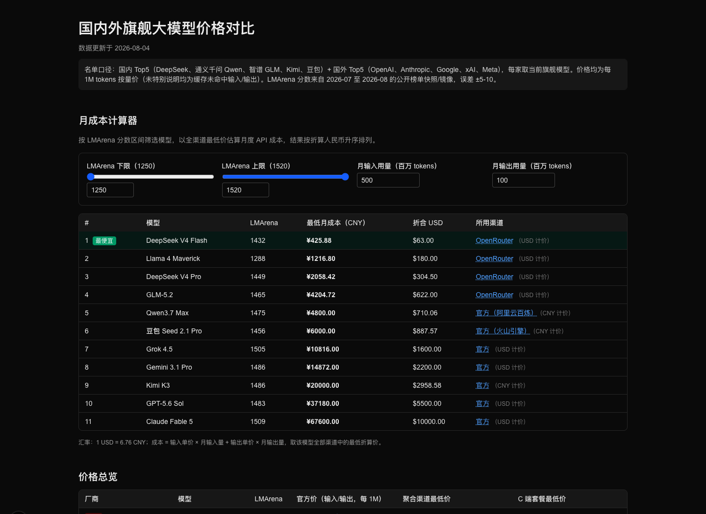

# 我只开了一次 Kimi CLI，4 小时后，多了个大模型「省钱计算器」

今天下午 3 点 14 分，我新建了一个文件夹。

名字叫 `ai-playgames`。

然后我进目录，开了一次 Kimi CLI：

```bash
mkdir ai-playgames
cd ai-playgames
kimi -y
```

晚上 6 点 55 分，文件夹里躺着一个国内外旗舰大模型价格对比站：11 个模型、34 条 API 渠道、26 个订阅套餐、45 个不重复来源，还有一个会自己重排的月成本计算器。

至于「playgames」去哪了……

只能说文件夹名，是人类在这个项目里留下的最后一点控制欲。



## 01 开工之，能核实的只有一条命令

先说个不那么 AI 爽文的事实：这次 Kimi 的完整对话没有留在项目目录里，我也不打算凭空编一段「神级提示词」。

能核实的是文件时间线。

- 15:14，Next.js 空项目落地；
- 15:37，月成本计算器出现；
- 15:38，价格总览、套餐、跑分三块页面接上；
- 16:04，汇率换算和最低渠道算法补齐；
- 18:55，306 行模型数据整理完成。

核心页面、计算逻辑、数据和核价脚本加起来 **1046 行**。



不到 4 小时。

（其中真正费时间的，显然不是写 React……）

## 02 比价之，官方价只是第一层

我最开始以为这会是一张普通价目表。

结果 Kimi 把整张表拆了三层：官方 API、OpenRouter / SiliconFlow / Together / Fireworks 等聚合渠道，以及 ChatGPT、Claude、Kimi、豆包这类 C 端会员套餐。



这一下就有点意思了。

因为「哪个模型便宜」其实是句废话。你得先问：**在哪买、买 API 还是会员、输入多还是输出多。**

页面没有假装给一个永恒答案，只把每条价格的币种、来源和备注都摊开。鼠标点过去，就能回原页面核账。

价目表终于不像广告了……更像账本。

## 03 算账之，50 块和 500 块可能是同一个模型

真正让我觉得它不只是「搜集了一堆数字」的，是月成本计算器。

你填每月输入、输出多少百万 tokens，它会把 34 个渠道统一折成人民币，按下面这笔小学数学重新排队：

`输入单价 × 输入量 + 输出单价 × 输出量`



输入 50M、输出 10M 是一张榜；输入 500M、输出 100M，又是另一张账单。


这也是我现在看模型价格最警惕的一件事：厂商海报爱写「低至」，但你的账单从来不生活在「低至」里。

尤其输出 token 贵得多时，多说几句废话都是真金白银……（突然理解甲方为什么爱说「精简一下」。）

## 04 跑分之，先决定多少分才算够用

便宜还不够，至少得能干活。

所以计算器又加了一个 LMArena 分数区间。把下限往右拖，分数不够的模型会直接退场，剩下的再按价格排序。


这个交互看着很朴素，背后的思路我很喜欢：**不是找全世界最强的模型，而是找达到你要求之后最便宜的模型。**

99 分的任务，没必要天天雇 150 分的人来写周报。

当然，页面也把丑话写在底部：榜单是公开快照，存在约 ±5–10 的误差；没有文本榜分数的模型，不参与排序。



跑分可以当筛子，不能当圣旨。

## 05 数据之，最难写的文件没有一行 UI

这项目最重的文件不是页面，是 `models.json`。

306 行数据里，一共放了 11 个模型、34 个渠道、26 个套餐、21 条其他基准，引用 63 次链接，去重后还有 45 个来源。



而且它很诚实地留下了一堆「建议人工复核」「第三方数据，置信度中等」「版本可能不一致」。

怎么讲，这些话看起来不够帅，却是整页最值钱的部分。

Kimi 还顺手写了一个 `fetch-openrouter.ts`：自动拉 OpenRouter 全量模型价格，和本地 JSON 一条条并排，发现差异只提示，**不自动改数据**。

我很喜欢这个分寸。

自动化负责找变化，人负责决定信不信。价格这种东西，就该这么更新。

## 06 成品之，桌面是表格，手机是卷轴

页面最后做成了响应式：桌面端把信息横着摊开，手机端把筛选器叠成一列，宽表允许横向滚动；系统切到暗色，它也跟着变。





技术上没有什么玄学：Next.js 16、React 19、Tailwind CSS 4，一份 JSON 做数据源，几段纯函数算汇率和最低成本，再配 Cloudflare Workers 的构建配置。

但回头看，Kimi 这次真正帮我省掉的不是 1046 行代码。

是把「我想比较一下大模型价格」这种松松垮垮的念头，逼成了一套能筛选、能算账、能追来源、也敢承认误差的东西。

以前我们上网找答案。

现在，顺手给答案做个计算器。

◇ ◆ ◇

- 项目目录：`/Users/joe/code/ai-playgames`
- 创作时间：2026-08-04 15:14–18:55（按文件时间线）
- 数据快照：2026-08-04；价格、套餐与跑分会变化，实际以各来源页面为准
- 技术栈：Kimi CLI · Next.js 16 · React 19 · Tailwind CSS 4 · OpenNext / Cloudflare Workers
- 规模：11 个模型 · 34 个 API 渠道 · 26 个订阅套餐 · 45 个不重复来源
