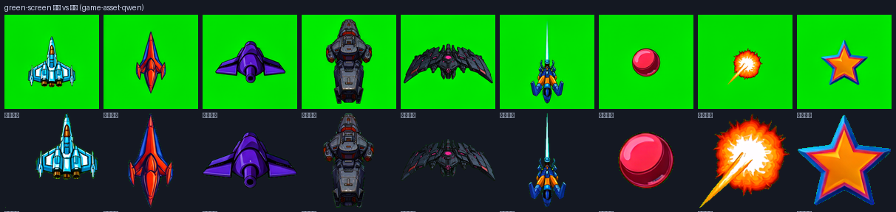
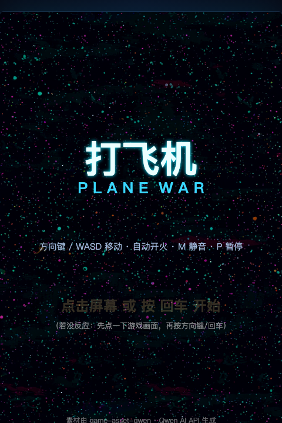
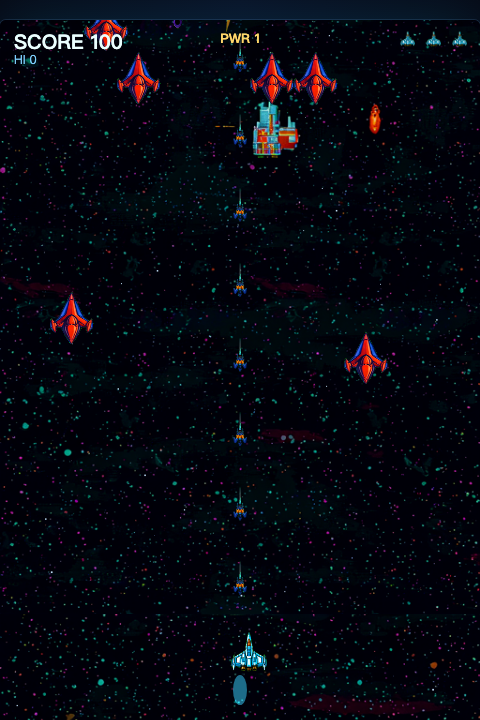
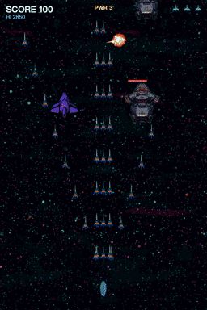
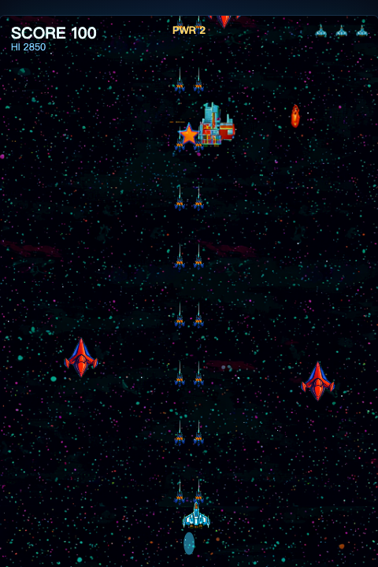
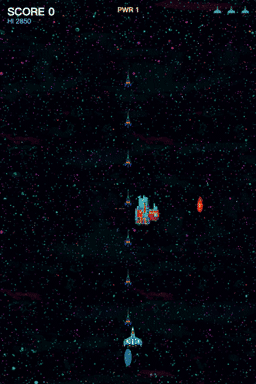
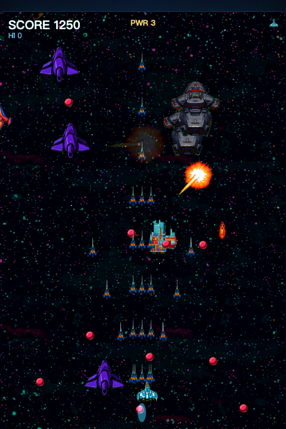
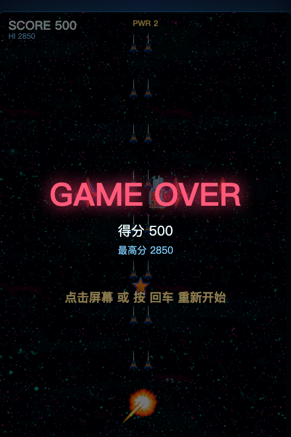
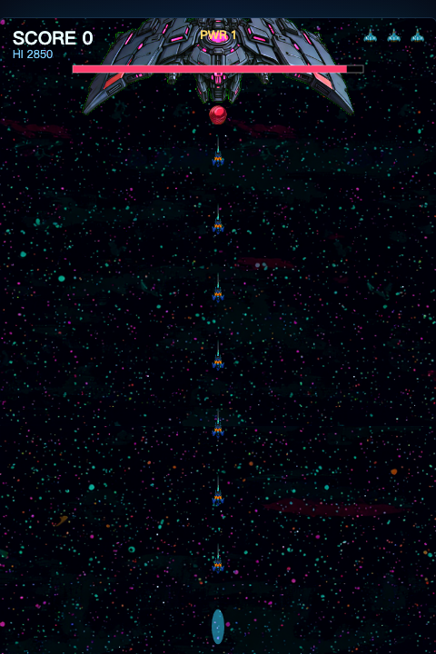
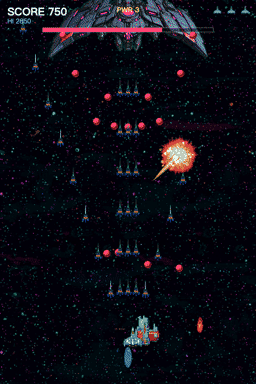

# 我对 Qwen 说了 6 句话，它给我造了架打飞机

起因很朴素：我手头攒了个 `qianwen` 目录，刚把一套 2D 游戏素材 skill（`game-asset-qwen`）打磨完，正愁没项目验证它。

于是我在 DeepSeek harness（ds 跑的是 Qwen3.8-27B）里丢了一句话：

> 做一款打飞机的小游戏

然后……一架能玩的打飞机就出来了。完整对话里我作为人类一共说了 6 句话，其中一句还是汇报 bug 的。

全程实机可玩，先上链接：

> 🕹️ 在线试玩：**https://plane-war-3fu.pages.dev** （双击 index.html 也能玩）

照例声明：所有美术和音效都是 AI 生成的，非商业练手项目，纯折腾。

## 01 前戏之，先造了个 skill

正经顺序其实是反的：先有 skill，后有游戏。

上一轮我让 Qwen 参考 `ai-api-usage.md` 和 `my-skills` 里 `game-asset` 那一族 skill 的经验，新造一个 2D 游戏素材 skill——出图走 `ideogram4-fp8`，音效走 `sa3-sm-sfx-trt`，密钥全部塞 `.env` 不进 git。它写完后还回头问了我一句：skill 叫什么名？（选项都替我想好了……）

最终落地成了 `game-asset-qwen`，和现有 `game-asset` 家族一个命名体系，一眼知道是 Qwen API 版。这一轮它自己跑了半小时的测试：doctor、models、chat、绿幕抠图、精灵表切片，全套。

## 02 素材之，绿幕出图再抠图

有了 skill，做游戏就是流水线了。美术素材走两段式：**先出绿幕源图，再 chroma-key 抠成透明图**——这样抠坏的边角还能回来调容差，不用重新烧钱生成。

九类素材，一次全出：玩家机、三种敌机（侦察机/炮手/重装）、Boss、两种子弹、爆炸、强化星星。画风统一靠一份 `_style.md`：

> Retro arcade space shooter art. Bold flat cel-shaded vector style... saturated neon palette (cyan, magenta, amber) on a deep space blue-black, 1990s shoot-'em-up aesthetic.

源图和抠图成品对照长这样：

（右下角那颗星星最圆……）

音效是 `sa3-sm-sfx-trt` 生成的枪声/爆炸/命中/拾取，再用 ffmpeg 裁成 mp3 内联进游戏。

## 03 游戏本体之，一个 1.4MB 的 index.html

交付物朴素得感人：**一个 index.html**。canvas 480×720，素材全部 base64 内联，双击就玩，零依赖零构建。

玩法该有的都有：三种敌人各有走位和弹幕，难度随时间爬坡，捡金色星星升级武器（最高 PWR 3），三条命，屏幕震动，视差星空，粒子爆炸，最高分存 localStorage。

## 04 武器升级之，捡星星变弹幕

武器系统是这套游戏里最爽的部分：PWR 1 单发，PWR 2 双发，PWR 3 直接左右两管齐射。捡星星的过程有个小细节——强化道具掉落时是三个横排，不是直线，专门让你在弹幕里走位去吃：

## 05 实机验证之，让无头浏览器先打一局

写完第一版我没敢直接交付，先让无头浏览器（gstack browse）进去打了一局：注入 `startGame()`、开 `player.weapon=3`、连发 `spawnWave()`，检查 console 零报错，再泡了 12 秒看它会不会崩。

爆炸那下粒子 + 震屏还挺有味道：

## 06 翻车之，按回车，游戏没开始

我信心满满把 `index.html` 丢给用户（也就是我自己……），得到的反馈是：

> 按回车 游戏没开始

回车绑定在 `keydown` 上、指向 `startGame()`，代码看着没问题，但真机就是不响应。查了十几分钟，最后是键盘焦点的问题——页面里那个 canvas 没拿到 focus，回车事件压根没到它头上。三处小 edit：把开始监听挂到 `window`，回车/点击/触摸都兜上，重进浏览器点了一下，成了。

（顺手看了眼这套小游戏能死得多花哨……）

## 07 上线之，plane-war 这名字全球都被占了

部署就一句话的事：`wrangler pages deploy dist --project-name plane-war`。

然后它告诉我：**plane-war 这名字，全球范围内已经被占用了**。于是自动带了个后缀，成了 `plane-war-3fu`——行吧，-3fu 就 -3fu，能玩就行。

Boss 战是每 55 秒来一艘旗舰，血量 70，打起来有压迫感：

## 收尾

回看整个下午：先造 skill（人类参与：1 句），再做游戏（人类参与：1 句），翻了一次车（人类参与：1 句 bug 报告），上了线（人类参与：1 句）。六句话，从工具到产品到发布，全程在一个 harness 里闭环。

最有价值的部分可能不是游戏本身，而是那条流水线——**绿幕出图 → 抠图 → base64 内联 → 单文件交付 → CF Pages 上线**，五个环节全部可复用，下一款游戏只是换个 `_style.md` 的事。

AI 造游戏最难的已经不是写代码了，是开口。

◇ ◆ ◇

- 在线试玩：https://plane-war-3fu.pages.dev
- 项目说明（README）：/Users/joe/code/qianwen/plane-war
- 素材 skill：game-asset-qwen（`ideogram4-fp8` 出图 / `sa3-sm-sfx-trt` 音效 / chroma-key 抠图）
- 开发工具：DeepSeek Harness（ds，Qwen3.8-27B）
