# 分析半小时，买入半秒：我用 AI 搓了套股民表情包

事情是这样的：我所在的几个炒股群，日常沟通基本靠吼。有人发个异动截图，底下清一色"？"；有人说加仓了，底下清一色"勇士"。

文字太苍白了。这种场合需要的是表情包——那种一图道尽散户心酸的。

于是我花了一天，让 AI 给我搓了一整套微信动态表情：**《仓位鼠：发现即买入》**，16 张，240×240 透明底 GIF，已经存进微信表情开放平台的草稿箱。

先上全家福：

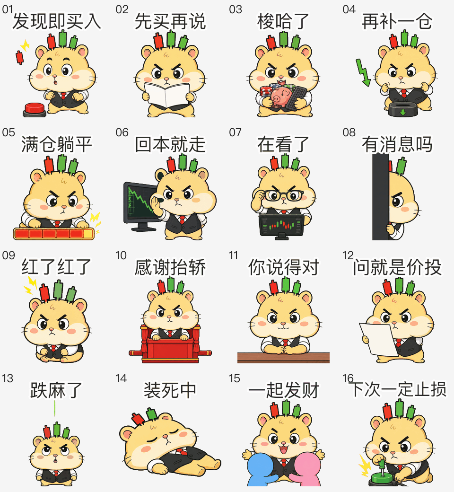

主打款长这样，群里只要有人报票名，就可以拍了：

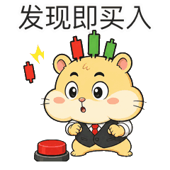

（声明：本人不提供任何投资建议，表情包也不提供。它只负责嘲讽。）

下面拆一下这套东西是怎么从一句话变成 16 张过审候选的。

## 01 人设先行之，先写小传，再画脸

之前的教训告诉我：上来就画图，画到第八张角色准走样。所以这回第一步不是生图，是写设计文档。

仓位鼠的核心设定就一句话：**分析半小时，买入只用半秒。**

围绕这个矛盾，文档里定死了：

- 视觉钩子：头顶三根红绿 K 线呆毛；圆腮帮代表仓位，亏损时瘪掉
- 笑点引擎：一本正经地执行荒谬交易
- 配色：奶油黄角色 + 炭黑设备 + 红涨绿跌（A 股语境，别搞反了）

然后是内容矩阵——16 句文案，每句对应一个真实的群聊发送时机：发现票、梭哈、补仓、躺平、装死、嘴硬、祝福……写文案这步 AI 也就是打下手，毕竟群里的真实嘴脸，它见得没我多……

## 02 母版角色之，品红背景的妙用

角色一致性是 AI 生图的老大难。解法是先锁一张"母版"，后面 16 张全部以它为参考：

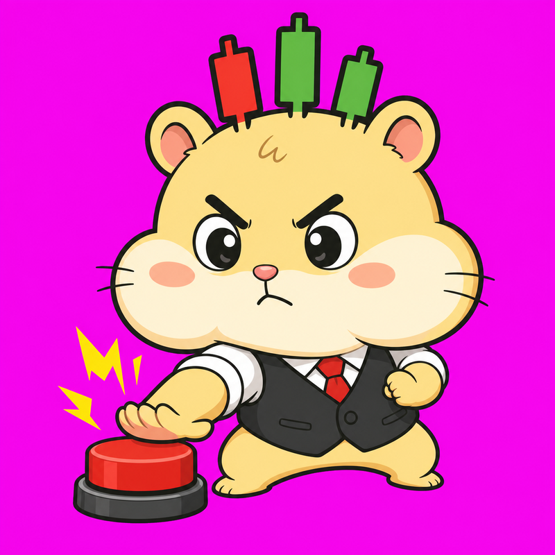

注意这个辣眼睛的品红背景，这是故意的。

套路是：让 AI 把背景画成纯平 `#ff00ff`，同时禁止角色身上出现任何品红色。这样本地代码一个颜色距离阈值就能把背景抠得干干净净，比让 AI 自己输出透明底靠谱一万倍——AI 生成的"透明底"，边缘谁用谁知道……

prompt 里还有一条反直觉的约束：**不准出现任何文字**。AI 写汉字约等于画符，所以 16 句文案全部留到本地排版，后面讲。

## 03 关键帧之，一张 2×2 图出四帧

动图怎么做？我之前踩过视频模型的坑：它的目标函数是"看起来自然"，所以角色会自己转身、往镜头前凑——在影视里叫演出，在表情包里叫废帧。

这回换了思路：**不让模型生成动画，只让它生成关键帧**。

每张表情出一张 2×2 网格图，四个格子 = 四个关键帧，prompt 里锁死同机位、同比例、同光照、底部锚点对齐：

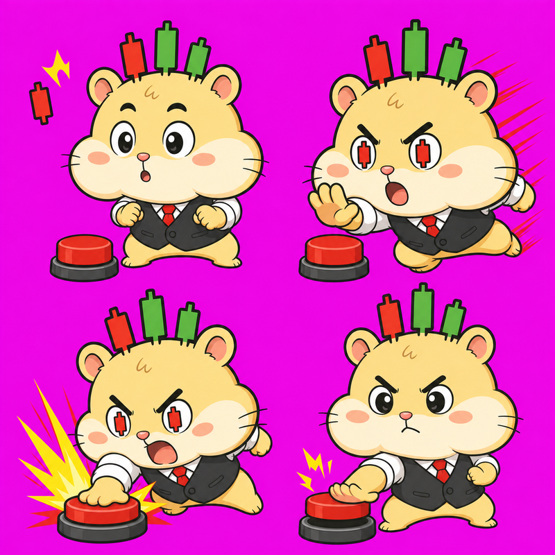

四个格子正好对应一个三拍循环：预备（眼神锁定）→ 主动作（拍下按钮）→ 冲击定格 → 回弹。上面这张抠掉品红、裁开、配上字，就是开头那张"发现即买入"。

## 04 本地流水线之，Pillow 干掉了美工

从这张品红图到最终 GIF，中间全是确定性代码，一步 AI 都不用：

1. 按颜色距离抠掉 `#ff00ff`，边缘做品红去溢色
2. 切成四张等大的帧，按透明像素边界归一化到 240×240（顶部留 42px 字幕带）
3. 用本地 PingFang 加文案，字号 28–38 自适应，炭黑填充 + 4px 白描边
4. 四帧拼成六帧回环 `[0,1,2,3,2,1]`，单帧时长 100–260ms
5. 超 500KB 就按 128→96→64→48→32 砍调色板，还超就抽掉一帧回弹帧

整个构建脚本还配了 pytest：抠图透明位、切格尺寸、GIF 几何参数，全是先写失败的测试再写实现。一句话总结这套流程：**AI 负责画画，代码负责正确。**

## 05 斗图时间之，十六张全在这了

不多说了，直接上货。每张的使用场景我都替你踩过了……

还没研究完，但手已经痒了：

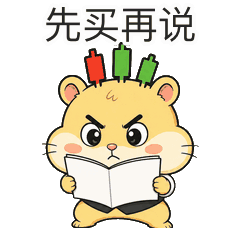

宣布重仓进场专用：

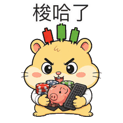

跌了？那是给你上车机会：

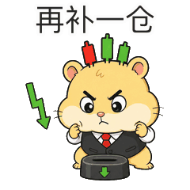

没钱加仓也不想割：

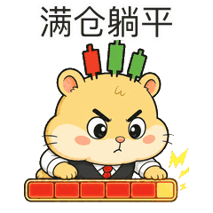

经典许愿环节（注意背后那只手）：

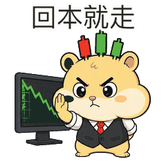

别人问行情时的标准回复：

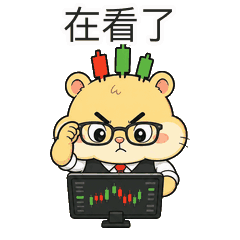

群里突然异动时：

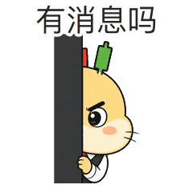

账户翻红的瞬间：

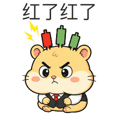

群友接力买入之后：

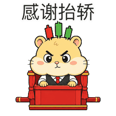

结束争论的万能句（桌面下的手很诚实）：

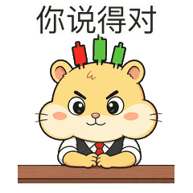

被套三个月后的官方解释：

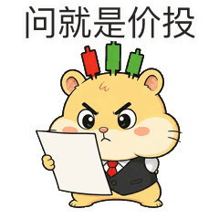

大跌当天：

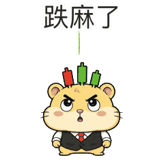

不想看盘也不想回消息：

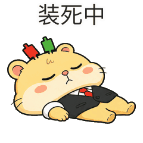

群里发红包、过生日、随便什么喜事：

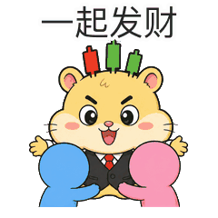

以及散户使用率最高的一句：

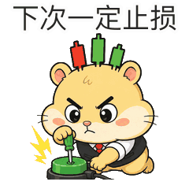

我个人最爱 16 号。按钮装得有多郑重，电线拔得就有多熟练……

## 06 校验上传之，0 error 0 warning

微信表情开放平台的规矩不少：主图 240×240 且 ≤500KB、永久循环、横幅 750×400、封面 240×240、聊天面板图标 50×50 且只能是头部。

所以上传前先过本地校验器，尺寸、帧数、循环、文件大小、透明边缘全查一遍：

```text
Stickers: 16
Result: 0 error(s), 0 warning(s)
```

配套三件套也是单独生成、单独构图的，不是从表情上随便裁的：

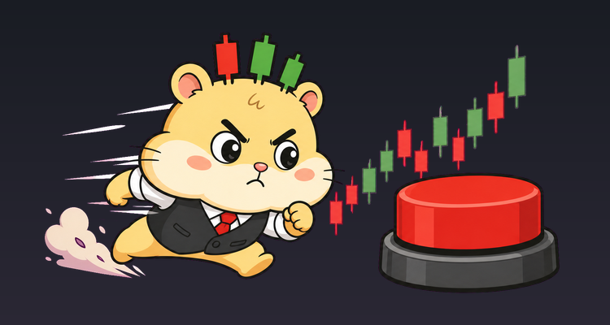


最后一步上传，自动化只被允许做一件事：**存草稿**。草稿回执里写得明白——"已保存草稿，未提交审核"，点"提交审核"那个按钮必须是我本人。

（AI 可以替我干活，但背锅的事得我自己来，这个安全门我觉得挺好……）

## 07 最后

整件事一天搞定：上午设计文档，下午生图 + 流水线，晚上校验上传。

搁以前，16 张风格统一、带文案、带循环动画的表情，够一个美工朋友拉黑我了。现在最贵的成本，变成了想那 16 句文案——毕竟画图 AI 在行，**散户的嘴脸还是我最懂**……

至于审核能不能过，平台说了算。反正草稿已经躺进去了，过不了我就再让它改——改图这种事，现在也不值钱了。

◇ ◆ ◇

- 微信表情开放平台：https://sticker.weixin.qq.com
- 同系列上一篇：《1 小时 3 条路，我让 AI 交出了一套能直接进引擎的 2D 动作素材》
