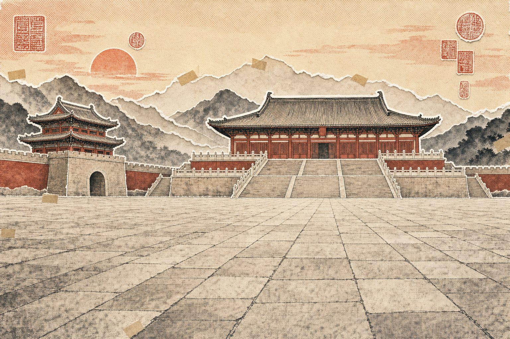
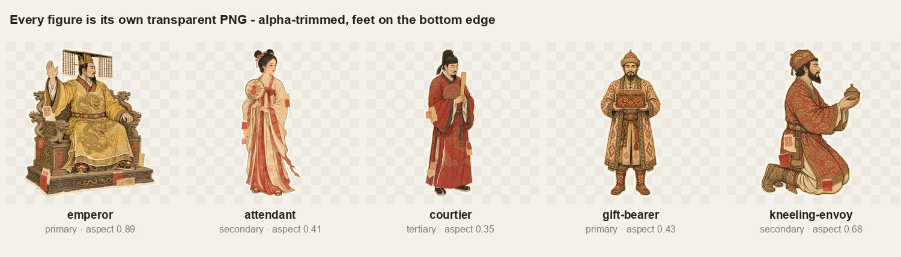
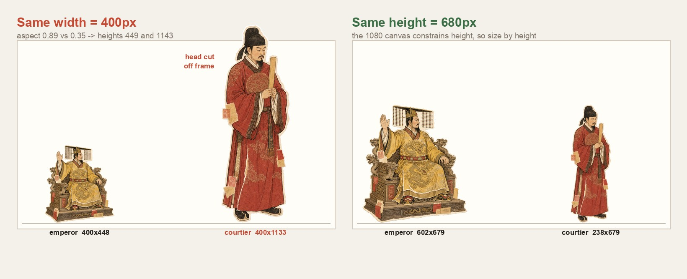

# 41 刀做了个 21 秒动画：我以为在调人物，其实在调空气

起因是刷到一条推特。

一条纸片风的分层动画——背景是空的宫城，人物像剪纸一样一片一片飞进来，各自有各自的节奏。那种质感，我当场就想要。

于是我打开 Claude Code，第一句话是：

「参考这条推特，帮我写一个做视频的 **skill**。」

注意，是 skill，不是 video。

视频我只要一条，流水线我想要一辈子……（这个区别，决定了后面所有事。）

一个多小时后，样片渲出来了：21 秒，1920×1080，主题《万邦来朝》。


账单 **$41.20**。

中间踩的坑，说实话，值这个价。

## 01 铁律之，人物不能画进背景

先说结论，这条是整个 skill 的第一性原理：

**永远不要把人物画进背景。**

听起来像废话？我一开始也这么觉得。

但你想想：人物一旦和背景粘在一起，你就再也不能让他单独飞入、单独缩放、单独排序、单独给节奏了。你手里只剩一张图，能做的只有整体推拉——那不叫分层动画，那叫 PPT 切换。

所以底板生成时，prompt 里得**大声喊「绝对没有人」**：



空得有点心慌，对吧。但这才是对的。

然后每个角色单独出一张透明 PNG：



最后在 Remotion 里按 `底板 → 后排 → 中景 → 主角 → 前排 → 字幕` 的顺序摞起来。

**深度不是 3D，深度是遮挡。** 前排的人挡住主角一点点，层次感就出来了。

## 02 换供应商之，水印把底板烙废了

一开始图片走的是智谱 GLM-Image。

结果第一版底板出来，我沉默了……

右下角，一个雷打不动的「AI生成」水印。

我去翻文档，找到 `watermark_enabled: false`，加上，重跑。

水印还在。

再试，还在。（参数被忽略得非常彻底。）

如果只是做个配图，这水印我认了。但在这条流水线里，它是致命的——因为**后面要按 alpha 通道自动抠图**，那块水印会被当成主体的一部分，直接把包围盒撑大。底板报废，角色也报废。

于是 18:06，我打断它：「生成图片改走 codex cli 的 imagegen，你写个生成图片的 skill 吧。」

Codex 内置的 imagegen 没这个毛病，而且**`codex login` 就能用，不要 API key**。

（省钱的事，我一向记得很牢。）

## 03 最坑的一步之，我在调空气

这是整篇文章我最想分享的一条。

图生成出来，是 1024×1024 的方画布，人物浮在中间，四周全是透明像素。

我照常在 `script.json` 里写：主角 `width: 650`，配角 `width: 245`。

渲出来一看，尺寸关系完全是乱的。

为什么？我去量了一下每张图里人物实际占的宽度：

**39% 到 84%。**

也就是说，同样写 `width: 650`，一张图里 650 有 84% 是人，另一张里只有 39% 是人——剩下的 61%，是空气。

**我以为我在调人物大小，其实我在调空气的大小。**

所以 `trim_layers.py` 是**必需步骤，不是可选优化**：按 alpha 通道把每张图裁到人物的真实边界。裁完之后，图片宽度就是人物宽度，图片底边就是脚。

（脚下原本还有 2%~6% 的透明 padding，不裁的话，人物是「浮」在地面上的。）

## 04 再坑一步之，按高度还是按宽度

裁完了，我又栽了一次。

裁完之后我量了五张图的长宽比：

- 皇帝（坐在宽椅子上）：**0.89**
- 朝臣（瘦高个站着）：**0.35**

这俩差了 2.5 倍。

如果统一按宽度给 400px，会发生什么？



左边：朝臣 400×1143，脑袋直接顶出 1080 的画框；皇帝 400×449，缩成一个小疙瘩。**主角比群演还小，等级完全倒了。**

右边：统一按高度 680px，皇帝 602 宽，朝臣 238 宽。正常了。

结论：**按高度，不要按宽度。**

道理其实很朴素——1080 的画布约束的本来就是高度；而且「这个人有多大」这句话，人脑想的也是身高，不是肩宽。

（跪着的人自然是站着的 60%，这个也得手动写进去。）

## 05 尺寸即等级之，主角要走得最远

分层动画好不好看，不在于图多精致，而在于**尺寸和运动都得编码叙事等级**。

我把角色分成三档，硬编码在 `layers.ts` 里：

| 角色 | 高度（占 1080） | 位移 | 层级 | 音效 |
|---|---|---|---|---|
| `primary` 主角 | ~680–820 | 走得最远，落地有分量 | 最上 | impact 撞击 |
| `secondary` 配角 | ~400–520 | 从两侧来，中等 | 中间 | whoosh 划过 |
| `tertiary` 后排 | ~330–380 | 几乎不动 | 最下 | tick 轻响 |

背景只给 1% 的推近，别的什么都不做。

关键在于：**人物绝对不能均匀分布，也绝对不能一样大。**

后排的人要给**更小的 baseline**（在屏幕上更高 = 更远）和更小的高度。所有人共享一条地平线——`baseline` 记的是**脚**的 Y 坐标，不是头顶。

还有入场：`delay` 错峰，4 帧、18 帧、24 帧、34 帧、40 帧……

**一起蹦出来的那不叫动画，那叫刷新。**

## 06 机器验收之，别用眼睛查构图

写到这我发现一个问题：上面这些约束，每条我都是**撞出来才知道的**。

那下次呢？下个题材、下个人物、下个分镜，我还得再撞一遍？

所以有了 `lint-layout.mjs`。里面每一条检查，都对应一次真实的翻车：

- 瘦高个尺寸给太大，脑袋被切了
- 后排的人整个躲在主角背后，白生成了
- 几个人 delay 撞在同一帧上
- 字幕条压在所有人脚上

它直接读 PNG 的 IHDR 头拿尺寸（不用引图像库），算出每个人的包围盒，然后挨个骂。

```
[wide]  322f
  primary   emperor         605x680 @ x960 feet890 z5 d4
  secondary attendant       210x515 @ x415 feet900 z6 d18
  ...
layout clean
```

**在烧渲染之前把构图 bug 挑出来**——一次渲染好几分钟，用眼睛查纯属浪费生命。

## 07 旁白说了算之，声音决定镜头长度

这条是我觉得整个模板里最舒服的设计。

镜头多长？**别拍脑袋，让旁白决定。**

流程是反的：先用 MiniMax 生成旁白 WAV，再用 ffprobe 量出它多少秒，然后 `镜头长度 = 旁白长度 + 20 帧尾巴`（留一口气，免得最后一个字被切）。

字幕再按句子长度，在这段时间里按比例摊开。

于是 `script.json` 里我只写文案，`script.build.json` 是生成的——Remotion 读的是后者。**手改生成物是没有好下场的。**

顺便记两个 MiniMax 的坑，都是真金白银换的：

- **它失败的时候也返回 200**。真正的状态藏在 `base_resp.status_code` 里。只看 HTTP 状态码，你会拿到一个空文件还以为成功了。
- **音频是 hex 编码，不是 base64**。`Buffer.from(hex, 'hex')`，别问我怎么知道的……

## 08 验收之，-91dB 就是哑的

最后一步，`check.mjs`，ffprobe 出场。

ffmpeg 不负责动画好不好看，它负责抓那些**在 Remotion 预览里根本看不出来的事**：

- 音轨压根没进去
- 时长不对
- 有音轨，但整条是哑的

最后这条最阴险。`mean_volume` 如果是 -91dB，说明轨在、码率正常、文件大小也对，就是一点声音没有。所以我让它一发现低于 -60dB 就直接报错退出。

（有轨无声这种事，不用 ffprobe 你就等着发出去之后被人评论区提醒吧。）

然后抽 5 帧静态图出来，人工过一眼：有没有切头切手切脚、有没有人朝向反了、主角是不是最大、字幕有没有压住关键道具。


## 09 最后的产出

先看片（21 秒，开声音）：

<video src="assets/remotion-paper-collage/paper-collage-demo.mp4" controls playsinline preload="metadata" poster="assets/remotion-paper-collage/cover.jpg" style="width:100%"></video>

技术参数：1920×1080，30fps，h264 + aac，633 帧（全景 322 + 特写 311），21.16 秒，52MB。

但**真正的产出不是这条视频**。

真正的产出是 `/Users/joe/code/my-skills/paper-collage-video/`：一个 215 行的 `SKILL.md`，加一套已经验证跑通的 Remotion 模板。

18:49 我特意打断了一次：「skill 放到 `code/my-skills` 下，然后软链到项目里，**不要放在全局 claude 下**。」

为什么？因为放全局，它就是个只有我这台机器知道的黑魔法。放进 `my-skills` 仓库，它能进 git、能 review、能改、能带走。

**技能要能进版本控制，才叫资产；不然只是这台电脑的运气。**

下一条视频，我不用再撞这九个坑了。

## 10 账单

老规矩，`cccost` 拉一下：

- **$41.20**，两个 session，391 条 assistant 消息
- 17:37 敲第一句话，**18:41 样片渲完**——64 分钟
- 我总共只说了 7 句话（其中两句是在换供应商）
- 36.7 万输出 token

但账单里最有意思的是这个拆解：

| 项 | Token | 花费 |
|---|---|---|
| 输出 | 36.7 万 | $9.18 |
| 缓存写入 | 73 万 | $4.57 |
| **缓存读取** | **5490 万** | **$27.45** |
| 输入 | 753 | $0.00 |

**三分之二的钱，花在反复重读上下文上。**

5490 万缓存读取 token——它一遍遍地把整个项目重新读进脑子里，一次比一次熟。这不是浪费，这就是「它记得住这个项目」的价格。

（真正在「写代码」的钱只有 $9.18。剩下的都是「记住我们刚才聊了啥」。）

---

回头看，这一小时里，AI 写代码从来不是瓶颈。

瓶颈是那些**只有真跑一遍才知道**的东西：智谱的水印参数是摆设、人物只占画布 39% 的宽、瘦高个按宽度会顶出画框、MiniMax 失败也返回 200、有音轨不代表有声音。

这些东西不在任何文档里。它们只在你渲完第三遍、盯着一张脑袋被切掉的截图时，才会找上你。

而这一小时最值钱的产出，是把这九个坑**焊死进了一个 skill 里**。

下次它不会再掉进去了。

**我花 41 刀买的不是 21 秒视频，是「这些坑我以后不用再踩」。**

◇ ◆ ◇

- 模板：Remotion 4.0.489 + React 19.2.7 + TypeScript 5.7.3
- 图片：Codex 内置 imagegen（`codex login`，不要 API key）
- 音频：MiniMax `speech-02-hd`（旁白 + BGM），本地音效
- 验收：Python + Pillow（alpha 裁切）、FFmpeg / ffprobe（时长 / 音量 / 抽帧）
- 成本：$41.20 / 两个 session / 64 分钟出片（cccost，Opus 4.8）
