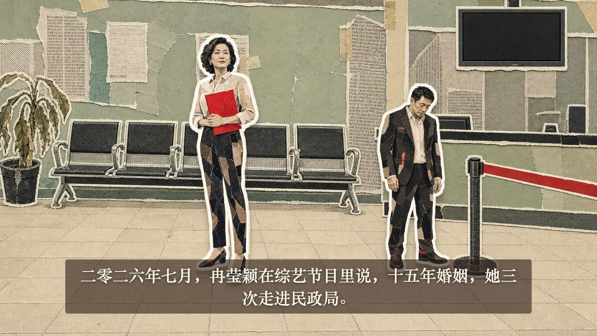
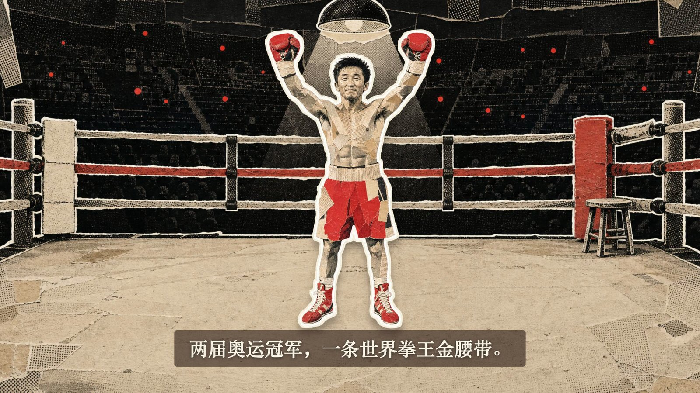
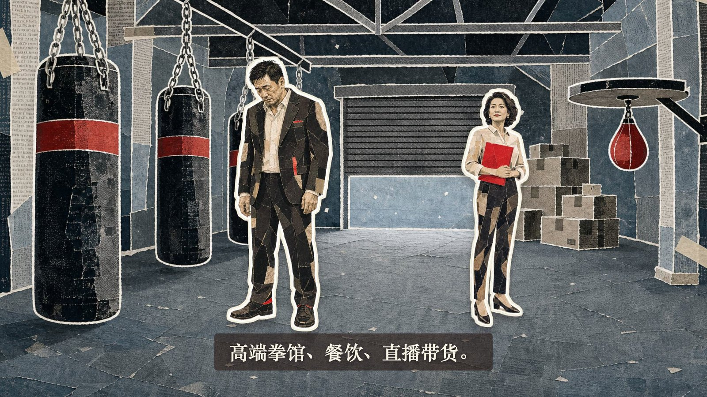
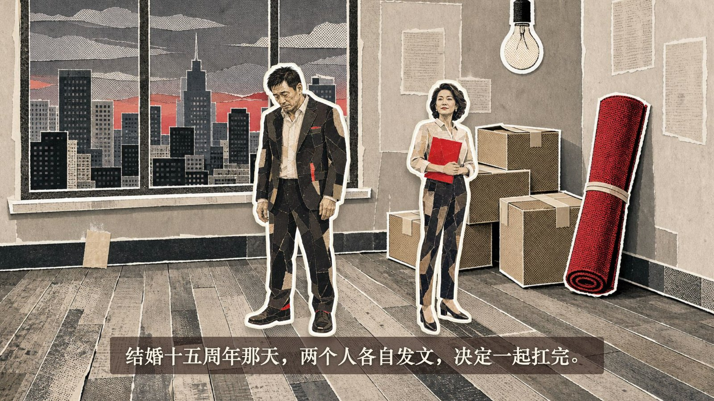

# 让 AI 做条「拳王离婚」视频，它反手把我的选题毙了

前阵子我干了件事：花 41 刀，让 Claude Code 给我焊了一条「纸片分层动画」的视频流水线。

当时我说了句挺装的话：**视频我只要一条，流水线我想要一辈子。**

但说实话，流水线这东西，第一条产出是不算数的——第一条是边踩坑边焊的，坑和产线你根本分不清谁是谁。

**真正的考试，是第二条。**

正好，前几天邹市明和冉莹颖的热搜刷到我脸上了。满屏都是「离婚」俩字。

于是我打开 Claude Code，敲下第一句话：

「帮我生成关于中国拳王近期的离婚故事。」

然后……它把我的选题毙了。

## 01 选题被毙之，它比我先去查了资料

它没有动手写代码，也没有开始画图。

它先去把资料搜了一圈，回来告诉我：**前提不成立，人家没离婚。**

事实是：十年间，冉莹颖三次走进民政局，三次都没离成；今年 2 月结婚十五周年那天，两个人各自发文——他写「三餐四季，一生相伴」，她写「以守为拳」。

官宣不离了。

那一刻我是有点尴尬的。因为我差点做出来的，正是我平时刷到就烦的那种东西……（标题跟事实反着来的那种。）

但这恰好撞在这条流水线的第一条规矩上：

**文案先行。任何美术开工之前，先把 script.json 写死；写 script.json 之前，先把事实核死。**

分镜没定，图全是白生成的；事实没核，片子做得再精致，也只是一条更精致的谣言。

于是选题从「拳王离婚」变成了「拳王为什么没离成」——顺便说一句，真实的版本比谣言的版本好看多了。

（故事本身我写在博客里了，链接在文末。今天这篇要说的是：这条片子是怎么被一条流水线吐出来的。）

## 02 流水线从哪来之，视频我只要一条，流水线我想要一辈子

简单交代下背景。

remotion-test 这个项目，起因是我刷到一条纸片风分层动画的推特——背景像旧报纸拼贴，人物像剪纸，一片一片飞进画面，各有各的节奏。那种质感，我当场就想要。

我对 Claude Code 说的是：「参考这条推特，帮我写一个做视频的 **skill**。」

注意，是 skill，不是 video。

一个多小时后，第一条样片《万邦来朝》渲出来了：21 秒，$41.20，途中踩了九个坑——图片水印、透明像素、人物尺寸、哑音轨，一个比一个阴间。

但这九个坑，全被焊进了一个 215 行的 SKILL.md 和一套 Remotion 模板里。

这次拳王的故事，就是拿着这套模板直接开的工：四张底板、三张人物剪纸、47 秒。

**上次踩过的坑，这次一个都没再踩。**（这句话后面我还要再说一遍，因为它就是全文的中心思想。）

## 03 铁律之，人物永远不能画进背景

整个项目只有一条第一性原理：

**永远不要把人物画进背景。**

底板生成时，prompt 里要大声喊「绝对没有人」；每个人物单独出一张透明 PNG；最后在 Remotion 里按 `底板 → 后排 → 主角 → 前排 → 字幕` 一层层摞起来。

为什么这条是铁律？看民政局这场戏：



她站前景，抱着红色文件夹；他缩在后景，隔着一条红色隔离带，低着头。

这个调度，只有人物和背景**分开**才做得出来：她可以更大、更靠前、先进场；他可以更小、更靠后、慢半拍。

如果这是一整张画死的图呢？你就只剩整体推拉了——**那不叫分层动画，那叫 PPT 切换。**

深度也不是什么 3D，深度就是遮挡：前面的剪纸挡住后面的一点点，层次感就出来了。

## 04 十个步骤之，一步都别想跳

流水线全流程十步，顺序焊死，每一步都在给下一步立规矩：

```
1. script.json   分镜 + 旁白文案（先于一切美术）
2. 底板          背景，绝对没有人
3. 人物          每人一张透明 PNG
4. trim          按 alpha 裁掉四周的空气（必需，不是可选）
5. 静态构图      只摆位置，不做动画
6. lint-layout   机器查构图，在渲染之前
7. 动效          按角色等级给运动，入场错峰
8. 旁白          MiniMax 出 WAV
9. sync          ffprobe 量时长 → 镜头长度
10. 渲染 + 验收  ffmpeg 挨个检查
```

为什么 trim 是必需的？因为 AI 出的图是方画布，人物只占中间一块，四周全是透明像素。你在 script 里写 `width: 650`，以为在调人物——**其实你在调空气的大小。**

为什么尺寸要按高度给、不能按宽度？你想想这条片子里的两张剪纸：拳台上双臂高举的拳手，和站得笔直的她——宽高比差出好几倍。按宽度统一给，瘦高的直接顶出画框，张开手的缩成一个疙瘩。

（上一条片子里，瘦高朝臣和坐着的皇帝宽高比是 0.35 对 0.89，我就是这么栽的。）

还有一条：`baseline` 记的是**脚**的 Y 坐标，不是头顶。一场戏里所有人共享一条地平线，后排的人脚更高（等于更远）、个子更小。

## 05 尺寸即等级之，这一场谁是主角

分层动画好不好看，不在图多精致，而在**尺寸和运动都得编码叙事等级**：

| 角色 | 高度（占 1080） | 运动 | 音效 |
|---|---|---|---|
| primary 主角 | ~680–820 | 走得最远，落地有分量 | impact |
| secondary 配角 | ~400–520 | 从两侧来，中等 | whoosh |
| tertiary 后排 | ~330–380 | 几乎不动 | tick |

有意思的是，「谁是 primary」这件事，在拳王的故事里是**换手**的。

第一场，拳台。他一个人站 C 位，聚光灯打在头顶：



到了拳馆那场，他还在前景，但头低下去了；她从右侧进场，抱着那个红色文件夹：



到了民政局，primary 换人了——她站进前景，他退成 secondary。

**尺寸就是话语权。这一段是谁的故事，谁就大。**

入场节奏同理：delay 必须错峰，4 帧、18 帧、24 帧……

**一起蹦出来的那不叫动画，那叫刷新。**

对了，还有个我特别喜欢的细节：她抱红色文件夹的那张剪纸，拳馆、民政局、出租屋三场用的都是同一张——换个底板、换个大小、换个位置，就是三场戏。



（这就是分层的复利：素材是资产，不是耗材。）

## 06 旁白说了算之，47 秒不是我定的

每个镜头多长？

**不是我定的，是旁白定的。**

流程是反着来的：先用 MiniMax 把旁白 WAV 生成出来，ffprobe 量出实际秒数，然后 `镜头长度 = 旁白长度 + 20 帧尾巴`（留一口气，免得最后一个字被切掉）。

字幕再按句子长度，在这段时间里按比例摊开。

所以这条片子是 47 秒——不是我拍脑袋写的 47，是从「两届奥运冠军，一条世界拳王金腰带」到「决定一起扛完」这几句话，读出来正好这么长。

`script.json` 里我只写文案；`script.build.json` 是脚本生成的，Remotion 读的是后者。

**手改生成物，是没有好下场的。**

## 07 机器验收之，渲染之前先挨骂

一次渲染好几分钟，用眼睛查构图纯属浪费生命。

所以渲染之前，`lint-layout.mjs` 先跑一遍：直接读 PNG 文件头拿尺寸，算出每个人物的包围盒，然后挨个骂——

- 谁的脑袋出画框了
- 谁整个人躲在别人背后、白生成了
- 谁俩的 delay 撞在同一帧了
- 字幕条压在谁的脚上了

渲染完，`check.mjs` 再跑一遍：ffprobe 查时长、查音轨、查音量。

最阴险的是最后一条：有音轨 ≠ 有声音。`mean_volume` 低于 -60dB 直接报错退出——轨在、码率正常、文件大小也对，就是一点声音没有。

（这种片子发出去，你就等着评论区提醒吧……）

## 08 流水线管不了的事之，底线得人来把

十步流水线，步步有脚本把关。但有三件事，是任何脚本都查不出来的：

**一、画面里不是真人肖像。**所有形象都是按「退役拳手」「前主持人」这样的角色特征生成的纸片剪影。我试过点名生成，工具给我的就是一张通用亚洲男拳手的脸——这条我没有硬凑。

**二、没有生成孩子。**「有三个儿子」是公开事实，旁白可以提；但把未成年人做成 AI 角色，放进一场关于父母婚姻的演绎里，这事我不干。

**三、每句旁白可溯源。**涉及数字的句子都带着「据公开报道」的限定词；只有自媒体在传、口径互相打架的说法（亏 7 亿、23 次抛弃之类），一律没进文案。

lint 能查出脑袋有没有出画框，查不出你该不该画这个人。

**流水线能保证片子是对的，保证不了片子是应该的。**后面这半截，永远是人的活儿。

## 09 第二条片子之，学费只交一次

最后盘一下账。

第一条片子《万邦来朝》：$41.20，64 分钟，九个坑，坑坑见血。

第二条片子，拳王的故事：四张底板、三张剪纸、47 秒。水印的坑没再踩，空气的坑没再踩，宽度的坑没再踩，哑音轨的坑也没再踩。

区别在哪？第一条踩完坑，我多要了一步：**把坑写进 skill，提交进 git。**

技能进了版本控制，才叫资产；不然只是那台电脑的运气。

> 📺 成片（47 秒，记得开声音）和完整的拳王故事，都在这里：
> **lokiwang.com/journal/zou-shiming-15-years**

流水线的价值，从来不在第一条产出上。

**第一条视频，你买的是坑；从第二条起，你才是在做视频。**

◇ ◆ ◇

- 成片 + 拳王故事全文：lokiwang.com/journal/zou-shiming-15-years
- 流水线开发全记录（41 刀踩的九个坑）：lokiwang.com/journal/remotion-paper-collage-41-dollars
- 模板：Remotion 4.0.489 + React 19 + TypeScript
- 图片：Codex 内置 imagegen（`codex login`，不要 API key）
- 音频：MiniMax `speech-02-hd`（旁白 + BGM），FFmpeg / ffprobe 验收
- 事实核查来源：极目新闻 / 新浪娱乐 / 网易 / 观察者网 / 中国日报（逐条出处见博客文末）
