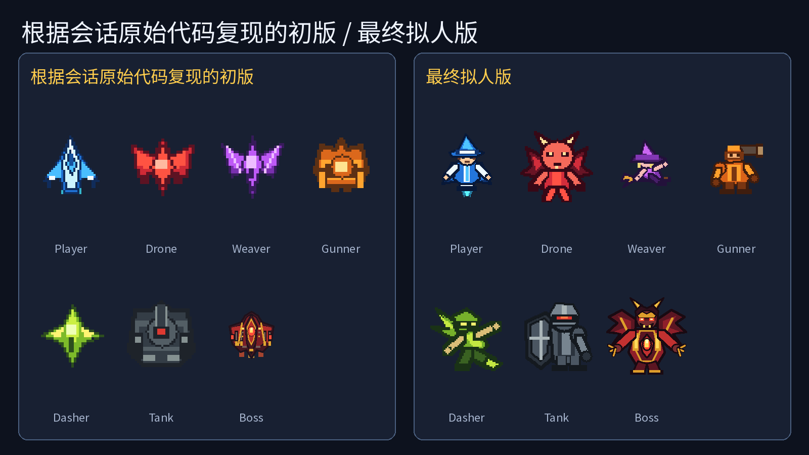
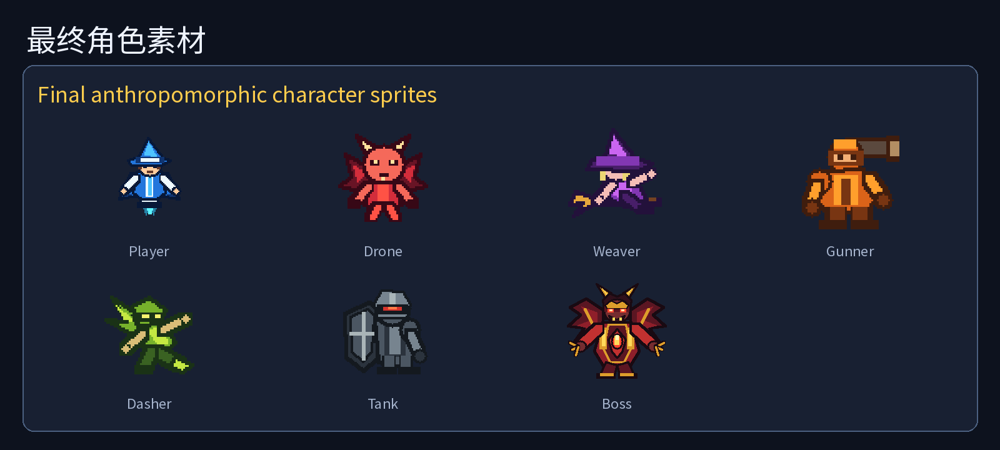
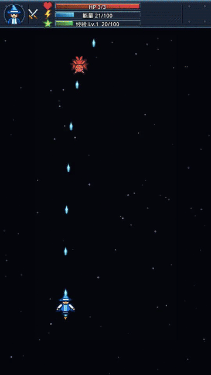
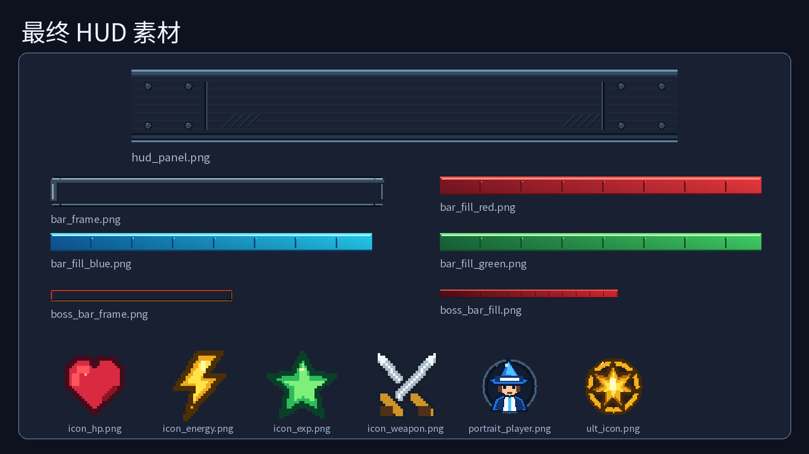
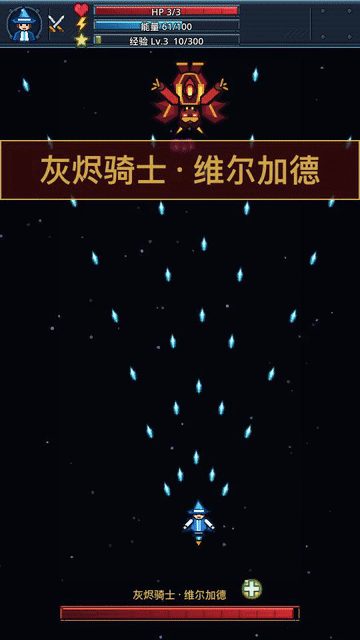
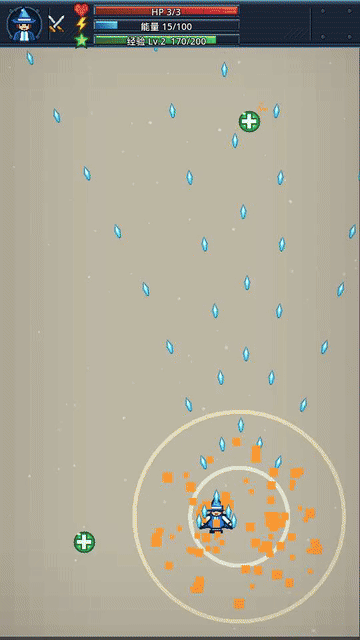
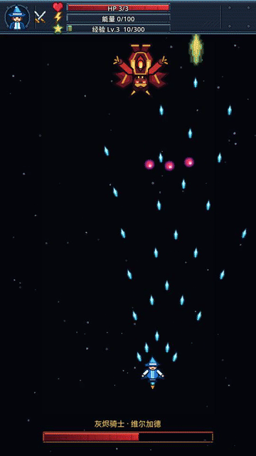
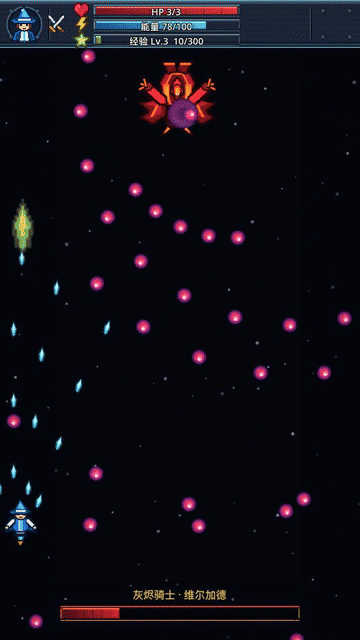

# Kimi 做出 Sky Striker，成本约 78 元

我用 **14 条消息**，让 Kimi Code 做出了一款 Godot 射击游戏。按 Kimi K3 API 标价折算约 **78 元**；但我用的是 Kimi Code 会员，这只是 **API 等价成本**，没有额外扣我 78 元。

先看 44.4 秒成片：升级、Boss、大招、二阶段，直到 `GREAT FOE VANQUISHED`……

<video src="assets/sky-striker-kimi-78-yuan/gameplay-full.mp4" controls playsinline></video>

## 01 第一版，打开就是黑屏

第一句话：「使用godot4 开发一款飞行射击游戏」。接着我让它「启动这个游戏」。

然后……黑屏。

我只发了截图和一句：「打开黑屏」。修完，屏幕上终于有东西能动。第一关不是 Boss，是窗口……

## 02 我把 Wing 和 Codex 都塞了进来

接着我要求用 Wing CLI 治理项目、迁移 skill、用 Codex 生成素材；敌人要有多种行动，玩家要能蓄力和放大招。

项目最终有五种敌机：`drone`、`weaver`、`gunner`、`dasher`、`tank`；玩家有 X 蓄力弹、C 大招和三级武器。

## 03 「飞行单位形象拟人化，更大一些」

我嫌第一版太像占位符：「飞行单位形象拟人化  更大一些」。于是玩家和六类敌人都长出了人形。

我紧接着问：「敌方单位不会发射子弹吗」。敌人这才从移动靶变成会还手的单位。

## 04 HUD 不能只负责好看

下一轮：HUD 换素材、加经验条、C 大招更华丽。

但状态条一直满着，说明也不直观。我又补了一句：「hud 状态不对 一直是满的 。 然后也缺少一些说明  不直观」。

这句比“优化 UI”有效。最终能量、经验和 Boss 血条都能反馈真实状态。

## 05 一句话，把它拽进魂系

中午 12 点 44 分，我突然说：「把这个游戏搞的更 魂系一些」。

Boss 随即有了登场、二阶段和弹幕；代码里也出现了 `YOU DIED` 与 `GREAT FOE VANQUISHED`。魂味来自阶段变化和结算仪式……

## 06 音乐、音效，以及那句「还没好吗」

下午我问：「音效 背景音乐都有了吗」。我说明 BGM 用 MiniMax、音效用 ElevenLabs 生成。最终有三首 BGM，也有蓄力、大招、二阶段和死亡等音效。

严谨一点：服务来源是我的会话说明；本地文件只能证明音频存在。

随后，我发了一条 prompt：

> 「还没好吗」

……催进度也是产品能力。

## 07 录视频，算账，提交

15 点 07 分，我让它录制游戏视频。成片是 540×960、30fps、H.264 + AAC；15 点 18 分，最后一句：「commit && push」。

提交 `ec93820`：127 个文件，6,028 行新增。

账按证据截止点计算：

| 项目 | Tokens | 单价（USD / 1M tokens） | 金额（USD） |
| --- | ---: | ---: | ---: |
| 未命中缓存输入 | 519,200 | 3.00 | 1.5576 |
| 命中缓存输入 | 26,259,007 | 0.30 | 7.8777021 |
| 输出 | 134,285 | 15.00 | 2.014275 |
| **小计** | — | — | **11.4495771** |

按 2026 年 8 月 5 日采用的工作汇率 **USD/CNY = 6.77**，结果是 `11.4495771 × 6.77 = 77.513637967`，四舍五入约 **78 元**。

这是 API 等价成本，不是会员会话额外支付的账单。

回头看，最初那句只给了方向。真正把它推到能看的，反而是后面的抱怨：**黑屏、敌人怎么不打人、HUD 一直满、还没好吗……**

规格负责开局，抱怨负责把游戏做完。

◇ ◆ ◇

Kimi K3 计价：<https://platform.kimi.com/docs/pricing/chat-k3>

汇率参考：<https://www.xe.com/currencycharts/?from=USD&to=CNY>
