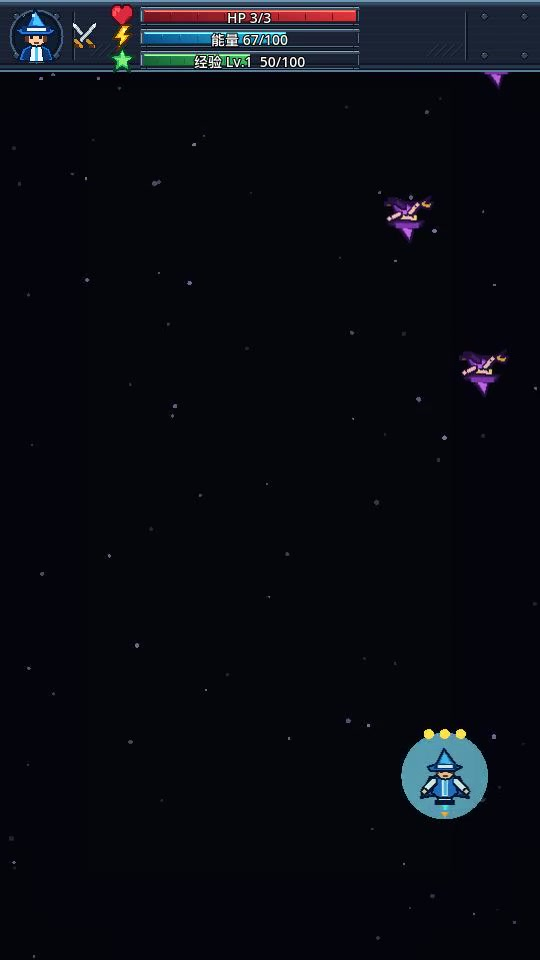
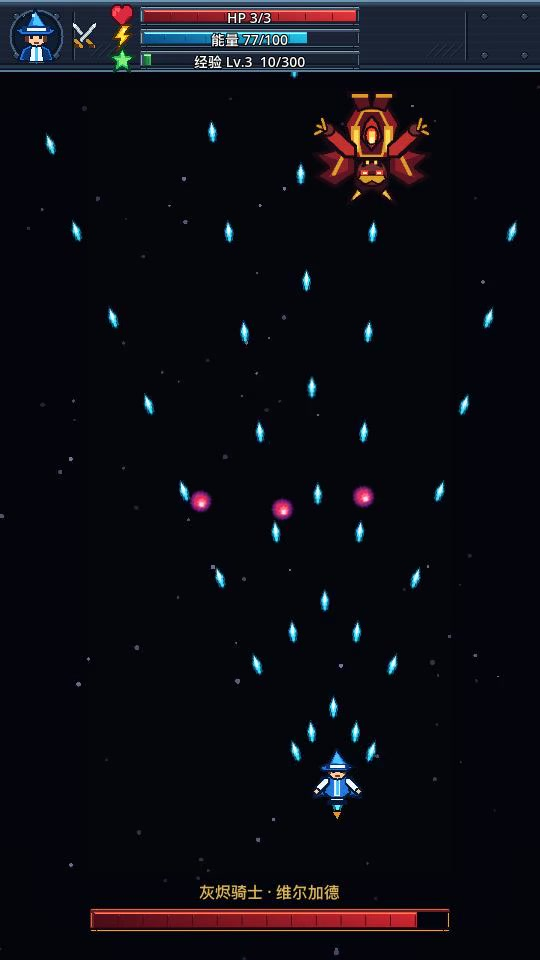
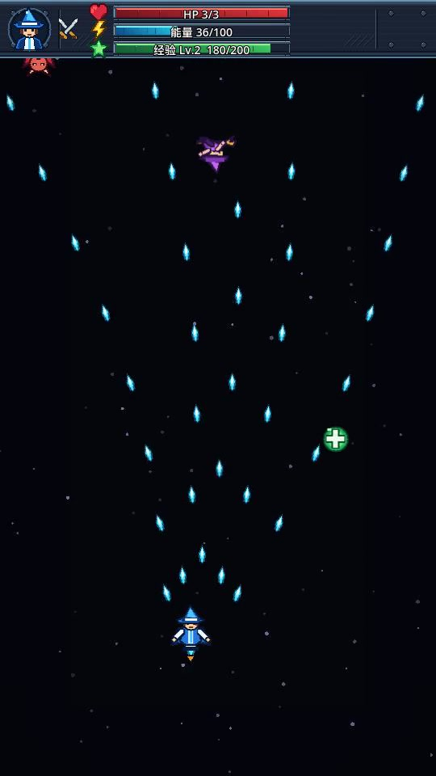
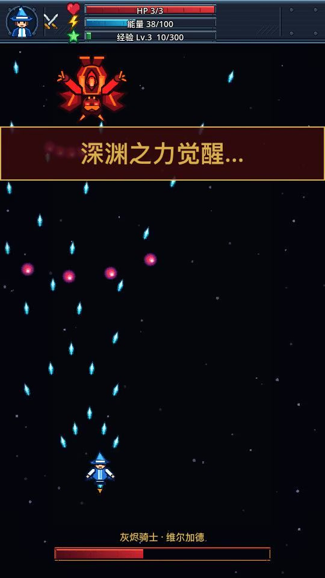
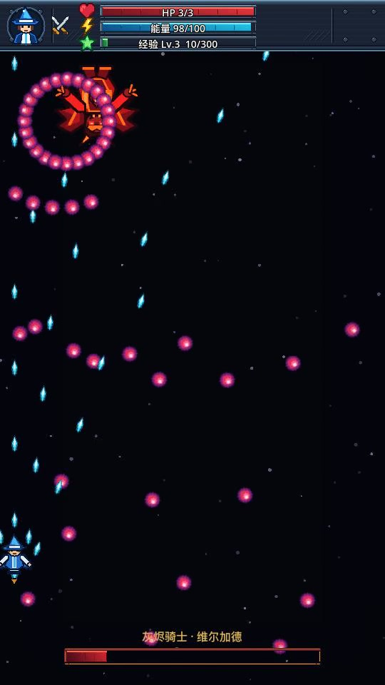

# 花了 78 元，说了 14 句话，我用 Kimi 做了一款魂系飞行射击游戏

我这次真没写游戏代码。

第一句是我在 Kimi Agent 里丢出去的：「使用godot4 开发一款飞行射击游戏」。后面 **13 句**，才是在 Kimi Code 主会话里补的。

所以是 **1 + 13 = 14 句话**。子代理自己互相派的活儿不算；最后「commit && push」之后那次网络重试，也不来蹭这个数……

先看完整的 44.4 秒成片。升级、蓄力、大招、Boss 二阶段，到最后把它打穿：

<video src="assets/sky-striker-kimi-78-yuan/gameplay-full.mp4" controls playsinline preload="metadata" poster="assets/sky-striker-kimi-78-yuan/cover-mp.png" style="width:100%"></video>

一句方向，能长成什么样？下面按我补的那些话，拆开看看。

## 01 第一版，打开就是黑屏

第一句话落下，我让它启动游戏。

然后……黑屏。

我发了张截图，补一句：「打开黑屏」。修完以后，终于不再是一个精致的黑色矩形了。

能动以后，还能一路升级。第一关算是活过来了。

## 02 我把一串需求塞了进去

第四条消息很贪心：用 Wing CLI 治理项目、迁移 skill、用 Codex 生成素材；敌人得有不同打法，玩家得能蓄力、能放大招。

最后敌机凑出了五种：`drone`、`weaver`、`gunner`、`dasher`、`tank`。玩家则有 X 蓄力弹、C 大招，还有三级武器。

一开始它们还是几何小飞机。我又补了一句：「飞行单位形象拟人化  更大一些」。这才有了现在这批人形单位……

## 03 敌人，终于开始还手

好看是好看，但我很快发现另一个问题：「敌方单位不会发射子弹吗」。

一句话，移动靶变成了会反击的敌机。

开始有点纵版射击的味儿了。

## 04 HUD 不能只负责漂亮

接着我要求 HUD 升级成游戏素材，加经验条，顺便让 C 大招华丽一点。

结果状态条一直满着……我只好再补：「hud 状态不对 一直是满的 。 然后也缺少一些说明  不直观」。

这之后，能量、经验、Boss 血条才真的会反馈战况。一个 HUD，终于不只是贴在屏幕上的装饰品。

## 05 一句话，把它拽进魂系

中午 12 点 44 分，我突然说：「把这个游戏搞的更 魂系一些」。

它理解得很直接：Boss 有登场、有弹幕、有二阶段；结算文字也狠狠干成了 `YOU DIED` 和 `GREAT FOE VANQUISHED`。

一句「魂系」，这排面就自己长出来了……

## 06 音乐、音效，以及那句「还没好吗」

下午我问：「音效 背景音乐都有了吗」。我在会话里说明：BGM 是 MiniMax 生成的，音效是 ElevenLabs 生成的。

最终项目里确实有三首 BGM，蓄力、大招、二阶段、死亡这些音效也都在。服务来源是我的会话说明；本地文件只能证明音频存在——这两件事，还是要分开说清楚。

随后我又扔下一条：

> 「还没好吗」

……催进度也是产品能力。

## 07 录下来，然后算账

15 点 07 分，我让它录一段视频，准备放到这篇里。最后的成片是 540×960、30fps，H.264 视频加 AAC 音频。

15 点 18 分，最后一句人类消息：「commit && push」。对应提交是 `ec93820`，127 个文件、6,028 行新增。

然后就是你们肯定会问的：到底花了多少？

| 项目 | Tokens | 单价（USD / 1M tokens） | 金额（USD） |
| --- | ---: | ---: | ---: |
| 未命中缓存输入 | 519,200 | 3.00 | 1.5576 |
| 命中缓存输入 | 26,259,007 | 0.30 | 7.8777021 |
| 输出 | 134,285 | 15.00 | 2.014275 |
| **小计** | — | — | **11.4495771** |

按 USD/CNY = 6.77 的工作汇率，`11.4495771 × 6.77 = 77.513637967`，约 **¥78**。

但这里必须说清：这是按 Kimi K3 API 标价换算的 **API 等价成本**。我这次用的是会员，**没有产生和这 ¥78 对应的额外实际扣款**。它不是我的会员账单，别给我算成「花 78 元开会员做游戏」……

回头看，第一句只负责把门推开。真正把这游戏从黑屏推到能看的，是后面那些很不客气的抱怨：黑屏、敌人怎么不打人、HUD 一直满、还没好吗……

**规格负责开局，抱怨负责把游戏做完。**

◇ ◆ ◇

- Kimi K3 API 计价：<https://platform.kimi.com/docs/pricing/chat-k3>
- 汇率参考：<https://www.xe.com/currencycharts/?from=USD&to=CNY>
