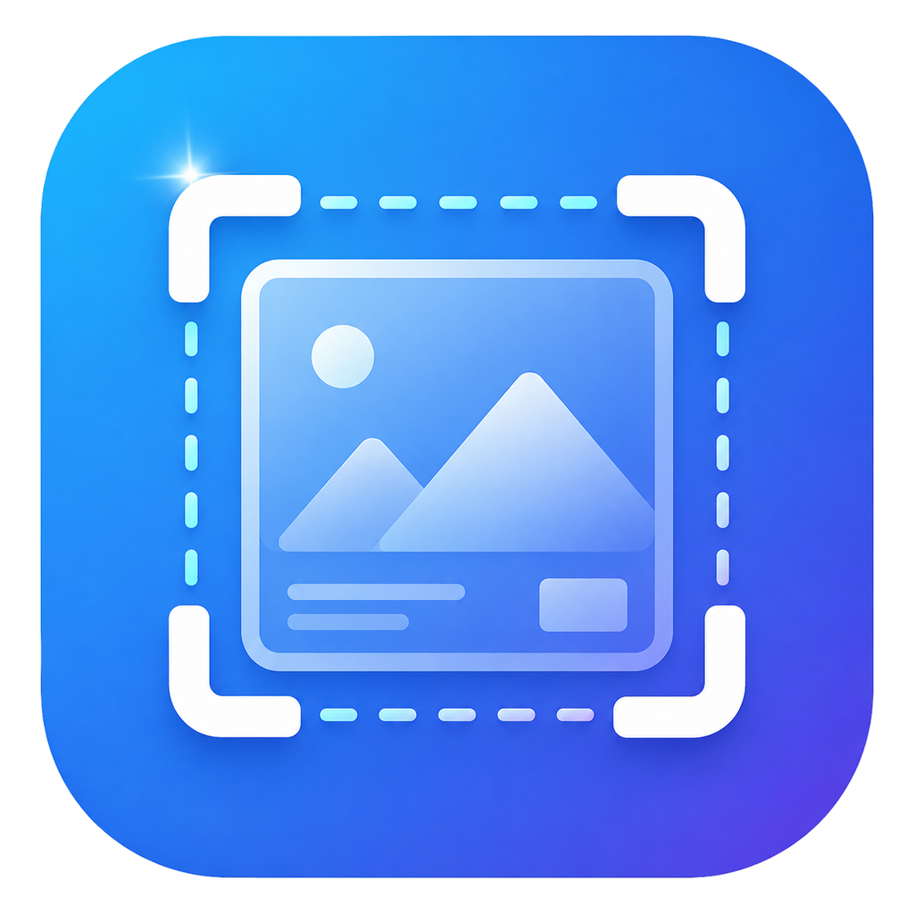
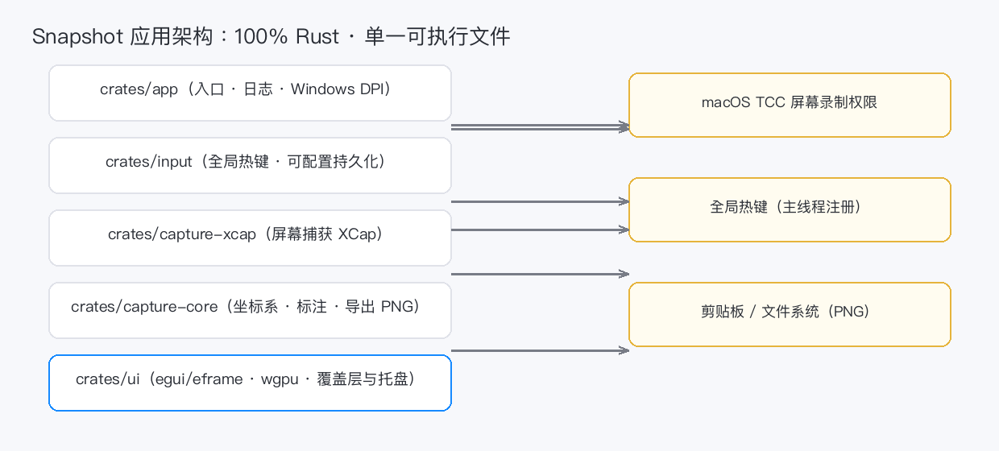
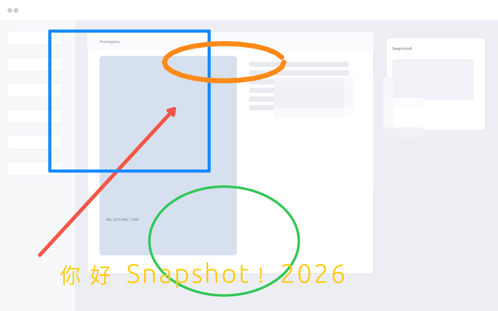
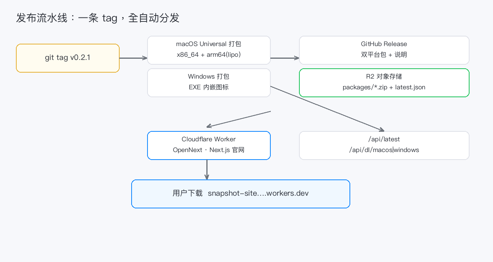

# 从 0 到 1：我用 100% Rust 写了一款跨平台截屏工具

> 全程由自家两台 Spark 服务器上部署的 DeepSeek Flash 结对写码。
> 没有 Electron，没有 Python，没有一把梭——只有一个 Rust 可执行文件，
> 从全局热键、截屏覆盖层、标注涂抹，一路写到官网、CDN 分发与自动发布流水线。



---

## 先说结果

- **技术栈：100% Rust**（egui / eframe + wgpu 渲染，零 Electron、零 Java）
- **平台：macOS + Windows**，单个可执行文件，macOS 为 Universal（Intel + Apple Silicon 原生）
- **交互对标微信截屏**：自由选区、六种标注、马赛克涂抹、八色色板、标注再编辑、托盘快捷键、一键复制
- **分发全自动**：打一个 `v*` 标签 → GitHub Actions 打包双平台 → 上传 Cloudflare R2 → 官网（Cloudflare Workers）实时可下载
- **官网**：`snapshot-site`（Next.js + OpenNext 部署到 CF Workers），含 `/api/latest` 版本接口与直下接口

这款截屏工具叫 **Snapshot**。这篇文章是它的完整开发旅程——**不是构想，是已经跑在桌面上的真实产物。**

---

## 01 · 为什么要做：被微信截屏惯坏的人

我平时在 macOS / Windows 之间横跳，被微信 PC 版截屏的体验惯坏了：按个组合键框选、箭头、矩形、马赛克、文字标注、回车复制，一气呵成。

系统自带截图、贴图工具各有各的不顺手：

- macOS `⌘⇧4`：标注能力约等于零，没有马赛克，想圈重点还得另开工具；
- QQ 微信的截图：绑定 IM 客户端，关了应用就没得用；
- 各种"截图增强"工具：要么 Electron 一个包三百兆，要么隐私不明，要么收费。

于是萌生了想法：**自己写一个「微信桌面式」的截屏标注工具，纯本地、跨平台、一个文件装完。**于是就有了 Snapshot。

---

## 02 · 技术选型：为什么是 100% Rust

选型时列过候选：

| 方案 | 缺点 |
|---|---|
| Electron + JS | 打包 200MB+，内存大户，和"轻量工具"的定位相悖 |
| Tauri（Rust + WebView） | 更轻，但仍依赖系统 WebView，且国内 WebView 环境参差 |
| **Rust + egui/eframe** | **即时模式 UI、wgpu 渲染、单文件、几十 MB 以内，直接调用系统 API** |

最终选了 **egui / eframe 0.35（wgpu 后端）**。理由很具体：

- egui 是即时模式（immediate mode）GUI，适合"全屏覆盖层 + 状态机"这种形态——每帧重绘，没有传统 GUI 的控件树心智负担；
- 覆盖层窗口要"透明 + 置顶 + 贴主屏 + 启动隐藏"，eframe 的 ViewportBuilder 全部支持；
- 屏幕捕获用 **XCap**（Rust 原生，无系统权限弹窗之外的门槛），标注渲染用 **tiny-skia + ab_glyph**，导出无损 PNG；
- 全局热键用 **global-hotkey**，托盘用 **tray-icon**——全部是 Rust 生态的量级组合。

整个工程 5 个 crate，每个都干一件事：



> 硬约束贯穿始终：**UI 坐标一律逻辑像素，导出按 scale 映射物理像素**；预览与导出共用同一套渲染管线（所见即所得）；导出一律无损 PNG；本地不联网、不落盘截屏内容。

---

## 03 · “写代码的”是谁：自家两台 Spark 上的 DeepSeek Flash

这是最有意思的部分：**这个项目的代码，大部分不是我手敲的，而是跑在自家两台 Spark 服务器上的 DeepSeek Flash 结对写出来的。**

### 为什么自部署

- **数据不出门**：正好这又是一款拷屏工具，我尤其在意隐私——让截屏工具体验"截图内容完全本地"，同时让写它的 AI 也"完全本地"，很自洽。
- **成本与可控**：两台 Spark 跑推理，一次投入，长期 0 推理成本；模型资源全部在自己手里，不受厂商限流影响。
- **结果确实能打**：DeepSeek Flash 深度参与架构、踩坑定位、代码重构与发布流水线，完成度远超我的预期。

### 协作流程（agent 化）

整条流水线是 agent 式的：

1. 我给一个明确目标（例如"马赛克改成涂抹交互"）；
2. agent（在 DeepSeek Flash 推理驱动下）读现有代码 → 设计 → 改代码 → 跑 `cargo test` / `clippy` 自检；
3. 打包到 `~/Applications/Snapshot.app` 交给用户实机验收；
4. 用户反馈（"选中元素要变光标""马赛克交互不对""UI 太丑要微信风浅色"）→ 下一轮迭代。

**一轮一个验收点，人机各自做自己擅长的**：AI 写代码、定位 wgpu 竞态、画像素；人做体验判断与验收。这大概就是"AI 结对编程"最务实的形态。

---

## 04 · 从零到"能截图"：M0 的硬骨头

第一里程碑（M0）只有一件事：**按全局热键 → 冻结当前屏幕 → 显示全屏覆盖层 → 拖出选区。**

看起来简单，坑都在暗处：

### 坑 1：覆盖层不能截图到自己

"先捕获、后显示"是常识，但 macOS 上还有一个更阴的坑：**builder 的 `with_visible(false)` 不可靠**，首帧仍可能闪一下窗。解决办法是首帧再强制隐藏一次，捕获完成才把窗口推出来。

### 坑 2：冻结帧纹理的 wgpu 竞态（“第二次黑屏”）

第一版每次会话都重新 `load_texture` 冻结帧，于是出现玄学：**第一次截屏好好的，第二次就整屏黑**。

原因：egui/wgpu 渲染器的纹理是通过 ID 索引的；会话间纹理被释放又重建，窗口隐藏期 GPU 资源被回收，恢复显示时引用悬空（`Missing texture: Managed(n)`）。

修复的关键洞察：**冻结帧纹理跨会话复用**——TextureHandle 创建一次、永不释放，之后每次只 `set()` 更新像素；纹理 ID 恒定，从根本上消除"隐藏期 free/alloc 竞态"。这是传统 GUI 思维不容易想到、只有把渲染管线吃透才会撞见的坑。

### 坑 3：macOS 屏幕录制权限（TCC）

macOS 的屏幕录制权限按"负责任进程（responsible process）"判定。从 shell `open` 启动的 App，responsible 是 shell，权限永远过不了；**必须用户从 Launchpad/Finder 双击启动**，才会弹授权框、权限才生效。

于是做了：
- 截屏前自检 `CGPreflightScreenCaptureAccess()`，未授权时给出引导并一键打开系统设置；
- 托盘增加"申请截屏权限"入口；
- 每次重新 ad-hoc 签名会改 CDHash，需要重新勾选——在打包脚本里固化 bundle id，尽量降低频率。

---

## 05 · 微信级体验：从"能截"到"好用"

M0 能截图后，用户的要求开始"像素级"对齐微信：

### M1：六种标注 + 撤销 + 一键复制

箭头、矩形、椭圆、画笔、文字、马赛克，键盘 `A/R/E/B/T/M` 秒切；预览与导出共用**同一套 DrawTarget（WYSIWYG）**，导出 tiny-skia、预览 egui，两边看到的标注一模一样。

### M2：标注再编辑（微信式的灵魂）

第一版画完就"定死"了，用户直接吐槽：**"选择区域内标记完就不能修改了。微信截屏支持拖拽标记、改变大小位置。"**

于是给每个元素加了几何能力：`bounds / translate / hit / resize`。现在：
- 点选元素 → 蓝色框 + 四角缩放柄，光标随角柄/元素切换；
- 按住拖动移动、拖角柄缩放、Delete 删除；
- **移动/缩放/删除全部进撤销栈**（编辑历史与创建历史分层，撤销先回退编辑再回退创建）。

### M2：马赛克从"拖框"改成"涂抹"

微信的马赛克是**画笔式涂抹、直出块纹**，不是拖个框。实现上：轨迹逐点烘焙成 RGBA 块位图（块外透明，露出原冻结帧）；**涂抹过程中 painter 直绘方块**——这里有个性能陷阱：如果用纹理每帧刷新，GPU 句柄会一路泄漏；改成 CPU 直绘几百个 rect，实时、零泄漏、效果一致。

### M2：色板、光标、浅色 UI

- 工具栏第二行八色微信式色板，选中蓝圈高亮，**只在有颜色的工具下显示**（马赛克时折叠）；
- 选中光标：角柄斜向缩放、元素上移动、马赛克大圆笔刷（隐藏系统指针）；
- 整体换成**微信风浅色**：白底圆角投影工具栏、浅蓝填充选区、白底尺寸标签、自绘文字编辑器；
- 文字编辑器是纯自绘而不是用 egui 控件——因为全屏覆盖层下，painter 自绘 + 命中检测比控件稳定可控。



---

## 06 · 打包与分发：一个 `v*` 标签走完全程

桌面工具做完，分发是另一座山。最后沉淀成一条全自动流水线：



### Universal 打包（macOS 的必修课）

CI 的 `macos-latest` runner 是 Intel 的，直接打包只会得到 x86_64——**在 Apple Silicon 上只能靠 Rosetta 跑，不算完**。

修复：`scripts/package_universal.sh` 交叉编译 `x86_64-apple-darwin` 与 `aarch64-apple-darwin`，用 `lipo -create` 合成 fat 二进制，再整体 ad-hoc 签名。一个 `.app`，两种架构原生跑。

### 图标：去背景那点事

用户发来一张带白底的图标原图。直接在代码里做处理：写了个 `bg_remove.py`，用**四边 flood-fill 只抠与边缘连通的白区**、保留图标内部白色、外缘 1px 羽化——不误删内部元素，也不会留下白边锯齿。ICNS / ICO / 托盘 32px 全套用它生成并编译期内嵌。

### GitHub Actions：打包 + Release + 上传全自动

- `release.yml`：打 `v*` 标签触发 → 并行打包 macOS / Windows → 创建 GitHub Release → **wrangler 上传 R2**（`packages/*.zip` + `packages/latest.json` 版本元数据）；
- `deploy-site.yml`：push `site/**` 即 OpenNext 构建 + 部署 CF Workers。

踩过的有意思的坑：
- **wrangler 强制 Node ≥ 22**，Actions 默认 Node 20 会直接拒绝部署——两个 workflow 都显式升 Node 22；
- **upload-r2 的版本号取自 `Cargo.toml`**（而不是 tag 名），手动 dispatch 时语义也不会错；
- **Node 20 弃用警告**一路伴随（actions/checkout@v4 等，不影响功能但很吵）。

---

## 07 · 官网：Next.js + OpenNext 上 Cloudflare + R2 分发

官网是配套很关键的一块：**官方下载页 + 版本接口 + 安装包托管**。

### 架构

```
用户 ──> CF Workers (snapshot-site)
          ├─ /               官网首页（Next.js RSC）
          ├─ /api/latest     最新版本元数据（版本/大小/发布时间）
          └─ /api/dl/macos|windows  安装包流式下载（R2）
GitHub Actions（v* 标签）
          ├─ 打包 macOS/Windows
          ├─ 创建 GitHub Release
          └─ 上传 R2（wrangler --remote）
```

- 官网用 **Next.js 15 + @opennextjs/cloudflare**，一条命令 `opennextjs-cloudflare build` 出 Worker 产物，`wrangler deploy` 上线；
- 安装包放 **Cloudflare R2**（`packages/` 下），Worker 通过 R2 binding 直读，下载走流式返回（带 Content-Length / Content-Disposition），不暴露存储桶；
- `/api/latest` 返回 `{ version, published_at, macos:{size}, windows:{size} }`，官网下载按钮的动态大小、版本号全部来自它。

> 有意思的小坑：OpenNext 的 `build` script 本身不能写成 `opennextjs-cloudflare build`，否则它会再回调你的 build script，形成无限递归——正确的姿势是 `build` 保持 `next build`，把 CF 打包放 `build:cf`。

### 页面设计：用 OpenDesign 当“设计引擎”

官网视觉在最初一版"微信浅蓝"上又做了一轮：用 **OpenDesign（开源设计引擎，跑在自己本机）** 按品牌简报生成落地页于稿，再把它转成真实的 Next.js 组件接进官网。

OpenDesign 产出的是一份单文件 HTML 于稿（深绿 accent 的 tech-utility 风格、产品示意窗、键盘优先快捷键表、更新日志）。

我做的事：
1. 原样提取它的 `<style>` 变 `globals.css`（零视觉改动）；
2. 正文 HTML → JSX，原 `<script>` 的工具栏点击高亮用 React state 实现；
3. 品牌与功能对齐 Snapshot：**下载按钮接到真实 `/api/dl/*`**、快捷键表换成真实键位（`⌥⌘A` / `Alt+Shift+A`、`A/R/E/B/T/M`）、更新日志换成真实版本记录。

于是官网从"能用"变成"有设计有质感"，还带一个自动浮起的选区示意动画。


---

## 08 · 一些数字与感受

| 项 | 数值 |
|---|---|
| 语言 | 100% Rust（截图/标注/导出/热键/托盘/UI） |
| 包体 | macOS ~13MB（Universal） / Windows ~7MB |
| 渲染 | egui/eframe + wgpu，tiny-skia + ab_glyph 导出 |
| 覆盖平台 | macOS 10.15+（Universal）、Windows 10/11 |
| 官网 | Cloudflare Workers + R2，打 tag 全自动分发 |
| AI | 自家两台 Spark 部署的 DeepSeek Flash |

**感受最深的三点：**

1. **把渲染管线吃透的价值**：冻结帧纹理竞态这类问题，用"测了再说"的心态会卡死人；把 egui/wgpu 的生命周期模型想清楚，改动是一行级别。
2. **交互细节的复利**：光"马赛克是拖框还是涂抹"、"选中要不要变光标"这些细节，就拉开了工具与玩具的差距。用户体验从来不是大功能，是这些"小事"。
3. **AI 结对的正确姿势**：AI 负责"怎么实现"，人负责"对不对"——每轮一个可验收的产物，迭代飞快，且所有代码都经过真实编译、真机截图、真实 CI。

---

## 09 · 下一步

还在路上的方向：

- macOS 正式签名与公证（目前 ad-hoc 签名，首次打开需手动放行）
- 官网加版本历史 / 下载统计
- 标注能力继续对齐微信：箭头样式、文字字号、贴图钉屏
- Windows 原生打包打磨（MSI 安装包）

如果你也想要一款"微信桌面式、纯本地、跨平台"的截屏工具——它已经在那了：

- **官网**：https://snapshot-site.wangchao0126.workers.dev
- **源码**：https://github.com/lifecoder1988/snapshot

> 一个小请求：如果你读到这觉得还不错，欢迎在 GitHub 给 Snapshot 点个 Star，或把这篇转给同样被截图工具惯坏的朋友。

（文中所有架构图与流程图为程序生成；演示标注图为真实导出渲染结果。）
