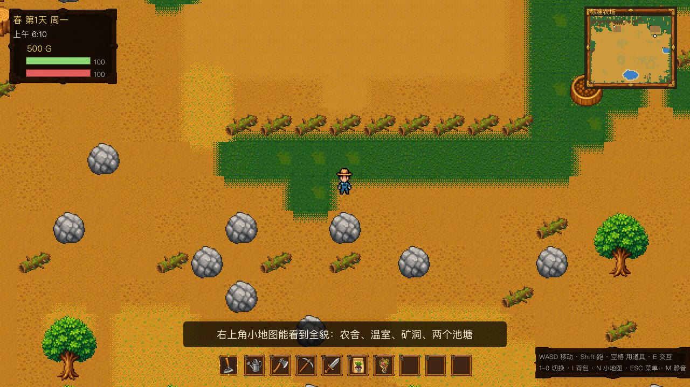
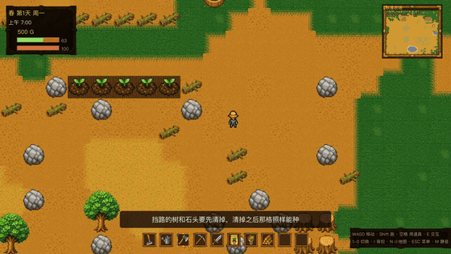
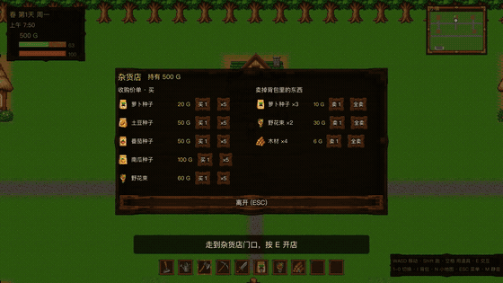
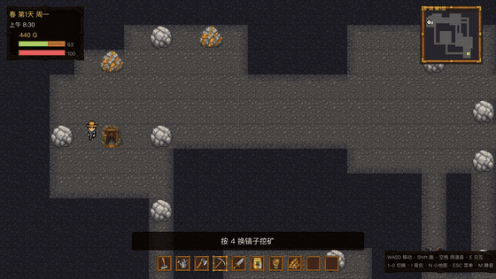
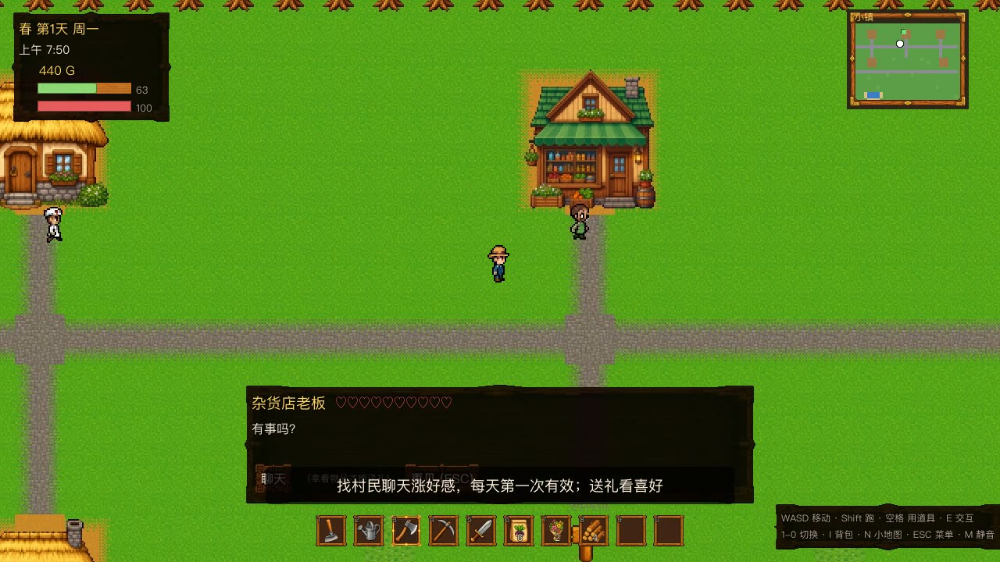
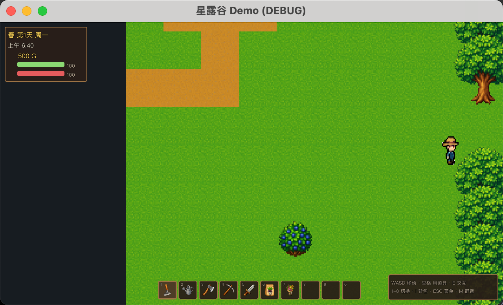
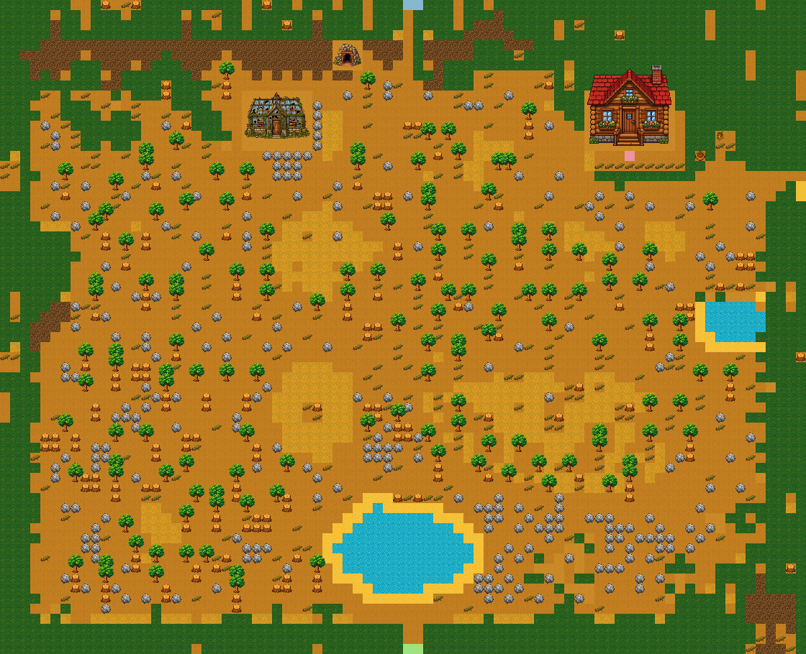
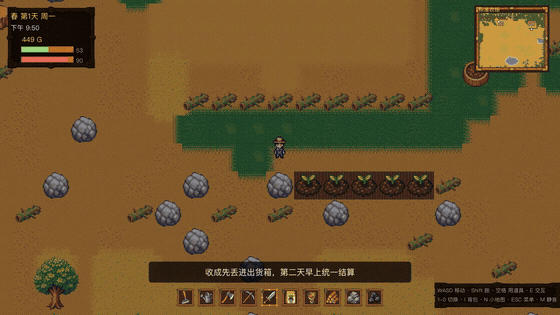
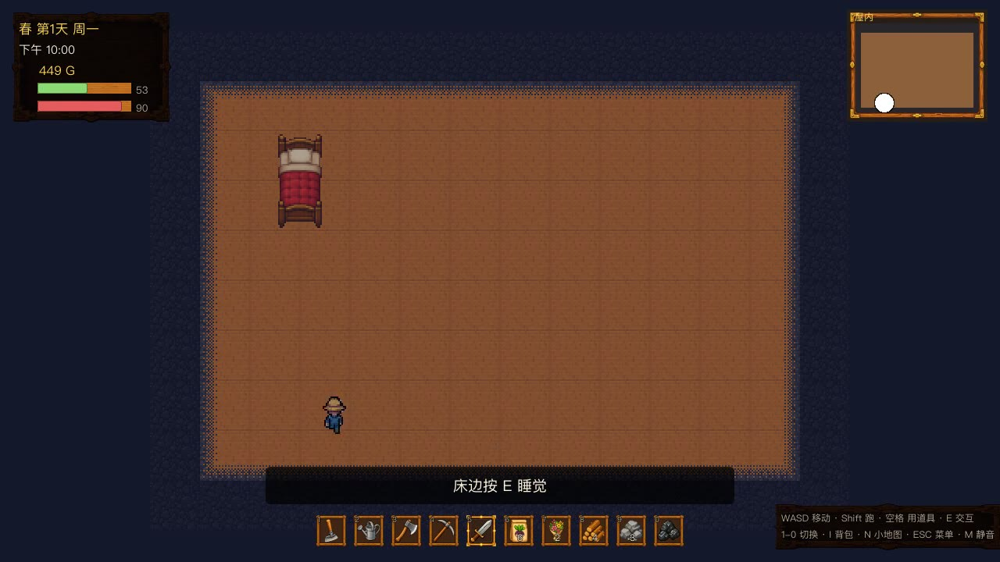

# 8 句话 503 刀，Claude 手搓了个《星露谷物语》，农场是从 wiki 原图上一格格抠下来的

中午 12 点 01 分，我对 Claude Code 说了第一句话。

晚上 19 点整，它交给我一个能玩的《星露谷物语》垂直切片：起床 → 种地 → 进城买卖社交 → 下矿挖矿打怪 → 回家睡觉 → 次日结算，一整条日循环闭环。

中间我一共只说了 **8 句话**——其中一句还只是一张截图，一个字没打。

先看 98 秒成片。这不是我玩的，是它自己写了个脚本，用真实按键和鼠标把一整天玩了一遍，还顺手给自己加了中文字幕：

> 📺 98 秒完整实机视频（AI 自己用真实按键玩完的一整天，带中文字幕）在博客原文：`lokiwang.com/journal/stardew-godot-503-dollars`

照例声明：非商业学习复刻，美术音频全是 AI 生成或程序合成的，没用原作任何资产。原作在 Steam 上，值得每个人买一份。

下面按时间线，把这 8 句话一句句拆开。

## 01 一句话立项之，三小时交出一整天

12 点 01 分，第一句：

> 使用 wing cli 治理这个项目。做一个星露谷物语的 demo。skill 参考 /Users/joe/code/shalujianta 里的，skill 主要是生成游戏素材、音频这些。角色动画我已经做好了，在 farm_folk_pack.zip

没了。没说要几种作物，没说地图多大，连「做到什么程度」都没提。

13 点 12 分，它说做完了。**354 个文件，+12484 行。**

清单我念一下：70 张 AI 美术（`gpt-image-2` 出图 → 洋红抠像 → 降采样）、5 首 MiniMax 的 BGM、20 个本地合成的音效、9 个白天游走夜里归家的 NPC、5 层程序生成的矿洞、单槽位 JSON 存档，外加 5 份领域文档、4 篇 ADR、1 份 OpenSpec 变更提案，`wing check --strict` 全绿。

（说实话，比我自己开新项目时规矩多了……）

## 02 「你实际玩一下」之，它自己写了个真人试玩

第二句我让它 commit，第三句只有六个字：**「你实际玩一下」**。

结果它写了个 `playtest.tscn`——发真实的 `InputEventKey` 和鼠标事件，WASD 走过去、空格用道具、E 交互、鼠标点 UI，把一整天真跑一遍。

然后它给我发来一句我很喜欢的话：

> **截图冒烟测试全绿的东西，一上手就露馅了。**

## 03 四个手感 bug 之，打蝙蝠要挥 30 下

试玩挖出来的四个问题，没有一个是截图能看出来的：

1. **矿洞走廊卡死**——走廊只有一格宽，碰撞盒蹭到瓦片角就完全动不了，它在 (17,14) 原地挣扎了 20 秒；
2. **战斗是打地鼠**——16 血的蝙蝠、剑伤 10，居然要挥 30 多下。病根是击退 60px 远超攻击距离 34px，**每打中一下就把敌人推出射程**；
3. **跟 NPC 说不上话**——判定要求同时靠近和面朝，对方一走动就点不到；
4. **对话时 NPC 自己走了**——弹窗只冻结玩家，世界还在跑。

第 2 条的修法是把击退调到 24、攻击距离拉到 42，然后**加了一条回归断言：`KNOCKBACK < ATTACK_RANGE`**。

把手感写成不等式钉进测试里……这招我记下了。

## 04 一张截图之，黑边不是画少了

我的第四句话是一张截图加六个字：「bug 出现黑色区域」。

原因挺妙：地砖是按**玩家位置**算该画哪些，可相机走到地图边界会被 `limit` 夹住——这时相机中心已经不在玩家身上了，绘制窗口和真实可视区错开，错开的那一条就没画。

改成从相机的真实可见矩形反推，顺带自动适配任意窗口尺寸。

它还写了个回归测试，在 1280×720 / 1600×900 / 1024×600 三种窗口下把玩家丢到三张地图的各六个边角逐点采样。第一版把背景色设成默认深色，**误报了 4569 个「黑边」像素**——洞窟墙本来就很暗。换成洋红底才干净。

## 05 抄农场之，wiki 用 403 把我拦在门外

第五句：「参考 stardewvalleywiki，先实现标准农场」。

然后它去抓 wiki，zh / en / fandom 三站分别回了 **403 / 403 / 402**。

它没有装作抓到了。它把话分成两栏摆给我看：**查证到的**——可耕地块 3427 格、最大连续矩形 63×31、两个池塘且都没鱼；**我的还原**——80×65 的尺寸、农舍温室池塘山洞的方位。

（这个「哪些是真的、哪些是我编的」的分栏，比多做十个功能都让我踏实。）

## 06 给它原图之，3463 vs 3427

第六句我一个字没打，只丢了一张图——wiki 上的标准农场地图原图。

它把做法整个换了：不再按文字猜，而是**从图里逐格提取**。图正好 1280×1040 = 80×65 格、每格 16px，直接按格取色。

关键的一步不是取色，是**怎么定农场边界**：树冠、建筑、水面会挡住地面颜色，按「这格有土」判会在农场里挖出一堆洞。改成从地图四边做洪水填充，**填不到的地方就是农场内部**。

|  | 提取结果 | wiki 记载 |
|---|---|---|
| 可耕地块 | 3463 | 3427（偏差 1.05%） |
| 最大连续可耕矩形 | 61×30 | 63×31 |

上一版是拿 3427 当目标去凑，这一版反过来——**这两个数字是算出来的，所以它们成了提取正确性的验证**。

踩的坑也很典型：暗棕色既是崖壁、又是树影、还是农舍的木台阶，一律当崖壁就**把农舍门堵死了**。抓到它的是那条「从出生点走得到每个地标」的可达性断言。

（原图有版权，它没入库，我这儿也就不放了。）

## 07 精致度四连之，猫身上的 1533 个白像素

第七句一次点了四条：地图不够精致、HUD 也要出图、要小地图、角色白边没抠干净。

最有意思的是白边。难点不是找白点，是**护士的白裙和奶牛的白斑本身就是白的**，一刀切会毁角色。它用了三条同时成立的判据：在轮廓上 + 低饱和亮色 + **明显亮于自己的不透明邻居**。

原素材包它坚持只读——那是它自己在文档里立的硬限制，洗出来的放副本目录。

地砖那边也有个小惊喜：变体直接用会出现成块的明暗补丁，它加了「变体自动归一化到基础砖平均色」，还把这步并回了生成管线。

（另外，物品槽第一版 AI 在框里画了个土豆。重出了一次。）

## 08 录屏之，五个坑和一个渲染器

第八句：「你自己玩一下，录个屏，我用来写文章」。

录像这事它连翻五次车，**一次比一次隐蔽**：

1. 长活的 `while` 协程抓帧被中途掐断——只录到一半；
2. 改成协程 + `_busy` 标志——协程一断标志永远卡 true，只录到 26 帧；
3. 连 `frame_post_draw` 在回调里读 viewport——拿到**清屏后的空缓冲**；
4. 在 `_process` 里不 await 直接读——拿到**陈旧缓冲**，1146 帧全是同一张画面；
5. 真正的病根：**`gl_compatibility` 渲染器下频繁读 viewport 会把渲染整个卡死**，游戏冻住了而 `_process` 还在跑，所以看起来像「录像坏了」，其实是游戏停了。

换 `forward_plus`，帧率回到 60+。另外抓帧必须存 JPEG，存 PNG 的编码开销会把帧率拖到个位数，连 UI 点击都开始失灵。

## 09 账单之，503 刀

`cccost` 拉出来的数字：

- **$503.23**
- 1 个 session，**696 条**回复
- 258 次 `Bash`、63 次 `Read`、56 次 `Write`
- 断言从 100 涨到 **160，全过**

503 刀买了 7 小时、一个能玩的垂直切片，和一整套我自己大概率会偷懒不写的文档与测试。

但这一天里真正让我坐直的，不是它写了多少代码——是它抓不到 wiki 时，老老实实把「查证到的」和「我编的」分成两栏；是它自己写了个真人试玩，然后跑回来告诉我「截图测试全绿的东西一上手就露馅了」。

**会写代码的模型已经不稀奇了。稀奇的是它开始知道自己哪里可能是错的。**

◇ ◆ ◇

- 引擎：Godot 4.6 · 治理：Wing · 美术：`gpt-image-2` · BGM：MiniMax · 音效：本地确定性合成
- 角色包：Farm Folk（FLUX.2 Klein 4B + 像素 LoRA 本地生成）
- 成本统计：`cccost`
- 仓库暂为私有，想看哪一段的实现可以留言，我贴出来
