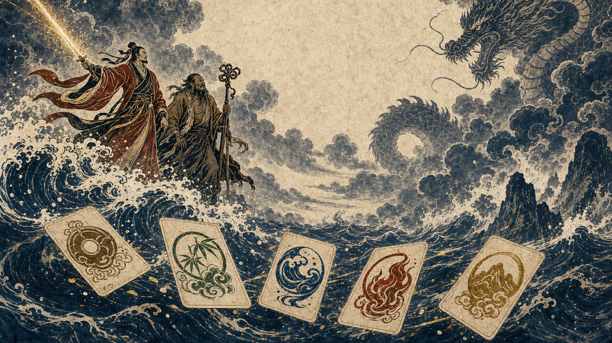
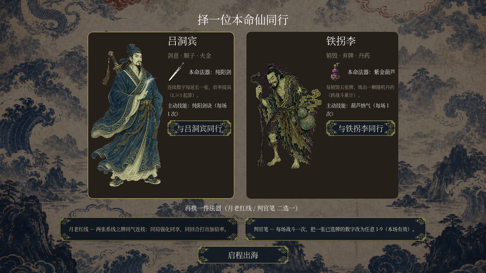
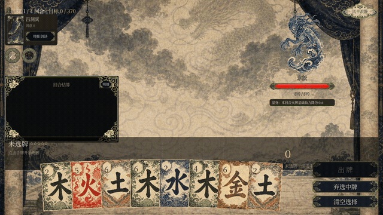
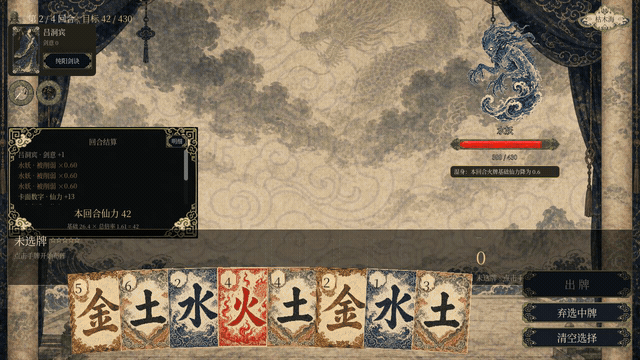
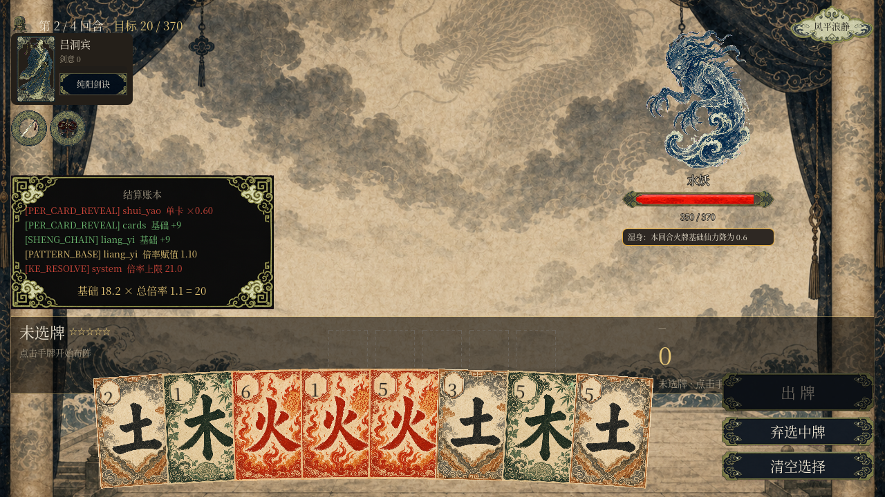
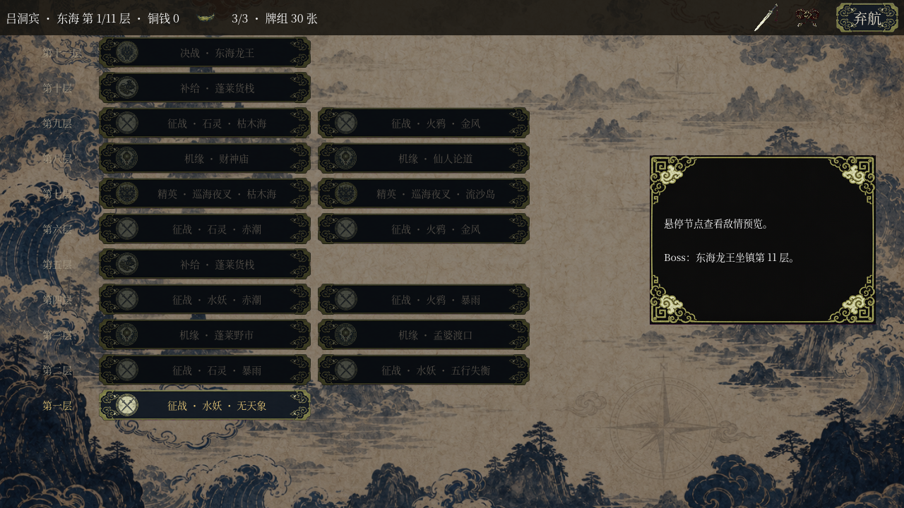
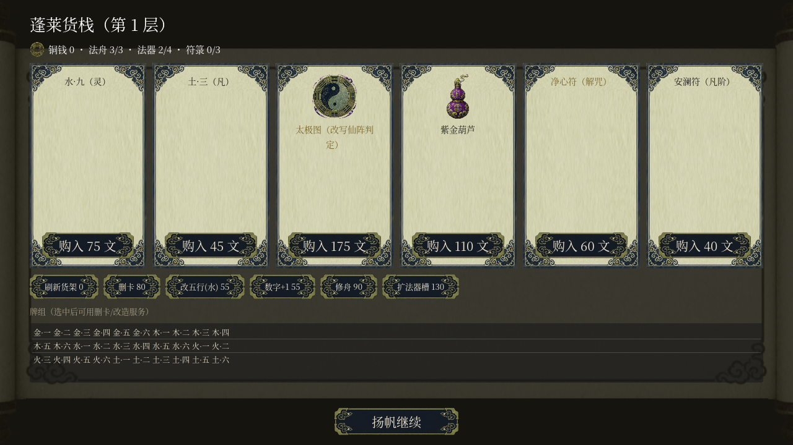
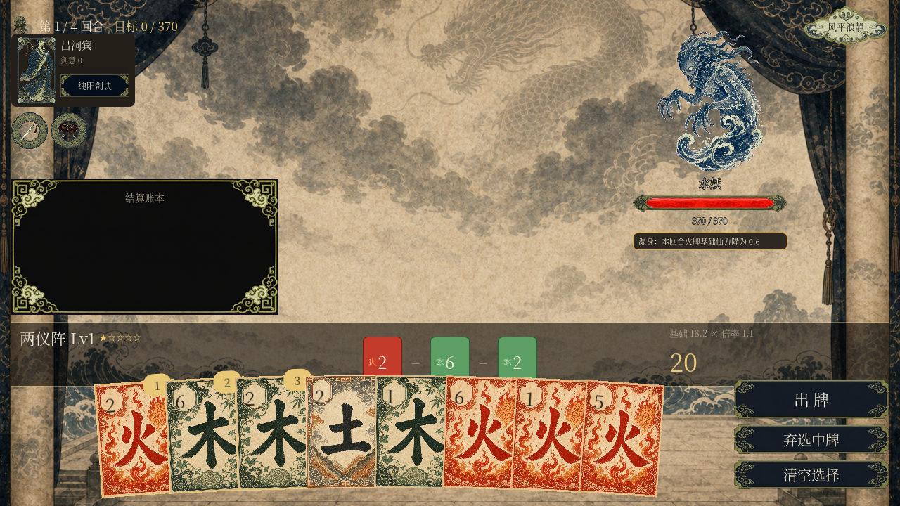

# 470 刀，Claude 手搓了个五行八仙牌局 Roguelike，最后揪出了自己藏得最深的 bug

前几期我让 Claude 手搓过种田、水墨格斗、送外卖……这回给它换了个更烧脑的活儿：**一款牌型构筑 Roguelike**。

数字定牌型，五行定出牌顺序，八仙定流派，法器和 Boss 一路改写规则——你可以理解成一个套着水墨皮的 Balatro。

这次最意外的不是美术，也不是它两天就搓出个能通关的可玩版本……是它**先给自己上了一副枷锁，然后老老实实用枷锁抓出了自己藏得最深的一个 bug**。（这段后面细说。）

照例声明：全套美术、音乐、音效都是 AI 生成，零现成资产，非商业纯学习。引擎是 Godot 4.7 + GDScript。

## 01 开工那句话，我扔了份 1870 行的需求

我没写一行代码，只丢给它一份 1870 行的 PRD，外加一句「用 wing 治理这个仓库，按文档实现」。

它没急着动手，先把需求翻译成了 **41 条跨域裁决**和 6 份技术规格——把「数字怎么定牌型、五行怎么定顺序、法器怎么改写规则」全部拍成可校验的条款。

然后才开始写。

## 02 先选一位本命仙——这是个真能玩的东西，不是 demo

开局二选一：**吕洞宾**走剑意流，顺子越长倍率越高，本命法器纯阳剑；**铁拐李**走销毁流，攒够五张废牌自动炼一颗丹药，本命法器紫金葫芦。再从月老红线 / 判官笔里挑一件随身法器。

同一套牌，两种玩法。这是构筑游戏的命根子，它给做出来了。

## 03 打一局长这样

手牌八张，每张牌有个五行（金木水火土）和一个数字。你选牌凑牌型（仙阵），五行之间相生相克决定出牌顺序和加成，然后一把打出去。

看它自己打的这段——选牌、连相生、两仪阵结成、一道金光糊到水妖脸上：

<video src="assets/xiaochoupai-godot-470-dollars/gameplay.mp4" controls playsinline preload="metadata" poster="assets/xiaochoupai-godot-470-dollars/gameplay-poster.jpg" style="width:100%;border:1px solid #e5e5e5;border-radius:8px"></video>

那些 `→生` `→克` 的小箭头，就是五行在实时算出牌顺序：

## 04 一张会说人话的账本

我最喜欢这个细节。每回合结算它都摊开一张**账本**，把这一击的仙力从哪来、算了几道乘倍，一行一行写清楚：

顺带一提，中途它自己发现账本里露出了 `lu_dong_bin` 这种拼音 id，默默改成了「吕洞宾」——**默认给玩家看人话，技术账本收进「明细」开关里**。这自觉性……

## 05 Roguelike 的骨架也齐了

东海十一层，一路上有征战、精英、机缘、补给、货栈，天象（赤潮 / 暴雨 / 金风 / 五行失衡）随机改规则，第 11 层东海龙王坐镇。

货栈里买牌、买法器、删卡、改五行、扩法器槽——构筑循环一样不缺。太极图 175 文，「改写仙阵判定」，听着就很唬人（记住这件法器，第 08 节它要出事）。

## 06 它先给自己上了一副枷锁

在写玩法之前，它给自己立了 8 条硬约束（H1–H8），而且**每条都配了机器校验**：

- `core/` 纯逻辑层不许碰场景树（不许 `preload` / `get_node` / `$` / `get_tree`）；
- 全项目禁用全局随机，唯一入口是一个确定性 RNG；
- 14 个流水线阶段名不许增改；
- 所有数值必须来自 `data/` 的 JSON，不许硬编码进行为脚本。

理由它写得很清楚：规则引擎必须能在测试里被实例化、跑完一整局——不然无头验证、地图和结算的确定性回归全都失效。

到收口时，**417 个测试全绿**。这些护栏不是摆设，下一节你就知道它有多值。

## 07 最狠的一段：它抓出了自己藏了两遍的血量 bug

它写了个 `balance_check.py`，专门给自己的数值做体检——每个敌人在每个战斗槽位的中位胜率、余量比，全都算一遍卡阈值。

然后诡异的事来了：**体检指标一直显示「没问题」，可血量表一直是错的。**

它自己刨到了根：`build_budget` 里把护甲总量减了两遍；而余量比（`margin_ratio`）的分子恰好又多算了一份护甲——**两个方向相反的 bug，数值上刚好抵消**。于是唯一的自检指标永远正确，血量表却永远错。

它给这组合的批注，我一字没改搬过来：

> 最阴险的组合：两个反向 bug 让唯一的自检指标看不出问题。

AI 揪出自己亲手埋的、还互相打掩护的 bug……这一段是整张账单里我觉得最值的钱。

## 08 「写了内容」不等于「玩家摸得到」

还记得第 05 节那件唬人的太极图吗？它把这件传说法器单独拎出来测了一遍，结论很打脸：**实际只影响 2.5% 的手牌**（rank 25，只赢过聚灵和两仪两种阵）。

一件「改写规则」的传说法器，摸到了基本等于没摸到。于是它补了第二条改写「四行轮转」，把命中率从 2.5% 拉到 **50.8%**。

同一天它还发现龙王的 phase_3 狂暴阶段，中位玩家血量还没磨到那儿就赢了——**根本见不到**。同一类病：写了内容，不等于玩家摸得到。这种「内容不可达」的自查，比修一个崩溃难多了。

## 09 美术、音乐、音效，它全包了

- **出图**：codex 内建 imagegen，29 张一套，靠一张风格锚点图保证「看起来是一套的」；抠图时品红幕抠不干净，它自己把容差拉到 150，还给火鸦单独做了色相后处理；
- **BGM**：MiniMax `music-1.5`，纯民乐；
- **音效**：ElevenLabs，10 条，裁掉起手静音、做了峰值归一化。

全部离线生成、产物入库，**游戏运行时不调任何外部 API**。

## 10 账单：$469.86，两天，35 次提交

照例用 `cccost` 扫本地 Claude Code 日志结账：

| 模型 | 花费 |
|---|---|
| Fable 5（读 PRD、定架构、写规格） | $264.59 |
| Opus 5（写引擎、跑测试、抠 bug） | $205.27 |
| **合计** | **$469.86** |

跟上回拍电影那次不一样——**这次一个 subagent 都没用**，没有 44 人剧组，就是一个循环从头肝到尾。钱大头花在缓存上：它反复回读那份 1870 行的 PRD、41 条裁决、一大摞规格，来回啃了两天。

## 11 最后一句

这游戏最好玩的地方，其实不是八仙，也不是水墨。

是它**主动给自己立了规矩，然后真的用规矩抓出了自己的错**——包括那个藏了两遍、还会自我掩护的血量 bug。

一个愿意先给自己上枷锁的 AI，比一个只会闷头写代码的 AI，靠谱得多。

◇ ◆ ◇

- 成本：`cccost` 扫本地 Claude Code 日志，Fable 5 + Opus 5，共 **$469.86**
- 引擎：Godot 4.7 + GDScript，四层架构（core / data / autoload / scenes），H1–H8 硬约束机器校验，417 测试全绿
- 美术：codex imagegen（29 张，风格锚点统一）；BGM：MiniMax music-1.5；音效：ElevenLabs
- 治理：wing cli + PRD 1870 行 + 41 条跨域裁决，全部离线生成、运行时零 API
