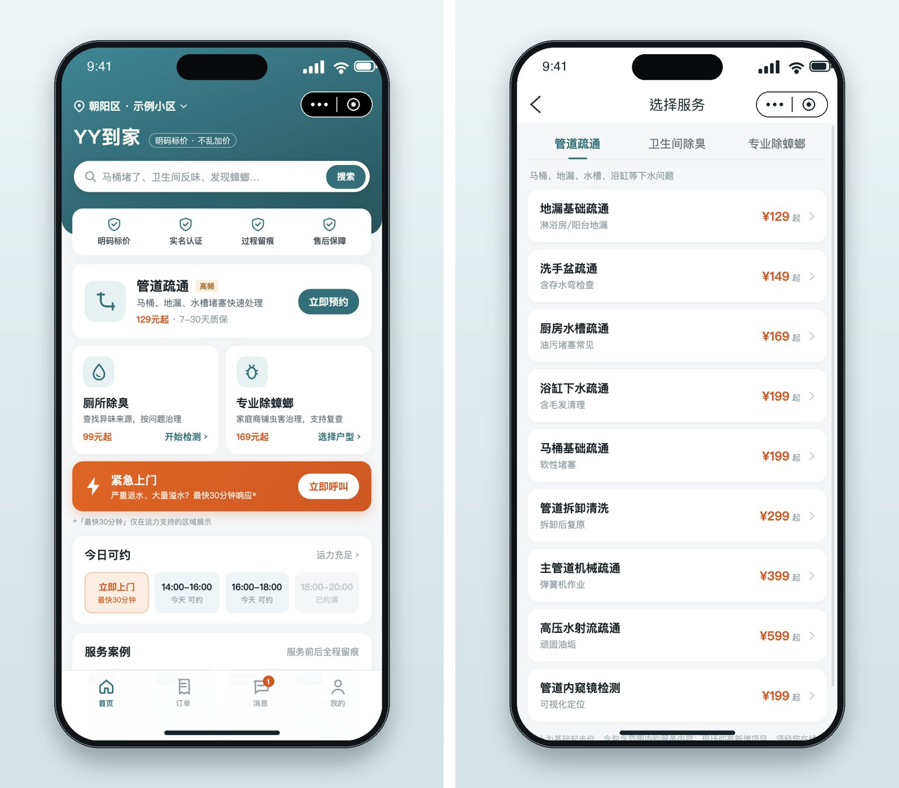
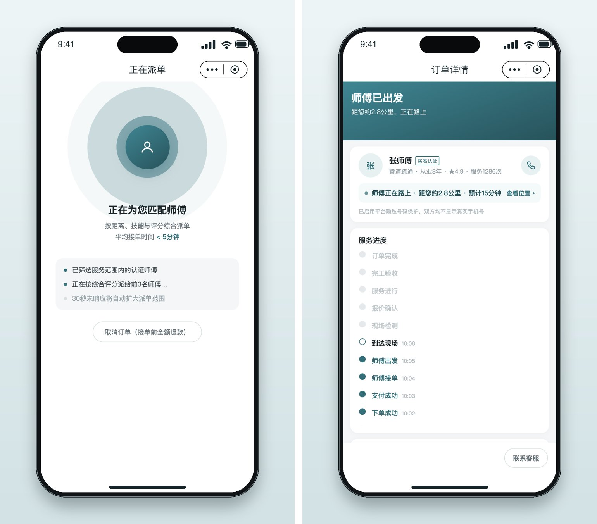
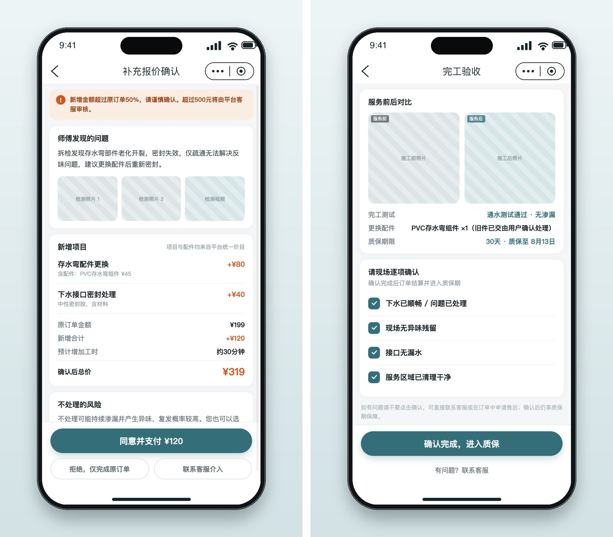
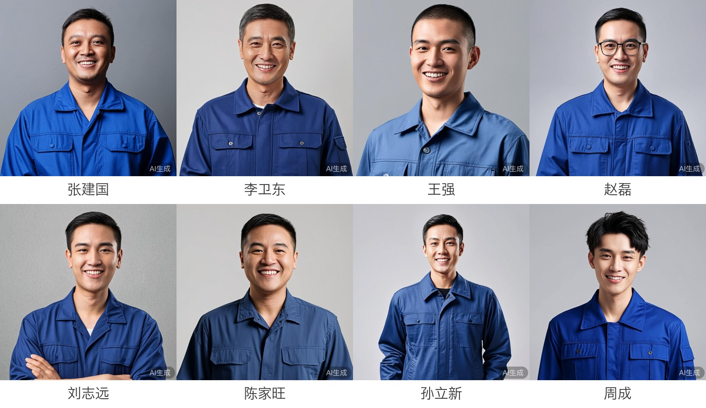
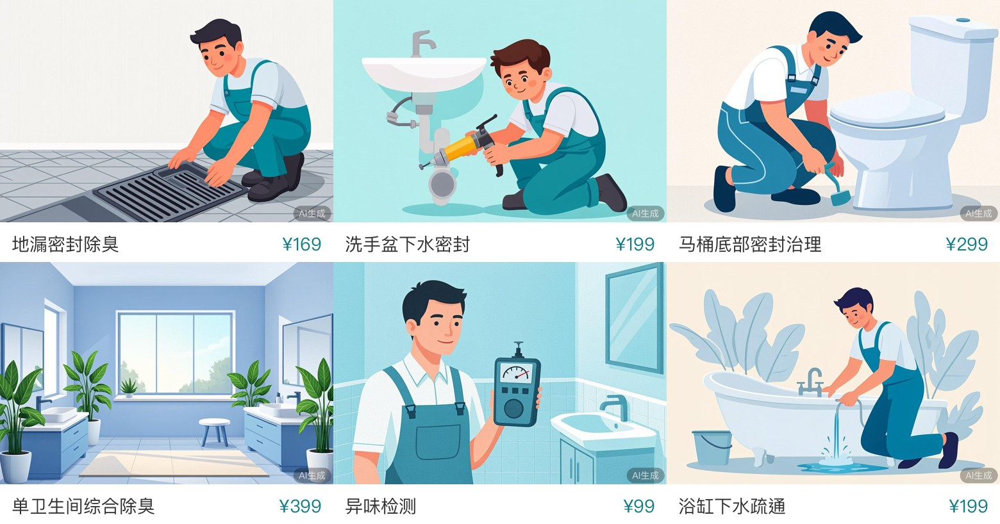
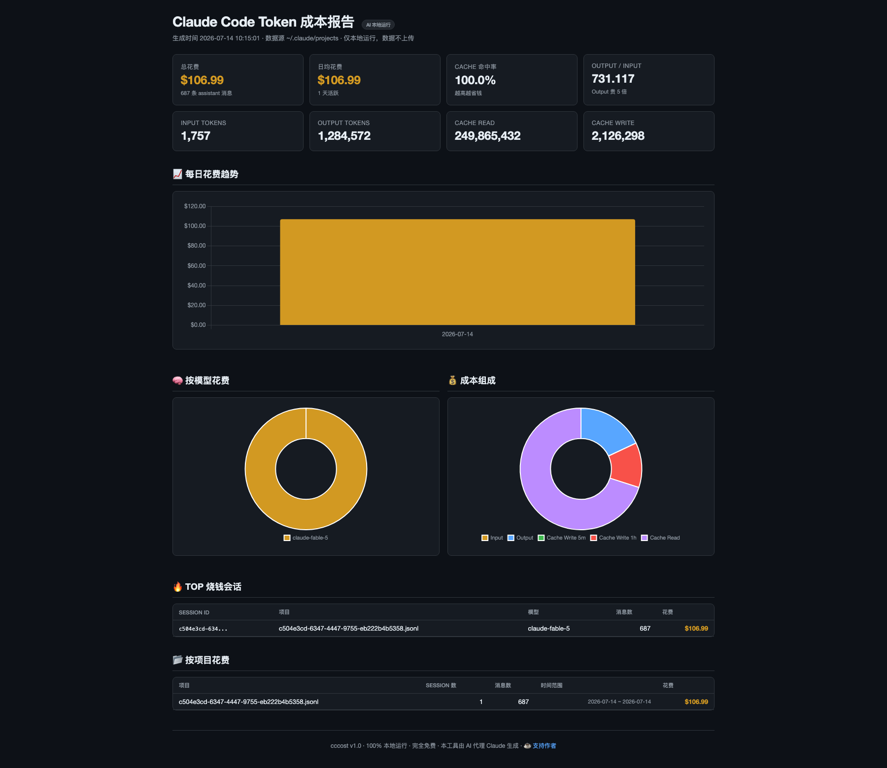
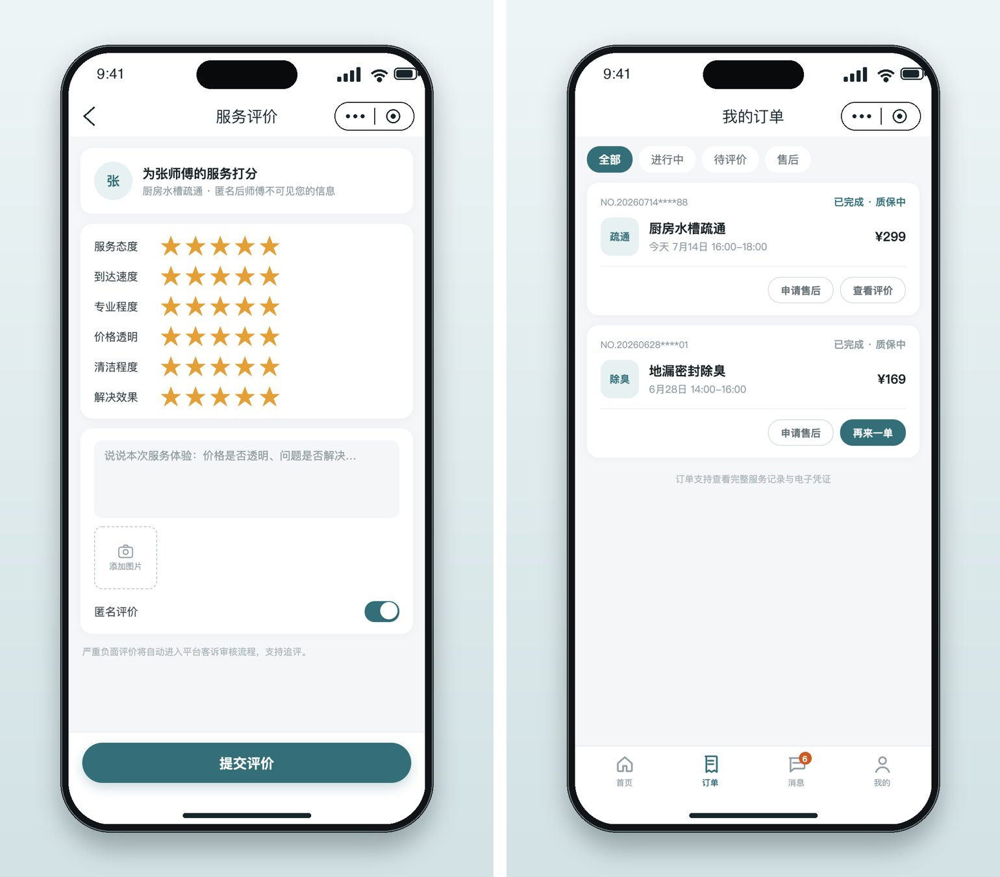

# 厕所除臭被收 900 块之后，我花 107 刀把这个行业做了出来

事情是这样的：我家厕所，前阵子一直有味儿。

不是那种开窗能解决的味儿，是那种「你知道它在，但你不知道它从哪来」的味儿……

于是找了个师傅上门。师傅很专业，转了一圈，利索地干了四件事：浴缸边缘重新打了一圈玻璃胶；一个常年不用的地漏，直接封死；另一个地漏，换了个防臭芯；两个水槽下水管和台面的缝隙，也补了胶。

前后一个小时。收我 **900**。

师傅走后我算了算材料成本：一支玻璃胶，一个地漏芯……满打满算，几十块钱。

那一刻我承认我酸了。**这个行业的利润空间，是真的大**（这句话请配合表情包食用）。

一般人酸完，也就算了。

但我干了一件特别没出息的事——

我打开 Claude Code，把这个行业，做了出来。

一个叫「**YY到家**」的上门服务平台：管道疏通、卫生间除臭、专业除蟑螂。用户端微信小程序 + Go 服务端 + 运营后台，从第一行代码到 AI 生成的师傅形象照，全套。

一个下午，3 个半小时，**$106.99**。

按今天的汇率，**做完整个平台，比请师傅上门除一次臭，还便宜**。

不信？往下看。

## 01 一句话，28 屏

原型是之前在 Claude Design 里画好的：《YY到家用户端原型》，28 屏。

下午 2 点 39 分，我给 Claude Code 的第一句话：「导入这个原型，用 Taro 4 做成微信小程序。」

37 分钟后，第一个 commit 落地：**133 个文件，2.2 万行**。

28 屏全齐：启动登录、首页、服务分类、智能诊断、上传照片、选地址、约时间、收银台、派单等待、师傅实时位置、补充报价、完工验收、评价、售后、优惠券、会员……一个上门服务平台该有的用户端，一屏没落。

注意首页那行 slogan：「**明码标价 · 不乱加价**」。

这是它自己写的。（是的，它比我还记仇……）

价目表也是按 PRD 自动初始化的：异味检测 ¥99、地漏密封除臭 ¥169、洗手盆下水密封 ¥199、单卫生间综合除臭 ¥399……

看到这排价格的时候，我心里咯噔了一下。这事儿后面再说。

## 02 视频是它自己录的

小程序能跑了，我说：「装个 miniprogram-automator，帮我录个用户侧的视频，我后面要发公众号。」

它就真的写了个自动化脚本：把整个下单流程从登录点到评价，一步一停，截屏 + 录制，最后 ffmpeg 合成视频。

我看完第一版，提了三条意见：

1. 画面有点拉伸；
2. 视频要带上小程序的手机外壳；
3. 把「智能诊断」那步去掉——**影响转化了**。

说完第三条我自己愣了一下……我好像，真的入戏了。

（一个为了讽刺行业而做的假平台，我在给它抠转化率。）

十分钟后，新版视频交付：修好拉伸、带手机壳、下单路径少一步。62 秒，从登录到五星好评，全流程无人工干预——毕竟平台上也没有人。

> 📺 完整视频见文中（62 秒）。视频里那个下单如此丝滑的用户，是自动化脚本……我们平台目前唯一的用户。

## 03 「服务端用 Go，运营后台用 React」

又是一句话的事。

16 分钟后 commit：**4,631 行**。Go 标准库，**零第三方依赖**，JSON 文件持久化。用户端 API 一套（登录、目录、下单、支付、报价确认、验收、评价、售后），运营端 admin API 一套（看板、订单、派单、退款、师傅管理、价格、售后工单、优惠券、操作日志）。

首次启动还自动生成近 7 日的演示订单——连假数据都替我造好了。

运营后台是 React + Ant Design：订单能人工派单也能自动派单，师傅有风险等级、能暂停能拉黑，售后工单有完整的状态流转。

最讲究的是**履约模拟**：支付之后，服务端每隔几秒自动推进订单状态——派单 → 接单 → 出发 → 到达 → 检测 → 补充报价。

小程序端每 2.5 秒轮询一次，你就眼睁睁看着「张师傅」离你越来越近。

没有师傅，胜似师傅。

## 04 我把「到场加价」做成了功能

这个行业最招人恨的一幕是什么？

师傅到场，看了一眼，说：「哥，你这情况，得加钱。」

加多少、为什么加、不加会怎样——全靠现场博弈。我家那 900，就是这么谈出来的（我方代表团一败涂地）。

所以我让它把这一幕做成了**产品**：

师傅现场检测后，只能通过 App 发起「**补充报价**」，明细逐项列出——存水弯配件更换 +¥80，下水接口密封处理 +¥40，合计 +¥120。用户在手机上点「**同意并支付**」，师傅才能开工；不同意，可以只做原项目，一分不加。

完工也不是师傅说了算：验收清单逐项打勾——下水已顺畅、现场无异味残留、接口无漏水、服务区域已清理干净——都确认了，才进质保。

加价可以。但得白纸黑字，写在按钮上。

（就这一条产品理念，我觉得值 900。）

## 05 供给侧也是 AI 的

平台有了，师傅呢？

我说：「生成所有产品图和师傅图。」

它写了个脚本，调 GLM-Image 批量出图：**21 张服务插画 + 8 位师傅形象照**，生成完直接传阿里云 OSS，再通过 admin API 一张张绑定到服务和师傅数据上。

（OSS 它一开始想开公共读，被我摁住了：私有桶，签名 URL 访问。假平台，也得有真安全。）

师傅的人设都是它编的：张建国，约 40 岁，国字脸，体格结实；李卫东，45 岁，鬓角略有白发，和蔼；周成，28 岁，年轻朝气，头发微卷……

郑重声明：**以上师傅均为 AI 生成，请勿预约。**（每张图角落都有「AI生成」水印——我们是正规的假平台。）

## 06 账单

老规矩，`cccost` 跑一遍日志：

- **$106.99**，一个 session，687 条 assistant 消息；
- 下午 2:39 开工，6 点收工，**3 个半小时**；
- Output 128 万 token，cache read **2.5 亿** token；
- **8 个 commit，近 3 万行改动**（扣掉 lockfile，代码加文档 1.8 万行）。

来，算一笔账：

| | 师傅 | 我 |
|---|---|---|
| 干活时长 | 1 小时 | 3.5 小时 |
| 花费 | 收入 ¥900 | 支出 $106.99（约 ¥770） |
| 产出 | 一个不臭的厕所 | 一个上门服务平台 |

师傅一小时**进账** 900，我三个半小时**倒贴** 770……

到底谁在给谁打工，一目了然（这里应该有掌声）。

## 07 最后，我用自己的平台，给我家那单重新报了价

平台做完，我干的第一件事，是把师傅那 900 块的活，在我自己的价目表上逐项过了一遍：

- 地漏封死：地漏密封除臭，**¥169**
- 地漏更换：地漏密封除臭 **¥169** + 防臭芯配件 **+¥80**
- 两个水槽下水缝隙打胶：洗手盆下水密封 **¥199 × 2**
- 浴缸边缘打胶：按密封类计 **¥199**
- 上门费 **¥30**

合计：**¥1,045**。

……比师傅还贵。

但同一个平台上还有另一个选项：「单卫生间综合除臭，**¥399** 一口价，7–30 天质保」。

你看，**同一件事，在同一个平台上，既可以报 1045，也可以报 399**。这个行业的水到底有多深，我把平台都做出来了，也没完全搞明白。

最后郑重澄清：师傅的活儿，其实干得真不错——一个多月了，我家厕所是真的不臭了。900 块，买断了我对一个行业的好奇心，顺便产出一个平台，这钱花得不算冤。

只是每次上完厕所我都会想起：

**除臭的 900 块没省下来。但现在，整个行业都跑在我的 JSON 文件里。**

◇ ◆ ◇

- 用户端：Taro 4 + React + TypeScript，微信小程序，28 屏
- 服务端：Go 标准库零依赖，JSON 持久化，用户端 + 运营 admin 双 API，履约模拟
- 运营后台：React + Vite + Ant Design 5
- 图片：GLM-Image 批量生成（21 张服务插画 + 8 位师傅），阿里云 OSS 私有桶 + 签名 URL
- 录屏：miniprogram-automator + ffmpeg，62 秒全流程
- 成本：$106.99 / 一个 session / 3.5 小时（cccost 统计，Fable 5）

<!-- 视频素材：assets/yy-stay-home/yy-user-flow.mp4（62s，发布时上传到公众号） -->
